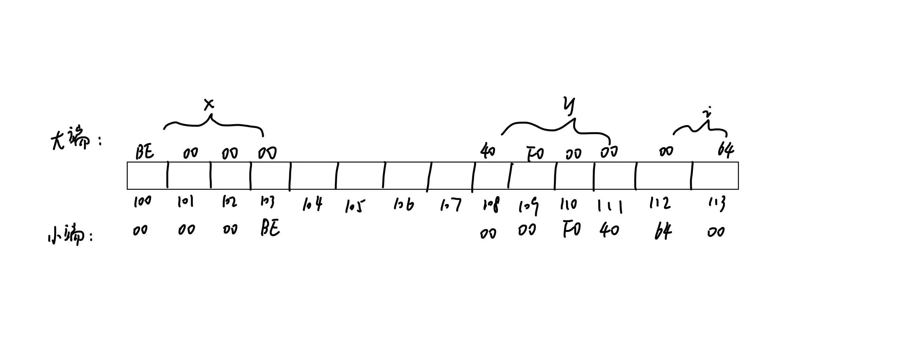

# 241880334 闵振昌 第二章
## 2
(1)有两个稳定状态的物理器件容易实现，电路设计更加简单，因此采用二进制表示信息。十六进制与二进制转换方便，并且更加简洁，便于阅读和书写，提高效率。

(2)常见的定点数编码有原码、反码和补码三种
原码：表示符号位和数值位，可以表示整数的绝对值和符号
反码：原码和补码的转换的中间状态
补码：表示带符号整数，便于减法运算

(3)补码可以将减法运算转化为加法运算，简化运算器的设计，并且0只有一种表示方式

(4)表示范围由阶码决定，阶码位数越多，表示范围越大；而精度由尾数决定，尾数位数越多，表示精度越高。由于总位数是一定的，两者相互制约，无法同时实现最大化

(5)对浮点数规格化使得浮点数的表示唯一并且充分利用尾数，提高表示精度。
两种规格化操作：
1. 规格化：将浮点数的尾数部分归一化，即将尾数部分的最高位设为1，然后将阶码部分减去1，得到规格化的浮点数。
2. 非规格化：将浮点数的尾数部分归一化，即将尾数部分的最高位设为0，然后将阶码部分设为0，得到非规格化的浮点数。

(6)输入码方便用户输入，内码便于计算机储存和处理，字模码用于显示输出。
这三个码都以二进制编码表示，因为计算机在哪识别二进制编码。

## 3
(1)$(25.8125)_10=(11001.1101)_2=(31.64)_8=(19.D)_{16}$

(2)$(101101.011)_2=(45.375)_10=(55.3)_8=(2D.6)_{16}$

(3)$(4E.C)_{16}=(78.75)_10=(01001110.1100)_2$

## 5
+1001 补码：00001001 移码：11110111
-1001 补码：11110111 移码：01110111
+1 补码：00000001 移码：10000001
-1 补码：11111111 移码：01111111
+10100 补码：00010100 移码：10010100
-10100 补码：11101011 移码：01101011
+0和-0 补码：00000000 移码：10000000

## 6
(1)x=-0.0011001

(2)x=-10000000=-128

(3)x=0.1010010

(4)x=-0101101=-45

## 7
(1)R1: 0000 108BH=00000000 00000000 00010000 10001011=4096 + 128 + 8 + 2 + 1 = 4235
R2: 8080 108BH=10000000 10000000 00010000 10001011=2147483648+8388608+4096+128+8+2+1=2155876187

(2)R1: 是正数，补码与原码相同，是4235
R2: 是负数，补码与原码不同，原码是-01111111 01111111 11101111 01110101=-2139085059

(3)R1: 符号位是0，是正数，阶码是00000000，那么E=e-127=-127, 所以表示的是$1.00000000001000010001011\times 2^{-127}$
R2: 符号位是1，是负数，阶码是00000001，E=-126, 表示$-1.0000000 00010000 10001011\times2^{-126}$

## 9
由于len是无符号整数，当len=0时，len-1会进行无符号数的运算，结果是无符号整数的最大值而不是-1，导致循环执行非常多次，直到访问a[i]时，i超出数组a的有效范围，引发存储器访问异常

## 10
(1)+1.75: 先转化为四进制：1.3，也就是$1.3\times4^0$，用格式表示就是0 10000 130000
+19：先转化为四进制：103，也就是$1.3\times4^2$，用格式表示就是0 10010 130000
-1/8：先转化为四进制：-0.02，也就是$(-0.2)\times4^{-1}$，用格式表示就是1 01111 020000
(2)表示范围：阶码的取值范围是0-31，对应的实际阶码-16-15，所以范围是$-(1.11111)\times4^{15}\sim-(0.00001)4^{-16}$和$(0.00001)\times4^{-16}\sim(1.11111)\times4^{15}$
12位定点补码整数表示范围：$-(2^{11})\sim(2^{11}-1)$
12位定点补码小数表示范围：$-1\sim2^{-11}$

## 12
+1.75：转化成二进制：1.11, 符号位是0，阶码是01111111，所以是0 01111111 11000000000000000000000
+19：转化成二进制：10011, 符号位是0，阶码是10000011，所以是0 10000011 00110000000000000000000
-1/8：转化成二进制：-0.001, 符号位是1，阶码是01111100，所以是1 01111100 00000000000000000000000
258：转化成二进制：100000010, 符号位是0，阶码是10000111，所以是0 10000111 00000010000000000000000

## 13
32位补码整数：二进制：1000000000010，32位：00000000000000000001000000000010，16进制：00001002H
IEEE-754单精度浮点格式：$1.000000000010\times2^{12}$
符号位：0
阶码：10001011
尾数：000000000010000000000000
十六进制：45002000H
尾数的高12位和补码的低12位完全相同。因为当整数的数值在浮点数的精度范围内时，浮点数的尾数会保留整数的有效二进制位，所以这部分二进制序列相同。

## 17
先把x，y和i转化成二进制表示
x=1 01111100 00000000000000000000000(BE000000H)
y=0 10000001 11100000000000000000000(40F00000H)
i=0000000001100100(64H)
