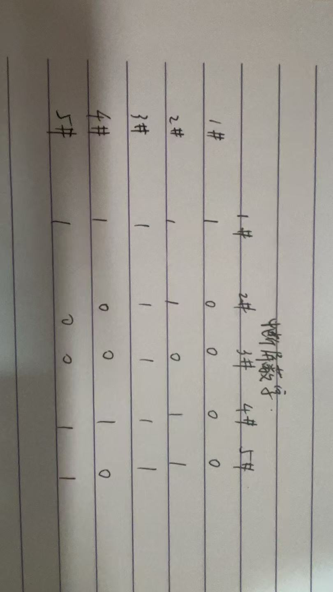
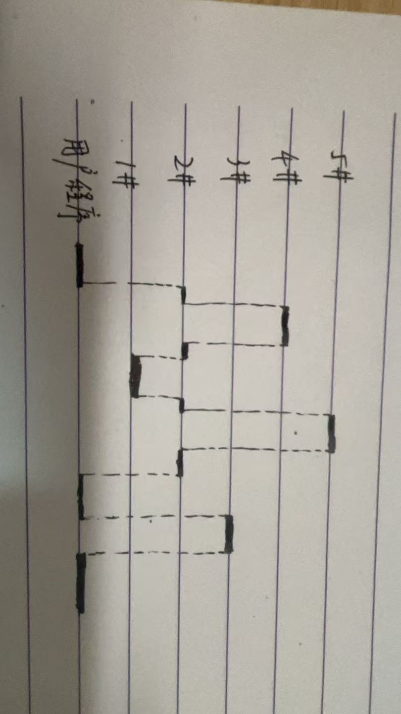

# 241880334 闵振昌 第八章
## 7
外设接口里有一个16位数据缓存器，所以每16位数据进行一次中断请求
中断请求的时间间隔是 $10^6\times 2B\div (20\times 10^3B)=100$ 微秒
对应的中断服务程序的执行时间是 $10^6\times \frac{1}{500\times 10^6}\times 500=1$ 微秒
因此中断响应和处理的总时间略大于1us，但是小于100us，所以可以使用中断方式处理数据传输。

改为2MB/s之后，中断请求的时间间隔是 $10^6\times 2B\div (2\times 10^6B)=1$ 微秒
中断服务程序的执行时间仍然是1微秒，中断请求的间隔时间小于中断响应和处理的总时间，在上一个中断服务程序还没有执行完时，就会有新的中断请求到来，因此不能使用中断方式处理数据传输。

## 8

## 9
（1）磁盘旋转一周需要 $60\times 10^3 \div 3000 =20$ ms
单个数据块传输需要 $20\div 2 - 2=8$ ms
因此最大数据传输率为 $8000B\div 8ms = 1MB/s$

（2）存储器总线宽度为16位，即2B，最大数据传输率为 $1MB/s$
因此每隔$2B\div 1MB/s=2000$ ns 产生一次DMA请求，由于主存周期是500ns，所以主存存储周期空闲的百分比为 $ (2000-500)/2000=75\% $

（3）无I/O打扰时，执行这个加法指令，需要五个周期：取指令，取操作数1，取操作数2，执行，加回结果
执行时间是 $5\times 500=2500$ ns

如果有磁盘I/O操作，每次DMA请求都需要占用一个周期，如果和CPU发生冲突，DMA优先
因为每隔2000ns产生一次DMA请求，而每个加法指令需要2500ns，因此每执行一个加法指令，必然会发生一次DMA请求
最好的情况下是在指令执行的时候，执行DMA请求，占用一个周期，执行时间是 $5\times 500=2500$ ns
其他情况下，有访存冲突的存在，执行时间是 $6\times 500=3000$ ns

## 10
如果总线宽度是8位，即1B
磁盘的平均数据传输率是 $16\times 512B\div 8.192ms=1MB/s$
DMA每隔 $1B\div 1MB/s=1000$ ns 产生一次请求，在这期间，CPU执行了2条指令
因此每两条指令的执行就被插入一个总线周期用于DMA传输
也就是平均每个指令的执行时间增加了总线周期的一半， $125$ ns
所以执行指令的速度降低了 $25\%$

如果总线宽度是16位，即2B
DMA每隔 $2B\div 1MB/s=2000$ ns 产生一次请求，在这期间，CPU执行了4条指令
因此每四条指令的执行就被插入一个总线周期用于DMA传输
也就是平均每个指令的执行时间增加了总线周期的四分之一， $125$ ns
所以执行指令的速度降低了 $12.5\%$