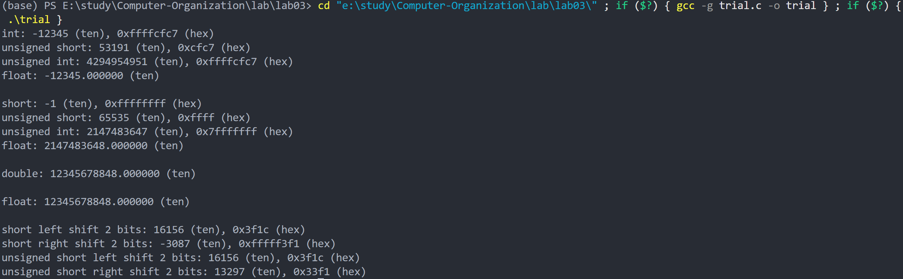

# 实验报告
## 源文件和实验结果
```c
#include <stdio.h>
#include <limits.h>

int main() {
    // 1. short 型数据 -12345 的类型转换
    short s_num = -12345;
    int int_num = (int)s_num;
    unsigned short ushort_num = (unsigned short)s_num;
    unsigned int uint_num = (unsigned int)s_num;
    float float_num = (float)s_num;

    printf("int: %d (ten), 0x%x (hex)\n", int_num, int_num);
    printf("unsigned short: %u (ten), 0x%x (hex)\n", ushort_num, ushort_num);
    printf("unsigned int: %u (ten), 0x%x (hex)\n", uint_num, uint_num);
    printf("float: %f (ten)\n\n", float_num);

    // 2. int 型数据 2147483647 的类型转换
    int int_num2 = 2147483647;
    short s_num2 = (short)int_num2;
    unsigned short ushort_num2 = (unsigned short)int_num2;
    unsigned int uint_num2 = (unsigned int)int_num2;
    float float_num2 = (float)int_num2;

    printf("short: %d (ten), 0x%x (hex)\n", s_num2, s_num2);
    printf("unsigned short: %u (ten), 0x%x (hex)\n", ushort_num2, ushort_num2);
    printf("unsigned int: %u (ten), 0x%x (hex)\n", uint_num2, uint_num2);
    printf("float: %f (ten)\n\n", float_num2);

    // 3. float 型数据 123456.789e5 转换为 double
    float float_num3 = 123456.789e5;
    double double_num3 = (double)float_num3;

    printf("double: %lf (ten)\n\n", double_num3);

    // 4. double 型数据 123456.789e5 转换为 float
    double double_num4 = 123456.789e5;
    float float_num4 = (float)double_num4;

    printf("float: %f (ten)\n\n", float_num4);

    // 5. short 和 unsigned short 类型对 -12345 进行左移 2 位和右移 2 位操作
    short s_shift_left = s_num << 2;
    short s_shift_right = s_num >> 2;
    unsigned short us_shift_left = ushort_num << 2;
    unsigned short us_shift_right = ushort_num >> 2;

    printf("short left shift 2 bits: %d (ten), 0x%x (hex)\n", s_shift_left, s_shift_left);
    printf("short right shift 2 bits: %d (ten), 0x%x (hex)\n", s_shift_right, s_shift_right);
    printf("unsigned short left shift 2 bits: %u (ten), 0x%x (hex)\n", us_shift_left, us_shift_left);
    printf("unsigned short right shift 2 bits: %u (ten), 0x%x (hex)\n", us_shift_right, us_shift_right);

    return 0;
}
```


## 回答问题
### 1 无符号数和带符号整数的扩展操作方式是否相同?各是如何进行的?
不同，无符号数扩展时高位补0，带符号数（补码表示）扩展时高位补符号位

### 2 补码整数(如 int 型数)是否总能转换为等值的 float 类型数据?为什么? 
不一定。float有效位数有限，当 int 数值过大，超出 float 能精确表示的范围时，转换会有精度损失。比如实验中2147483647转为float之后数值就不一样了

### 3 float 型数据是否总能转换成等值的 double 型数据?为什么?
是，因为 double 型数据有效位数更多，能表示的范围更广。

### 4 长数被截断成短数后可能发生什么现象?为什么?
可能发生溢出或精度丢失。因为短数的表示范围比长数小，长数的部分高位会被截断，导致数值变化。

### 5 C 语言中移位操作规则与操作对象的数据类型有关吗?
有关。对于有符号数，右移是算术右移，高位补符号位；对于无符号数，右移是逻辑右移，高位补 0。左移对于有符号数和无符号数，都是高位丢弃，低位补 0。

### 6 左移 2 位和右移 2 位操作分别相当于扩大和缩小几倍?
左移 2 位相当于扩大 4 倍，右移 2 位相当于缩小 4 倍。