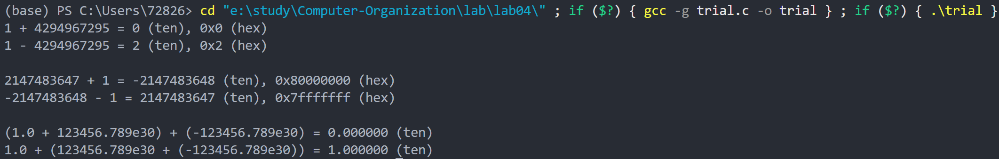

# 实验报告
## 源文件和运行结果
```c
#include <stdio.h>
#include <limits.h>

int main() {
    // 1. unsigned int 型数据运算
    unsigned int u_num1 = 1;
    unsigned int u_num2 = 4294967295;
    unsigned int u_add = u_num1 + u_num2;
    unsigned int u_sub = u_num1 - u_num2;

    printf("1 + 4294967295 = %u (ten), 0x%x (hex)\n", u_add, u_add);
    printf("1 - 4294967295 = %u (ten), 0x%x (hex)\n\n", u_sub, u_sub);

    // 2. int 型数据运算
    int i_num1 = 2147483647;
    int i_num2 = -2147483648;
    int i_add = i_num1 + 1;
    int i_sub = i_num2 - 1;

    printf("2147483647 + 1 = %d (ten), 0x%x (hex)\n", i_add, i_add);
    printf("-2147483648 - 1 = %d (ten), 0x%x (hex)\n\n", i_sub, i_sub);

    // 3. float 型数据运算
    float f_num1 = 1.0f + 123456.789e30f;
    float f_num2 = -123456.789e30f;
    float f_res1 = f_num1 + f_num2;
    float f_res2 = 1.0f + (123456.789e30f + f_num2);

    printf("(1.0 + 123456.789e30) + (-123456.789e30) = %f (ten)\n", f_res1);
    printf("1.0 + (123456.789e30 + (-123456.789e30)) = %f (ten)\n", f_res2);

    return 0;
}
```


## 对每个计算结果的说明
### 1 unsigned int 型数据运算
unsigned int 的最大值是 4294967295（十六进制 0xffffffff），加1后发生溢出，结果为 0。
而1 - 4294967295：相当于 1 + ( -4294967295 )，对 unsigned int 型数据来说，负数要取模，因此-4294967295等价于1， 1+1=2。

### 2 int 型数据运算
int 的最大值是 2147483647（十六进制 0x7fffffff），最小值是 -2147483648（十六进制 0x80000000）。
2147483647加1后发生溢出，结果为 -2147483648。
-2147483648减1后发生溢出，结果为 2147483647。

### 3 float 型数据运算
float类型精度有限，当一个极小的数（1.0）与一个极大的数（123456.789e30）相加时，由于极大数的量级远超过小数，小数的有效数字会被 “吞没”—— 即相加后结果与极大数本身几乎无差异。
因此等价于(123456.789e30 + (-123456.789e30))=0
1.0 + (123456.789e30 + (-123456.789e30))：先计算 123456.789e30 + (-123456.789e30) 结果为 0.0，再与 1.0 相加，结果为 1.0。