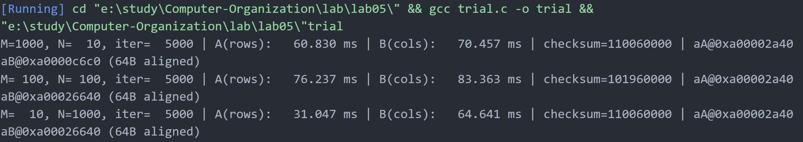

# 实验报告
## 源文件和运行结果
```c
#include <stdio.h>
#include <stdlib.h>
#include <stdint.h>
#ifdef _WIN32
#include <malloc.h>
#endif

#ifdef _WIN32
#include <windows.h>
static double now_ms(void) {
    static LARGE_INTEGER freq = {0};
    LARGE_INTEGER counter;
    if (freq.QuadPart == 0) {
        QueryPerformanceFrequency(&freq);
    }
    QueryPerformanceCounter(&counter);
    return (double)counter.QuadPart * 1000.0 / (double)freq.QuadPart;
}
#else
#include <sys/time.h>
static double now_ms(void) {
    struct timeval tv;
    gettimeofday(&tv, NULL);
    return tv.tv_sec * 1000.0 + tv.tv_usec / 1000.0;
}
#endif

// 尝试降低跨核迁移与时钟漂移影响：可选线程亲和（默认关闭）
#ifdef _WIN32
static void pin_thread_to_cpu0(void) {
    HANDLE h = GetCurrentThread();
    SetThreadAffinityMask(h, 1ULL);
}
#else
static void pin_thread_to_cpu0(void) {}
#endif

// 简单的缓存冲刷：访问一个较大的缓冲区，逐行步进以逐出各级 cache
static void flush_caches(void) {
    static size_t buf_sz = 64 * 1024 * 1024; // 64MB，大于多数桌面 CPU 的 L3
    static unsigned char *buf = NULL;
    if (!buf) {
        buf = (unsigned char*)malloc(buf_sz);
        if (!buf) return; // 若分配失败，直接放弃冲刷
    }
    volatile unsigned long long s = 0;
    for (size_t i = 0; i < buf_sz; i += 64) { // 以 cache line 步长访问
        buf[i] = (unsigned char)(i);
        s += buf[i];
    }
    (void)s;
}

static int choose_iterations(int M, int N) { //选择迭代次数
    const long long targetWrites = 50LL * 1000 * 1000; // 约 5000 万次写
    long long cells = (long long)M * (long long)N;
    long long it = targetWrites / (cells > 0 ? cells : 1);
    if (it < 1) it = 1;
    if (it > 200000) it = 200000;
    return (int)it;
}

// 对齐分配，提升可重复性
static int* alloc_aligned64(size_t count) {
    size_t bytes = count * sizeof(int);
#ifdef _WIN32
    return (int*)_aligned_malloc(bytes, 64);
#else
    void* p = NULL;
    if (posix_memalign(&p, 64, bytes) != 0) return NULL;
    return (int*)p;
#endif
}

static void free_aligned64(void* p) {
#ifdef _WIN32
    _aligned_free(p);
#else
    free(p);
#endif
}

static double measure_rows(int* __restrict a, int M, int N, int iterations) {
    double t0 = now_ms();
    for (int it = 0; it < iterations; ++it) {
        for (int i = 0; i < M; ++i) {
            int* p = a + (size_t)i * N;
            for (int j = 0; j < N; ++j) {
                p[j] = i + j + it;
            }
        }
    }
    double t1 = now_ms();
    return t1 - t0;
}

static double measure_cols(int* __restrict a, int M, int N, int iterations) {
    double t0 = now_ms();
    for (int it = 0; it < iterations; ++it) {
        for (int j = 0; j < N; ++j) {
            int* p = a + j;
            for (int i = 0; i < M; ++i) {
                *p = i + j + it;
                p += N;
            }
        }
    }
    double t1 = now_ms();
    return t1 - t0;
}

static void run_case(int M, int N) {
    long long cells = (long long)M * (long long)N;
    int *aA = alloc_aligned64((size_t)cells);
    int *aB = alloc_aligned64((size_t)cells);
    if (!aA || !aB) {
        fprintf(stderr, "Allocation failed for %d x %d\n", M, N);
        exit(1);
    }

    int iterations = choose_iterations(M, N);
    volatile long long checksum = 0; // 防止编译器优化

    pin_thread_to_cpu0();

    // 预热 + 清零
    for (int i = 0; i < M; ++i) {
        int* pA = aA + (size_t)i * N;
        int* pB = aB + (size_t)i * N;
        for (int j = 0; j < N; ++j) { pA[j] = 0; pB[j] = 0; }
    }

    // 两次交错测量，取最小值，降低顺序与抖动影响
    flush_caches();
    double tA1 = measure_rows(aA, M, N, iterations);
    for (int i = 0; i < M; ++i) { // 读回
        int* pA = aA + (size_t)i * N;
        for (int j = 0; j < N; ++j) checksum += pA[j];
    }

    flush_caches();
    double tB1 = measure_cols(aB, M, N, iterations);
    for (int i = 0; i < M; ++i) {
        int* pB = aB + (size_t)i * N;
        for (int j = 0; j < N; ++j) checksum += pB[j];
    }

    flush_caches();
    double tB2 = measure_cols(aB, M, N, iterations);
    flush_caches();
    double tA2 = measure_rows(aA, M, N, iterations);

    double timeA = tA1 < tA2 ? tA1 : tA2;
    double timeB = tB1 < tB2 ? tB1 : tB2;

    printf("M=%4d, N=%4d, iter=%6d | A(rows): %8.3f ms | B(cols): %8.3f ms | checksum=%lld | aA@%p aB@%p (64B aligned)\n",
           M, N, iterations, timeA, timeB, checksum, (void*)aA, (void*)aB);

    free_aligned64(aA);
    free_aligned64(aB);
}

int main(void) {
    run_case(1000, 10);
    run_case(100, 100);
    run_case(10, 1000);
    return 0;
}
```


## 对实验结果的分析

### 1. 存储布局与访问顺序
行优先（A程序）：有效局部数据块 = 缓存行大小（64B），高性能
列优先（B程序）：有效局部数据块 = 单个元素（4B），低性能
矩阵形状影响：N越大，列优先性能越差，但行优先几乎不受影响

### 2. Cache 行与空间局部性
- 常见 CPU 的 Cache 行（cache line）大小为64B，一次装入/写回以行为单位。
- 若每次访问的字节步长 `S` 远小于 64B，则一条缓存行能被多次连续命中（良好空间局部性）。
- 若 `S >= 64B`，几乎每次访问都会落在新的缓存行上，缓存命中率显著下降，访存带宽与延迟成为性能瓶颈。

在本实验中（假设 `sizeof(int)=4`）：
- 程序 A 的步长 `S_A = 4B`，远小于 64B，命中率高。
- 程序 B 的步长 `S_B = 4N`（字节）。当 `N≥16` 时，`S_B≥64B`，几乎次次触发新行。

