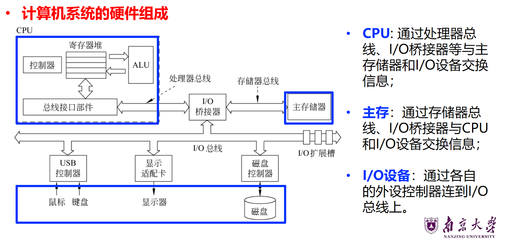
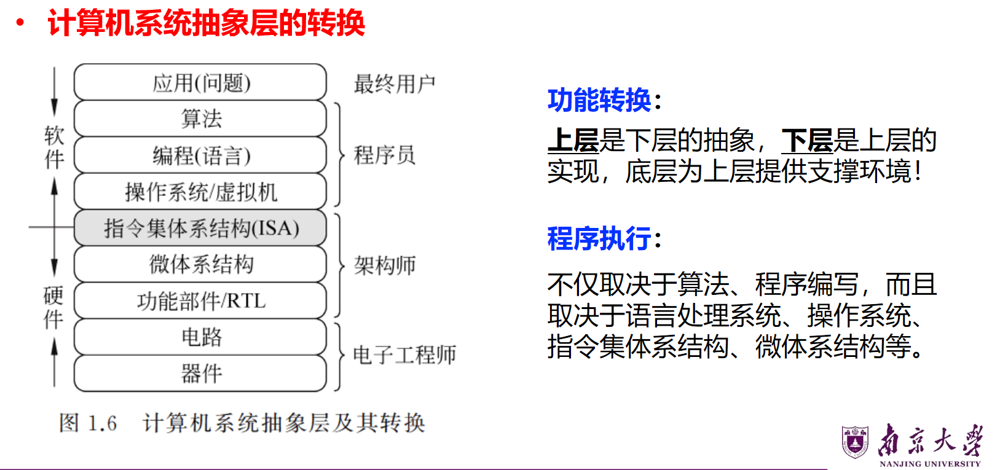
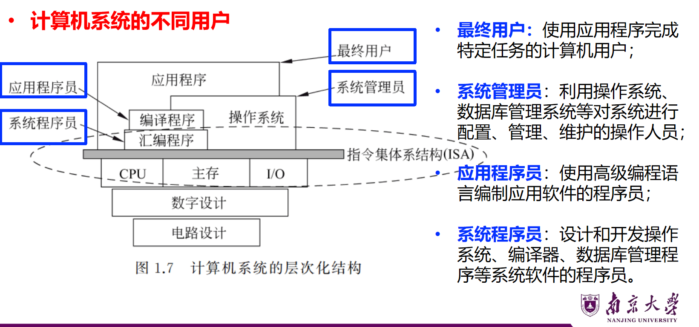
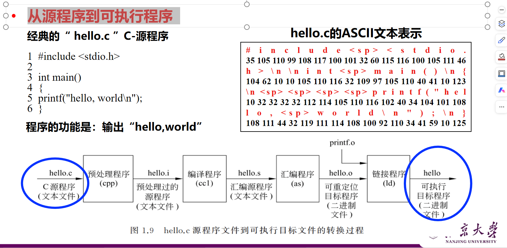
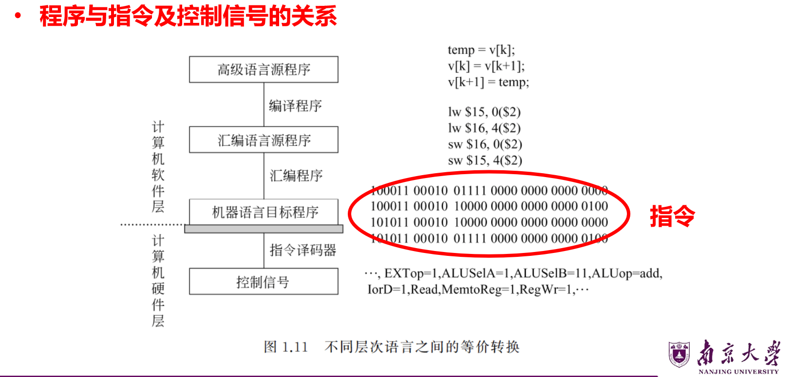
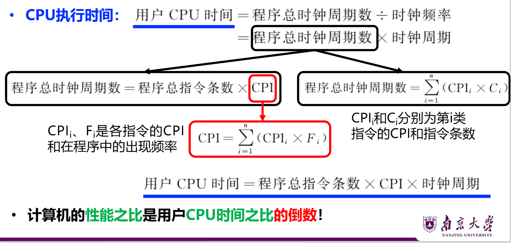
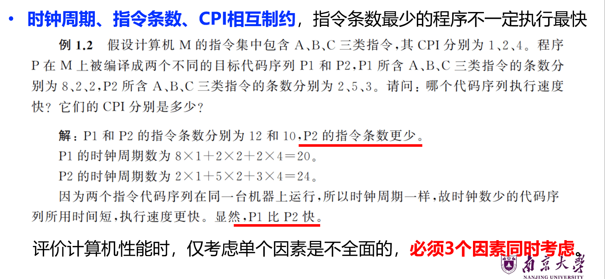
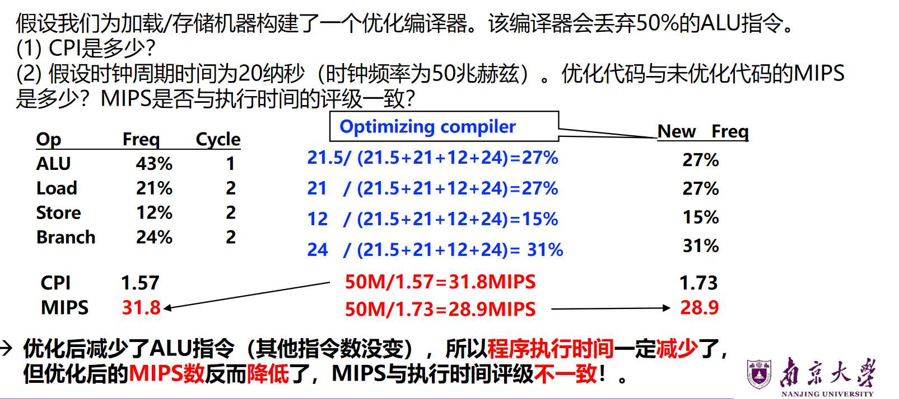
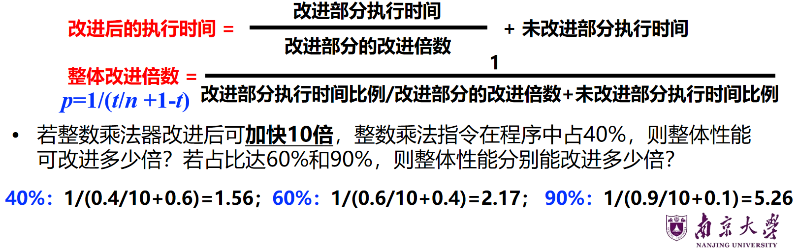
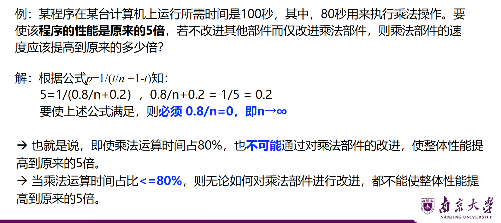

# Lec1 计算机系统概述

## 计算机的发展历程

- 第一代：真空管 ENIAC
- 第二代：晶体管
- 第三代： SSI/MSI 大规模集成电路
- 第四代： 超大规模集成电路

## 计算机系统的基本组成

计算机是一种能对数字化信息进行自动、高速算术和逻辑运算的处理装置，它由**硬件和软件**组成。

- 硬件：具体物理装置的总称
- 软件：指计算机系统中的程序、数据及相关文档

冯诺依曼结构：

- 运算器 控制器 存储器 输入设备 输出设备

现代计算机：把运算器、控制器和各类寄存器等互连在一个中央处理器中(CPU)

- 中央处理器：核心部件，用于指令执行，有控制器和算术逻辑单元(ALU, Arithmetic Logic Unit)
- 存储器：分为内存和外存
- 外部设备和设备控制器：外设通过设备控制器连接到主机
- 总线：传输信息的通道

### 计算机硬件组成

#### CPU

算术逻辑部件ALU：执行算术和逻辑运算等操作
通用寄存器：**暂存**指令所用的操作数或执行结果
控制器：对指令进行译码，生成相应的**控制信号**，控制数据通路进行正确操作

#### 存储器

内存：主存和高速缓存
外存：磁盘、磁带、光盘等

#### 总线

CPU、主存、I/O模块都通过总线连接
各类总线及总线接口部件、I/O桥接线、I/O扩展槽、I/O控制器、显示适配器等互连，用于数据传输和缓存任务

### 计算机软件

应用软件
系统软件：

- 操作系统
- 语言处理系统
- 数据库管理系统...

## 计算机系统层次结构

### 计算机系统抽象层的转换

#### 算法和程序：

- 先将应用问题转换为算法描述，再转换为用编程语言描述的程序

#### 语言处理系统：将高级语言程序转换成机器语言程序

- 编译程序：将高级语言源程序翻译成汇编语言或机器语言目标程序
- 汇编程序：将汇编语言源程序翻译成机器语言目标程序
- 解释程序：将源程序中的语句逐条翻译成机器指令并立即执行

#### 操作系统：是对计算机底层结构和计算机硬件的一种抽象

#### 指令集体系结构（ISA）：是硬件和软件之间接口的一个完整定义

- 定义了一台计算机可以执行的所有指令集合
- 指令规定了计算机执行的操作，所处理的操作数存放的位置以及类型等
- 软件能感知，属于软件可见部分

#### 微体系结构：指令系统具体实现的组织

- 软件不可感知：如加法器是采用串行还是并行进位方式，软件不知；
- 相同的ISA可能具有不同的微体系结构；
- 由逻辑电路实现。

### 计算机系统的不同用户

## 程序开发与执行过程

### 从源程序到可执行程序

### 可执行程序的启动和执行

### 程序与指令及控制信号的关系

## 计算机系统性能评价

### 计算机系统性能的定义

两个基本指标：

- 作业提交开始到完成所有的时间（相应时间，执行时间，等待时间）
- 单位时间完成的工作量（吞吐率）
  比较计算机的性能时，常常用**执行时间**来衡量，完成同样工作量所需时间最短的那台计算机就是性能最好的。

通常把用户感觉到的响应时间分成：

- 用户CPU时间：程序在CPU上执行的时间
- 其他时间：包括等待时间、输入输出时间等

系统性能和CPU性能不等价：

- 系统性能：系统响应时间，与CPU外的其他部分也有关系
- CPU性能：用户CPU时间

计算机系统的性能主要考虑**CPU性能**，即**用户CPU时间**！

用户CPU时间涉及的概念和参数：

- 时钟周期：计算机产生的同步时钟定时信号(CPU主脉冲信号)的宽度
- 时钟频率：主脉冲信号的时钟频率，CPU时钟周期的倒数
- CPI：cycle per instruction，执行一条指令所需的时钟周期数。对于一条指令，CPI是确定值；对于一个程序或机器，综合CPI是所有指令的平均时钟周期数。

时钟周期、指令条数、CPI相互制约，提高时钟频率不能保证速度同倍数提高。

### 用指令执行速度进行性能评估

指令速度计量单位：平均每秒钟执行多少百万条指令，（MIPS，Million Instructions Per Second）；因为每条指令执行时间不同，所以MIPS总是一个平均值。
浮点操作速度：MFLOPS，Million Floating-point Operations Per Second

在这个例子中，由于我们减少了50%的ALU，所以ALU部分由43%变为21.5%，所以百分比重新计算，CPI则是每个百分比乘以cycle数再求和，最终结果是CPI增加了。由于我们减少了ALU指令，程序执行时间一定变少了。但是我们计算MIPS时，是用频率除以CPI(因为$MIPS\times T\times CPI=1$M条指令)，所以MIPS增加了。由此可见所以MIPS数不能说明性能的好坏。

### 用基准程序进行性能评估

- 基准测试程序是专门用来进行性能评价的一组程序；
- 在不同机器上运行相同的基准程序比较运行时间来测评性能；
- 基准程序能够反映机器在运行实际负载时的性能。

缺陷：
现象：基准程序的性能与某段短代码密切相关时，会被利用以得到不当的性能评测结果
手段：硬件系统设计人员或编译器开发者针对这些代码片段进行特殊的优化，使得执行这段代码的速度非常快。

SPEC：引用最广泛也是最全面的基准程序集

如何给出综合评价结果？
可考虑每个程序在作业中的使用频度，加权平均。
可用以下两种平均值来评价：

- Arithmetic mean(算术平均)：求和后除n
- Geometric mean(几何平均)：求积后开根号n

根据算术平均执行时间能得到**总平均执行时间**
根据几何平均执行时间**不能得到**程序总的执行时间

执行时间的规格化（测试机器相对于参考机器的性能）：
time on reference machine ÷ time on measured machine

平均规格化执行时间不能用算术平均计算，而应该用**几何平均**
program A going from 2s to 1s as important as program B going from 2000s to 1000s.  （算术平均值不能反映这一点！）

### Amdahl定律

阿姆达尔定律是计算机系统设计方面重要的定量原则之一

- 基本思想：对系统中某部分（硬件或软件）进行更新所带来的系统性能改进程度，取决于该部分被使用的频率或其执行时间占总执行时间的**比例**。
  
  
