# Lec2: 数据的机器级表示
## 数制和编码
计算机外部信息，有不同的形态，而内部信息，统一采用二进制编码。
机器级数据分为：
- 数值数据
- 非数值数据

### 进位计数制
R进制数：$a_{n-1}R^{n-1} + a_{n-2}R^{n-2} + \cdots + a_0R^0$，R是基数
8/16进制是二进制的简便表示，便于阅读和书写。
十进制数转换成R进制数：整数和小数部分分别转换
整数部分：除R取余，逆序排列
小数部分：乘R取整，顺序排列
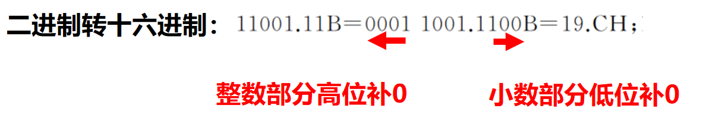

### 原码、补码、反码、移码
#### 原码
第一位是符号位，0表示正，1表示负
原码0有两种表示方法，+0和-0
直观方便但是需额外对符号位进行处理，不利于硬件设计。 

#### 补码
##### 主要思想：模运算
在一个模运算系统中，一个数与它除以“模”后的余数等价。
例如，时钟是一个模12的系统，12点和0点是等价的。
结论1：一个负数的补码等于模减该负数的绝对值。比如在模12系统中，-4的补码是8。
结论2：对于某一确定的模，数x减去小于模的数y，总可以用数x加上-y的补码来代替。

##### 补码的定义
正数：符号为0，数值部分是它本身
负数：模与该负数绝对值之差
假设补码有n位，模为$2^n$
一个负数的补码等于对应正数的补码**取反加1**

#### 反码
与补码相比的差异在于，负数的各位取反但末位不加1. (在计算机中很少被使用)

#### 移码
将每一个数值加上一个偏置常数
一般来说，当编码位数为n时，偏置常数为$2^{n-1}$
0的移码表示唯一，移码和补码只有第一位不同
主要用作浮点数的阶码，对阶方便

## 整数的表示
### 无符号整数
一个编码的所有二进位均表示数值而没有符号位时，称为无符号整数。
一般在全部是正数运算且不出现负值结果的场合下，使用无符号数表示。
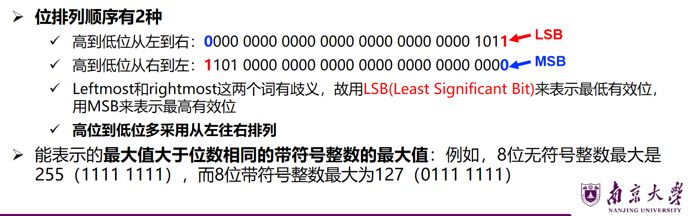

### 有符号整数
必须用一个二进位来表示符号，现代计算机中有符号整数都用补码表示
为什么用补码？
- 数0的表示唯一，方便使用；
- 与原码和移码相比，补码运算系统是模运算系统，加、减运算统一；
- 比原码和反码多表示一个最小负数；
- 与反码相比，不需要通过循环进位来调整结果

### 带符号整数与无符号数的比较
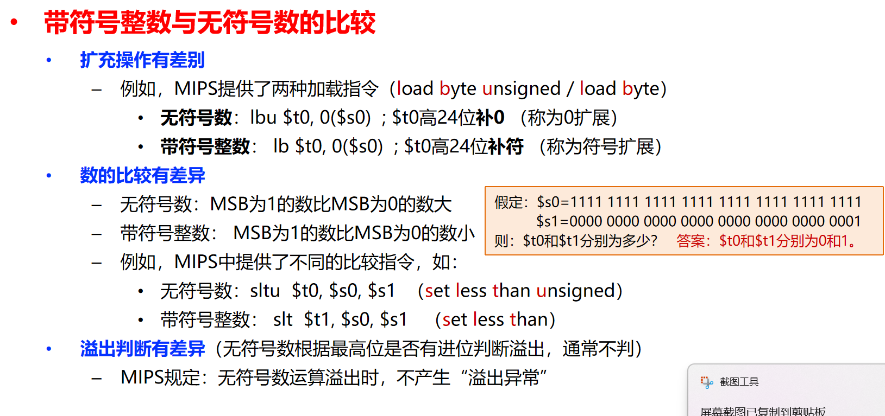
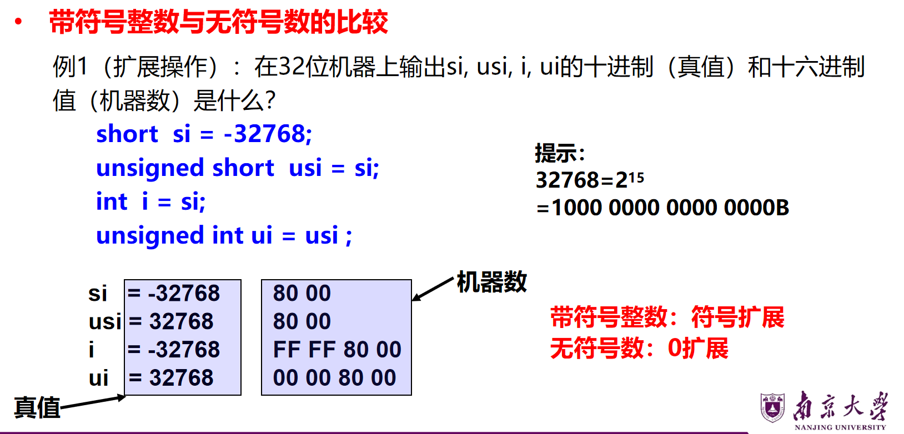

## 实数的表示
IEEE-754标准
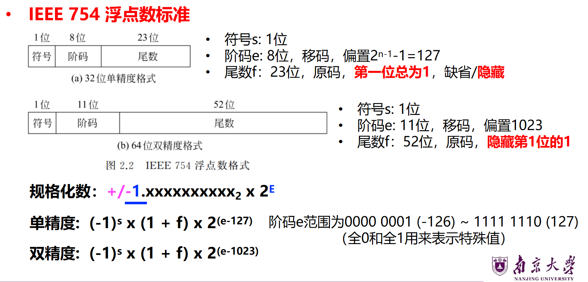
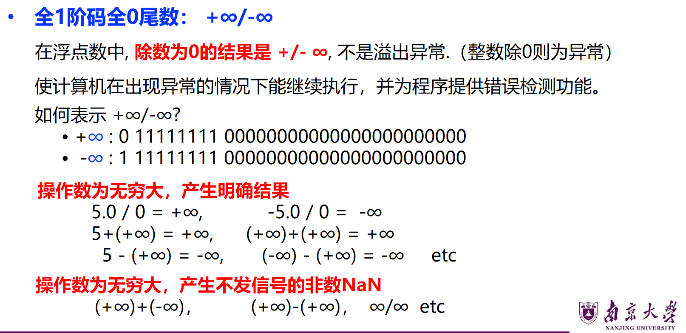
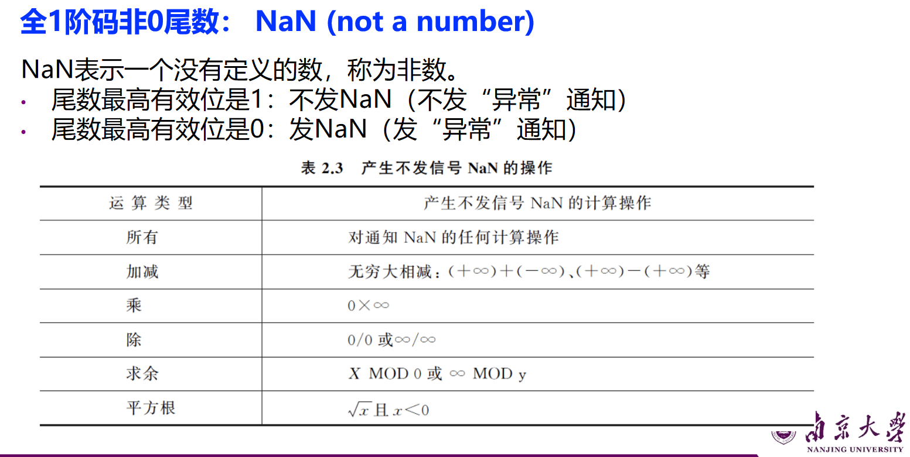

## 非数值数据的编码表示
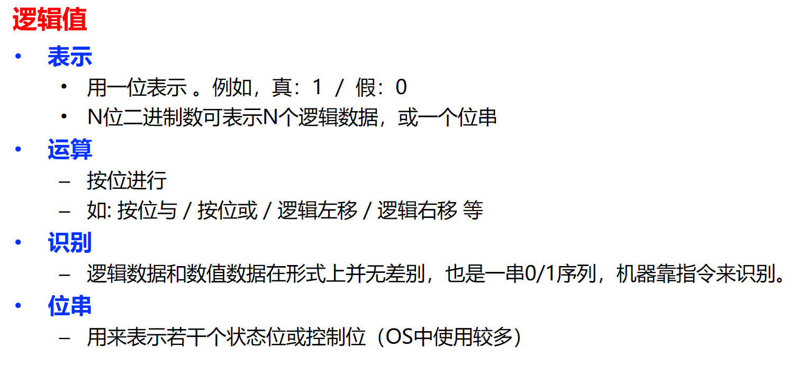
### 西文字符
ASCII码

### 中文字符
GB2312国标码的基础上产生汉字内码，每个中文字符用两个字节表示。
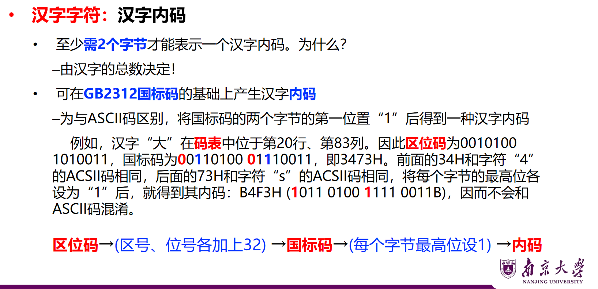

### 国际字符集
Windows系统中，采用Unicode码

### 字模点阵码和轮廓描述
为便于打印、显示汉字，汉字字形必须预先存在机内
- 字库（font）
- 不同字体，对应不同字库
从字库中找到汉字对应的字形信息，由内码反过来产生区位码

## 数据的宽度和存储
### 比特和字节
比特是最小单位(bit)，也叫位
字节是基本单位(byte), 1byte = 8bit
- 存储器按字节编址
- 字节是最小可寻址单位
- 如果以字节为一个单位，那么LSB表示最低有效字节，MSB表示最高有效字节
比如：ABCD1234, 是16进制，那么MSB是AB，LSB是34 因为16进制两位代表8个bit
字(word)也经常作为单位，可能由2个字节或4个字节或8个字节组成

### 字和字长
- `字(word)`：数据类型的宽度，表示被处理信息
- `字长(word length)`：定点运算数据通路的宽度，总线最多能同时传输的位数
字长会等于CPU内部总线的宽度、运算器的位数、寄存器的宽度
字和字长可以一样，也可以不同

### 主存、主频、带宽

容量用的是字节(B)，带宽用的是位(b)，注意区分大B和小b
有时也用kib表示2的幂次方，以此与10的幂次方加以区分

### 数据的存储和排列顺序
#### 如何根据一个地址取到一个32位的字？--字的存放问题
大端存储和小端存储，会涉及到访问的速度
大端方式：
- 数据的**高位**存放于起始地址，后面的字节依次存放
小端方式：
- 数据的**低位**存放于起始地址，后面的字节依次存放
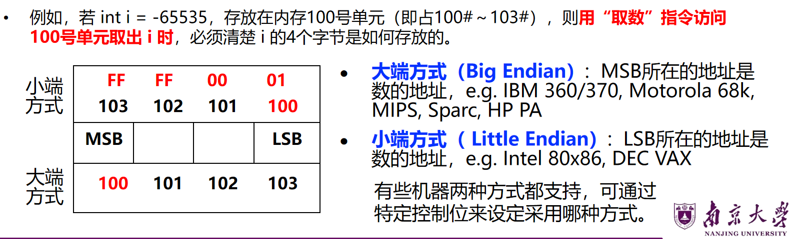
系统间通信，不同系统的字节序不同，需要进行顺序转换

#### 对齐--要求数据的地址是相应的边界地址
从哪个地址开始存？
两种方式：
- 按边界对齐
- 不按边界对齐，哪里空闲存哪里，但是可能会增加访存次数
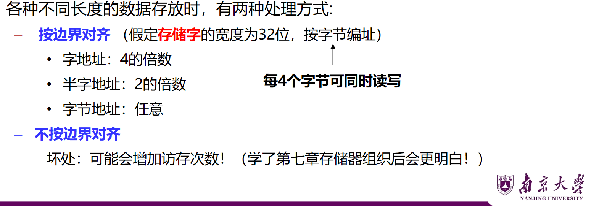
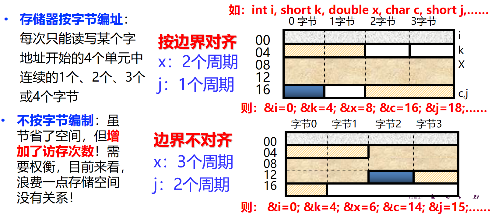
short型只填了一半，他只要是2的倍数就行，但是double必须从8开始，因为要在2个周期内把double型读完，double型占用8个字节。
char型1个字节，随便放，然后因为short j需要2个字节，需要从2的倍数开始存储。
而不按边界对齐，double型放在了三个周期内，显著增加访存次数。
