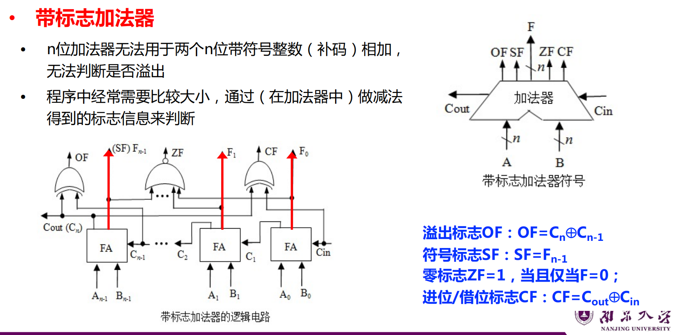
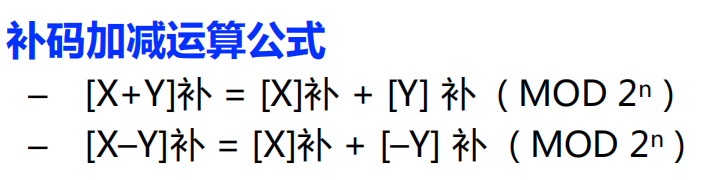
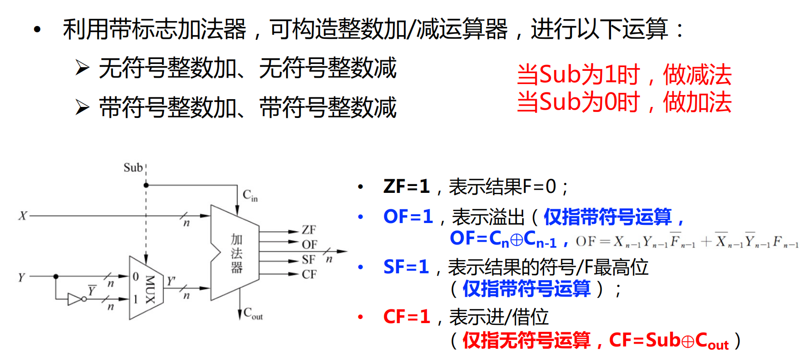
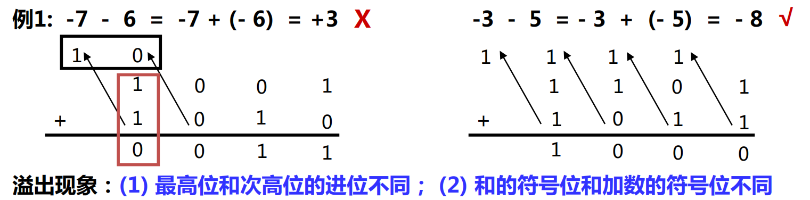
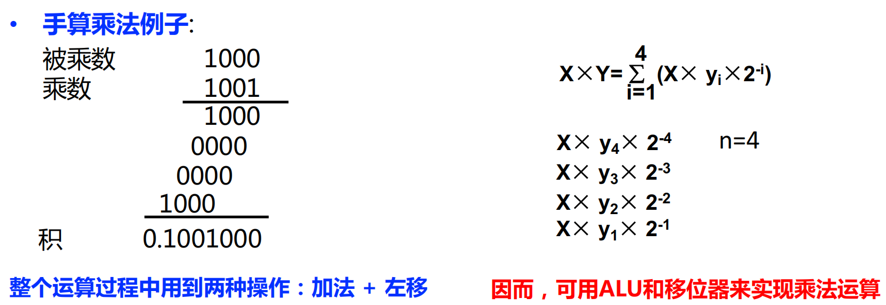
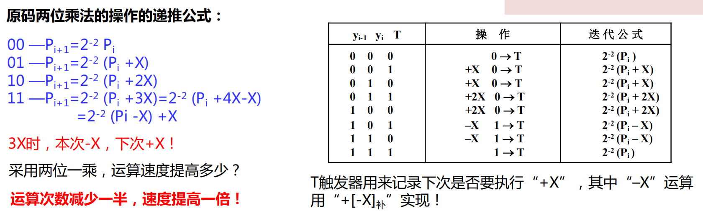
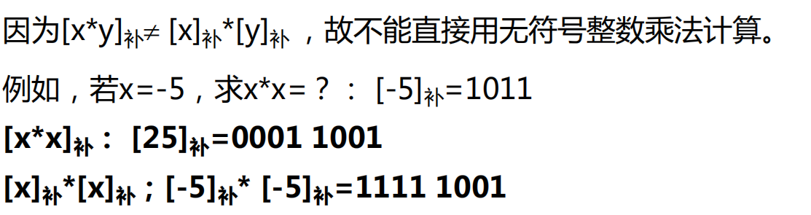

# Lec3：运算方法和运算部件
## 高级语言和机器指令中的运算
### C语言中的运算
- 算术运算
- 逻辑运算(针对关系表达式)
- 位运算(针对位操作)
- 移位运算（移出，补0，带符号整数右移时高位补符）
若无符号整数高位移出的是1，则溢出，有符号整数若移出的位不等于新的符号位，那么发生溢出。
- 位扩展和位截断（用类型转换实现）
截断：长数转为短数，高位丢弃，可能会发生溢出。
扩展：短数转为长数，高位补0或1，根据符号位判断。无符号数：高位补0；有符号数：高位补符号位

### MIPS指令中的运算
- 定点数运算
- 逻辑运算
- 浮点数运算

## 基本运算部件
### 全加器
$F_i = X_i \oplus Y_i \oplus C_{i-1}$
$C_{out} = X_iY_i + (X_i + Y_i)C_{i-1}$

### 串行进位加法器
进位按串行方式传递，速度慢，有时间延迟，要等待进位的延迟
假定进位时延是2ty，与门或门延迟1ty，异或门延迟3ty
那么从进位C0到Cn延迟时间是2n级门延迟
最后一位和的延迟时间是2n+1级门延迟

### 并行进位加法器
**先行进位方式**
定义两个辅助函数Gi和Pi
全加逻辑函数：$F_i = X_I \oplus Y_I \oplus C_{i-1}$
$C_{i+1} = X_iY_i + (X_i + Y_i)C_i = $
所有进位独立并同时生成，相当于每个Ci都是已知项，虽然提高了时间效率，但是逻辑部件的设计会很复杂

### 带标志加法器
涉及到正负的问题，需要考虑溢出的情况

### 算术逻辑部件
ALU：算术逻辑单元

## 定点数运算
### 补码加减运算

直接用ALU实现两个数的加运算（模运算系统）

由此可见，溢出有可能会导致得到错误的结果。

### 无符号数的乘法运算
通过手算乘法，我们可以知道只需要加法和左移运算就可以实现乘法

在计算机中，为了减少保存每次 $X\times y_i$ 结果的开销，采用部分积，称为$P_i$，部分积是当前所有i个 $X\times y_i$ 的和。
每次得到$X\times y_i$之后，将$P_{i-1}$右移一位，与$X\times y_i$相加，这样一来，每次运算始终对$P_i$的高n位操作，只需要n位加法器就可以实现两个n位二进制数的乘法运算。

对于乘数中为1的位，将部分积右移并且与被乘数相加，对于乘数中为0的位，直接将部分积右移一位。

### 原码乘法运算
用于浮点数尾数乘运算
符号与数值**分开处理**：积符用两个符号**异或**得到，数值用无符号乘法运算

这样的方法是**原码一位乘法**：每次只取乘数中的一位进行判断，需n次循环，速度相对较慢。
因此，我们介绍一个**原码两位乘法**运算：
对乘数的每两位取值进行判断，每步求出**对应两位的部分积**。

这样递归式有四种情况，对不同情况采用不同公式，注意3X的情况很特殊，本次-X下次+X的意思是先给本次的$P_i-x$之后移位，再在下一次计算中用到$P-{i+1}$的地方把X加上。
具体的可以看右边表格，当我们需要+3X的时候就转换成+4X-X，利用T这个辅助位来帮助我们判断要不要在算当前部分积的时候多加一个X。

### 补码乘法运算
对带符号整数的乘法运算

因为[A+B]补= [A]补+[B]补 ，只要将[x*y]补转换为对若干数的和求补即可

布斯算法：