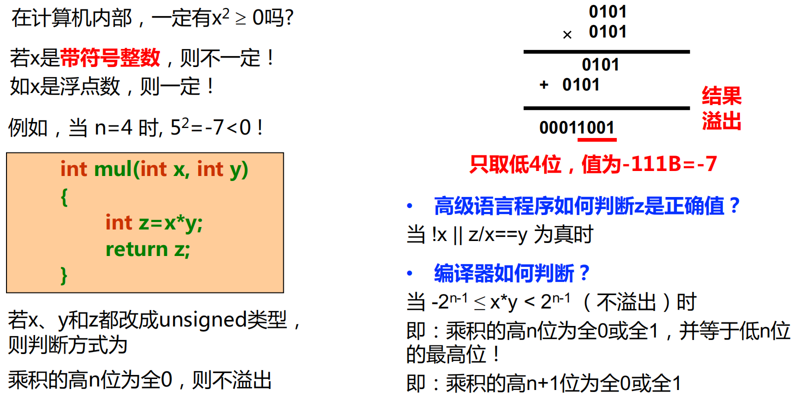

# Lec3：运算方法和运算部件
## 高级语言和机器指令中的运算
### C语言中的运算
- 算术运算
- 逻辑运算(针对关系表达式)
- 位运算(针对位操作)
- 移位运算（移出，补0，带符号整数右移时高位补符）
若无符号整数高位移出的是1，则溢出，有符号整数若移出的位不等于新的符号位，那么发生溢出。
- 位扩展和位截断（用类型转换实现）
截断：长数转为短数，高位丢弃，可能会发生溢出。
扩展：短数转为长数，高位补0或1，根据符号位判断。无符号数：高位补0；有符号数：高位补符号位

### MIPS指令中的运算
- 定点数运算
- 逻辑运算
- 浮点数运算

## 基本运算部件
### 全加器
$F_i = X_i \oplus Y_i \oplus C_{i-1}$
$C_{out} = X_iY_i + (X_i + Y_i)C_{i-1}$

### 串行进位加法器
进位按串行方式传递，速度慢，有时间延迟，要等待进位的延迟
假定与门或门延迟1ty，异或门延迟3ty，那么进位时延是2ty，输出延迟是6ty（2个异或门）
那么从进位C0到Cn延迟时间是2n级门延迟
最后一位和的延迟时间是2n+1级门延迟
因为只有进位会串行传递，而输出不会
延迟时间与位数n成正比，速度较慢

### 并行进位加法器
**先行进位方式**
定义两个辅助函数Gi和Pi
$G_i = X_iY_i$ 进位产生函数
$P_i = X_i + Y_i$ 进位传递函数
全加逻辑函数：$F_i = X_I \oplus Y_I \oplus C_{i-1}$
$C_{i+1} = X_iY_i + (X_i + Y_i)C_i = G_{i} + P_{i}C_i$
所有进位独立并同时生成，相当于每个Ci都是已知项，虽然提高了时间效率，但是逻辑部件的设计会很复杂
设n=4,则：$C_1=G_0+P_0C_0$
$C_2=G_1+P_1C_1=G_1+P_1G_0+P_1P_0C_0$
$C_3=G_2+P_2C_2=G_2+P_2G_1+P_2P_1G_0+P_2P_1P_0C_0$
$C_4=G_3+P_3C_3=G_3+P_3G_2+P_3P_2G_1+P_3P_2P_1G_0+P_3P_2P_1P_0C_0$
把实现上述逻辑的电路称为**4位先行进位部件**

### 带标志加法器
带符号整数（补码）的相加涉及到正负的问题，需要考虑溢出的情况
溢出实际上就是结果超出表示范围
要判断溢出，也就是将最后一位的进位C_n和倒数第二位的进位C_(n-1)进行比较，作为溢出符号
- 若C_n和C_(n-1)相同，则无溢出
- 若C_n和C_(n-1)不同，则发生溢出

### 算术逻辑部件
ALU：算术逻辑单元
核心电路是整数加/减运算部件，输出除和/差等，还有标志信息
有一个操作控制端（ALUop），用来决定ALU所执行的处理功能。ALUop的位数k决定了操作的种类例如，当位数k为3时，ALU最多只有$2^3=8$种操作

## 定点数运算
### 补码加减运算

直接用ALU实现两个数的加运算（模运算系统）

由此可见，溢出有可能会导致得到错误的结果。
在上面说的这两种情况下，可能会产生溢出

### 无符号数的乘法运算
通过手算乘法，我们可以知道只需要加法和左移运算就可以实现乘法

在计算机中，为了减少保存每次 $X\times y_i$ 结果的开销，采用部分积，称为$P_i$，部分积是当前所有i个$X\times y_i$ 的和。
每次得到$X\times y_i$之后，将$P_{i-1}$右移一位，与$X\times y_i$相加，这样一来，每次运算始终只对$P_i$的高n位操作，只需要n位加法器就可以实现两个n位二进制数的乘法运算，而低n位则用来保存移位的结果。
这个过程有很明显的递归性质，最终递归公式
$$P_i = 2^{-1}(P_{i-1} + y_{i-2} \cdot X)$$

对于乘数中为1的位，将部分积右移并且与被乘数相加，对于乘数中为0的位，直接将部分积右移一位，不用进行加法运算。

### 原码乘法运算
用于浮点数尾数乘运算
符号与数值**分开处理**：积符用两个符号**异或**得到，数值用无符号乘法运算
这样的方法是**原码一位乘法**：每次只取乘数中的一位进行判断，需n次循环，速度相对较慢。

因此，我们介绍一个**原码两位乘法**运算（对原码数值部分，符号部分仍用异或）：
对乘数的每两位取值进行判断，每步求出**对应两位的部分积**。

这样递归式有四种情况，对不同情况采用不同公式，注意3X的情况很特殊，本次-X下次+X的意思是先给本次的$P_i-X$之后移位，再在下一次计算中用到$P_{i+1}$的地方把X加上。
具体的可以看右边表格，当我们需要+3X的时候就转换成+4X-X，利用T这个辅助位来帮助我们判断要不要在算当前部分积的时候多加一个X。

这个是具体的例子，我们把整个PY的部分当成一个长的bit串，每次右移两位的时候相当于把Y的最低两位移出了
T为1的时候表示要加一个X，比如$y_3y_4$的时候因为T是1，所以要加2X
在这个例子中我们可以理解到，P的高n位是用来存储部分积的，低n位是用来存储移位的结果的，最终乘积的结果是P的全部位
最后Y全部移出了，剩下一个T的0

### 补码乘法运算
对带符号整数的乘法运算

因为[A+B]补= [A]补+[B]补 ，只要将[x*y]补转换为对若干数的和求补即可

布斯算法：首先对于乘法$X\times Y$，Y是乘数，X是被乘数
Y的补码可以表示为$Y=y_{n-1}y_{n-2}\dots y_1y_0$
由补码的定义可以知道，Y的十进制值为$Y = -y_{n-1}2^{n-1} + y_{n-2}2^{n-2} + \dots + y_12^1 + y_02^0$
因为最高位是符号位，这一项要取负的，其他是数值位，都是正的

引入辅助位$y_{-1}=0$，那么Y就可以表示成：
$$
Y = -y_{n-1}2^{n-1} + (y_{n-2}2^{n-1}-y_{n-2}2^{n-2}) + \dots + (y_12^2-y_12^1) + (y_02^1-y_02^0) + y_{-1}2^0
$$
通过变形，以n=32为例，我们可以得到：
$$
Y = -y_{31}2^{31} + (y_{30}2^{31}-y_{30}2^{30}) + \dots + (y_12^2-y_12^1) + (y_02^1-y_02^0) + y_{-1}2^0
$$
$$
Y = (y_{30}-y_{31})2^{31} + (y_{29}-y_{30})2^{30} + \dots + (y_0-y_1)2^1 + (y_{-1}-y_0)2^0
$$
现在，每一项都变成了 $(y_{i-1}-y_i)2^i$ 的形式，其中i取值是0到31

接下来我们推导$X\times Y$的补码表达式，为了便于迭代我们在左右两边同时乘以$2^{-32}$:
$$
2^{-32}\times[X\times Y] = (y_{30}-y_{31})2^{-1} X + (y_{29}-y_{30})2^{-2} X + \dots + (y_0-y_1)2^{-31} X + (y_{-1}-y_0)2^{-32} X
$$
观察这个式子，每一项之间是有关系的，由此我们可以得出部分积公式：
$$P_i = 2^{-1}(P_{i-1} + (y_{i-1} - y_i) \cdot X)$$

这样，当i等于31时，我们就得到了$P_{31}$，即$X\times Y$的低32位。

越往左，Y的标号越大，每次我们判断是小减大也就是右边的位减去左边的位，分四种情况，如上图所示

在计算过程中，我们不断右移Y，每次移1位，对Y的低2位进行判断，对Y右移的同时也要右移部分和，如此得到最后的部分积P
但是在这个例子中，我们可以发现答案不对，因为发生了溢出，4位是不够的
如何判断是否发生溢出？通常我们用双倍长度储存结果，比如4位乘4位，结果需要8位来储存，避免溢出
我们先计算出结果，是11101110，由于前4位并不全是1或0，说明前4位参与了数值的计算，也就是说如果用4位表示这个数会发生溢出
而前三位都是1，说明前三位参与了数值的计算，那么如果我们用5位表示这个数，就不会溢出（不算符号位）

### 补码两位乘法

这里的$y_{-1}$相当于我们前面原码两位乘法的T，就是辅助位

### 快速乘法器

### 除法运算

手算除法如上图所示，计算机里面我们会先做预处理：
若被除数=0且除数≠0，或定点整数除法时|被除数|<|除数|，则商为0，不再继续
若被除数≠0、除数=0，则发生“除数为0”异常

两个n位数相除的情况：
(1)定点正整数（即无符号数）相除：在被除数的高位添n个0
(2)定点正小数（即原码小数）相除：在被除数的低位添加n个0
这样，就将所有情况都统一为：**一个2n位数除以一个n位数**

R的前四位是被除数的高4位，后四位是被除数的低4位
每次运算先减去除数，如果结果为负，商位0，并且把这个除数加回来，然后左移一位，进行下一轮运算
如果结果为正，商位1，左移，继续运算
这样到最后R的前四位是除法的余数，后四位是商

**不恢复余数**除法（加减交替法）：在下一步运算时把当前多减的除数补回来

#### 带符号数除法
##### 原码除法
商符和商值分开处理：
• 商的数值部分由无符号数除法求得
• 商符由被除数和除数的符号确定：同号为0，异号为１，**余数的符号同被除数的符号**

##### 补码除法
方法1：同原码除法一样，先转换为正数，先用无符号数除法，然后修正商和余数。
方法2：直接用补码除法，符号和数值一起进行运算，商符直接在运算中产生。

若是两个n位补码整数除法运算，则被除数进行符号扩展，否则可能溢出
若被除数为2n位，除数为n位，则被除数无需扩展。

## 整数乘除运算

## 浮点数运算
### 浮点数加减运算

“对阶”操作：目的是使两数阶码相等
- 小阶向大阶看齐，阶小的那个数的尾数右移，右移位数等于两个阶码差的绝对值
- IEEE 754尾数右移时，要将隐含的“1”移到小数部分，高位补0，移出的低位保留到特定的“附加位”上

一些小问题：

### 浮点数运算的精度和舍入
在浮点数运算中，保留多少附加位才能保证运算精度？ 无法给出准确答案！
保留附加位可以得到比不保留附加位更高的精度。

IEEE754的舍入方式：

### 浮点数乘除运算

