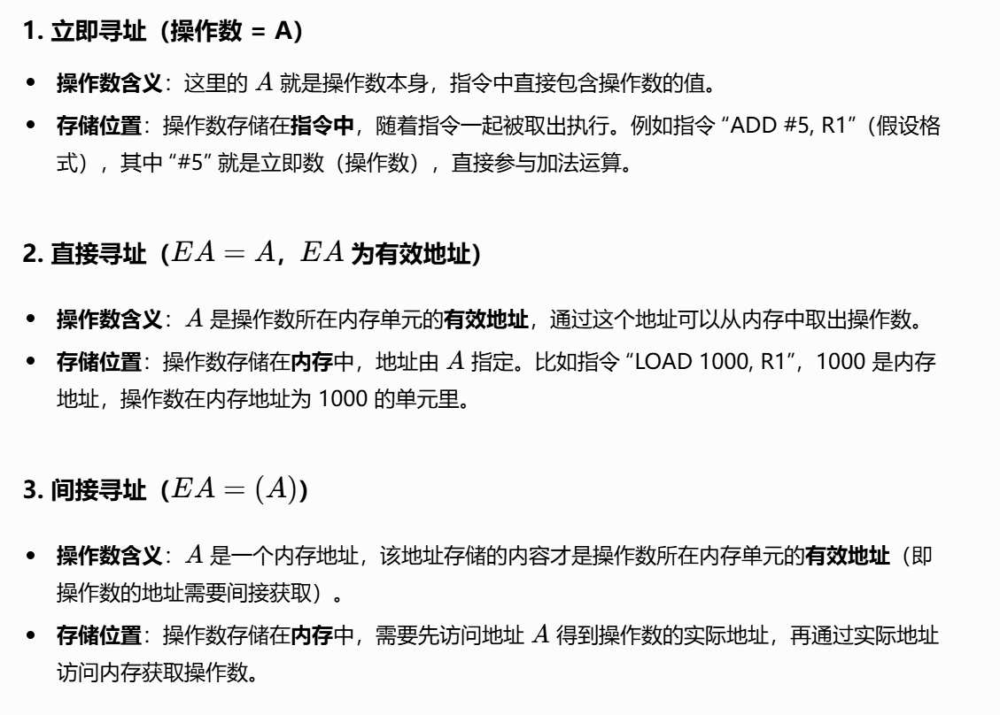

# Lec4: 指令系统
## 指令格式设计

指令系统处在**软/硬件交界面**，能同时被硬件设计者和系统程序员看到

一条指令必须包含：
- 操作码
- 源操作数或者地址
- 结果的地址
- 下条指令的地址（PC）

一条指令中有几个地址码字段？
- 零地址指令：如空操作，停机等
- 一地址指令：如取反等
- 二地址指令：双目运算
- 三地址指令：双目运算，还有一个存放结果的地址
- 多地址指令：如三目运算等

指令执行周期：

## 指令系统设计

### 操作数类型
操作数是指令处理的对象，与高级语言数据类型对应，基本类型有：
- 指针或地址：被看成无符号整数，用来参加运算以确定主(虚)存地址
- 数值数据：定点数，浮点数，十进制数
- 位、位串、字符和字符串

### 寻址方式
指令或操作数地址的指定方式，即：根据地址找到指令或操作数的方法。

通常寻址方式特指**操作数的寻址**
指令的寻址简单，要么是PC增值，要么是跳转，跳转的情况和操作数的寻址是一样的
因此我们主要关注操作数的寻址，也相对复杂。

有效地址：操作数所在**存储单元的地址**（可能是逻辑地址或物理地址），可通过指令的**寻址方式和地址码**计算得到

假设一条指令：OP R A ...
EA=有效地址，A=地址字段值（地址码），R=寄存器编号

对于间接寻址，A中的内容也是一个地址，记为(A), 把这个地址给EA
寄存器寻址，是操作数即为寄存器R中存的内容
寄存器间接寻址：EA=(R)，R中存的不再是操作数而是一个地址
偏移寻址，最常用的寻址方式，EA=A+(R)，A为地址码，R为寄存器编号

三种偏移寻址方式

相对寻址实现公共子程序的浮动：与用户程序的地址无关，不管浮动到哪里，总是实现公共子程序的调用
相对寻址实现相对转移：PC=PC+A，A为地址码，PC为当前指令的地址

基址寻址实现程序重定位
变址寻址实现线性表元素的存取

### 操作类型

### 操作码编码
两种方式：
- 定长操作码编码：操作码长度固定，如RISC指令系统
- 扩展操作码编码：操作码长度根据操作数的不同而变化，如CISC指令系统

#### 定长操作码编码
指令的操作码部分采用固定长度的编码，比如RISC指令系统的操作码长度为6位，那么最多可以表示64种指令
译码方便，但有**信息冗余**