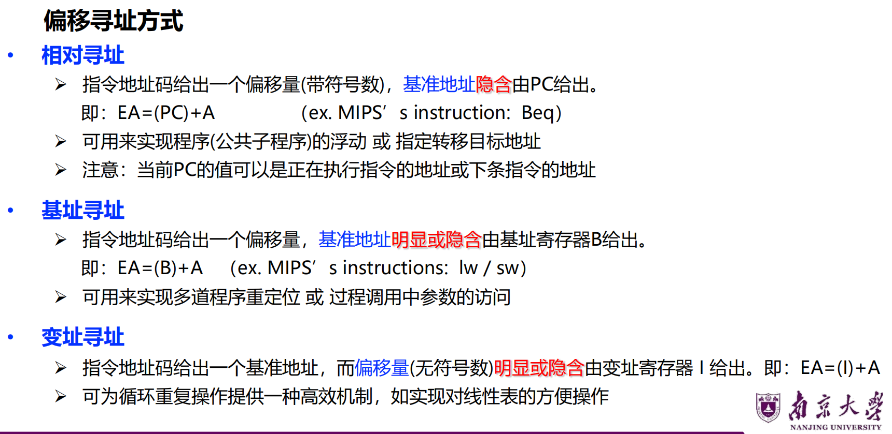

# Lec4: 指令系统
## 指令格式设计

指令系统处在**软/硬件交界面**，能同时被硬件设计者和系统程序员看到

一条指令必须包含：
- 操作码
- 源操作数或者地址
- 结果的地址
- 下条指令的地址（PC）

一条指令中有几个地址码字段？
- 零地址指令：如空操作，停机等
- 一地址指令：如取反等
- 二地址指令：双目运算
- 三地址指令：双目运算，还有一个存放结果的地址
- 多地址指令：如三目运算等

指令执行周期：

## 指令系统设计

### 操作数类型
操作数是指令处理的对象，与高级语言数据类型对应，基本类型有：
- 指针或地址：被看成无符号整数，用来参加运算以确定主(虚)存地址
- 数值数据：定点数，浮点数，十进制数
- 位、位串、字符和字符串

### 寻址方式
指令或操作数地址的指定方式，即：根据地址找到指令或操作数的方法。

通常寻址方式特指**操作数的寻址**
指令的寻址简单，要么是PC增值，要么是跳转，跳转的情况和操作数的寻址是一样的
因此我们主要关注操作数的寻址，也相对复杂。

**有效地址**：操作数所在**存储单元的地址**（可能是逻辑地址或物理地址），可通过指令的**寻址方式和地址码**计算得到

假设一条指令：OP R A ...
EA=有效地址，A=地址字段值（地址码），R=寄存器编号，EA=有效地址

立即寻址：立即数A即为操作数
直接寻址：A为操作数的地址，EA=A
间接寻址：A中的内容也是一个地址，把A中的内容记为(A), 把这个地址给EA
寄存器寻址，是操作数即为寄存器R中存的内容
寄存器间接寻址：EA=(R)，R中存的不再是操作数而是一个地址
偏移寻址，最常用的寻址方式，EA=A+(R)，A为地址码，R为寄存器编号，A的地址加上一个偏移量，得到有效地址
分为三种：

相对寻址实现公共子程序的浮动：与用户程序的地址无关，不管浮动到哪里，总是实现公共子程序的调用
相对寻址实现相对转移：PC=PC+A，A为地址码，PC为当前指令的地址

基址寻址实现程序重定位，基址不同，程序可以放在内存的不同位置运行
变址寻址实现线性表元素的存取，比如取数组元素

### 操作类型

### 操作码编码
指令字 = 操作码 + 地址码
两种方式：
- 定长操作码编码：操作码长度固定
- 扩展操作码编码：操作码长度根据操作数的不同而变化

#### 定长操作码编码
指令的操作码部分采用固定长度的编码，比如RISC指令系统的操作码长度为6位，那么最多可以表示64种指令
译码方便，但有**信息冗余**
指令字：操作码+地址码
代码长度更重要时：采用变长指令字、变长操作码
性能更重要时：采用定长指令字、定长操作码
也有可能是定长操作码，变长指令字

#### 变长操作码编码
将操作码的编码长度分成**几种固定长的格式**。
等长扩展法：4-8-12；3-6-9；…... / 不等长扩展法

对于零地址指令，前10位中还有30种可以用，后6位能产生$2^6=64$种指令，所以乘起来一共能表示$30 \times 64$种指令

### 异常和中断处理机制
- 中断（Interrupt）：是CPU 外部的**硬件事件**引发的，属于外部请求，是**异步**的（和 CPU 当前执行的指令无关，随机发生）。
- 异常（Exception）：是CPU 内部的**软件事件**引发的，属于内部故障/内陷，是**同步**的（和 CPU 当前执行的指令紧密相关，执行某条指令时必然触发）。

异常/中断处理分两个阶段
- 检测和响应：由硬件完成
- 具体处理：由软件（操作系统）执行程序完成

发生异常(exception)和中断(interrupt)事件后，系统将进入OS**内核态**对相应事件进行处理，即改变处理器状态（用户态→内核态）

## 程序的机器级表示
### MIPS汇编语言和机器语言
MIPS有三种指令格式：
- R型指令：寄存器类型指令，两个操作数和结果都在寄存器
- I型指令：立即数类型指令，运算指令：一个源寄存器、一个立即数，还有LOAD/STORE指令：一个源寄存器和一个内存地址偏移量，还有条件分支指令
- J型指令：跳转类型指令，无条件跳转指令

以每条指令的地址都是4的倍数，最后两位为0，所以可以只用26位来表示地址，实际地址=指令地址的高4位+地址字段左移2位
寻址方式由指令格式来确定，而指令格式由op来确定。
J型指令是伪直接寻址，因为跳转地址不是直接给出的，而是通过指令地址的高4位和地址字段加上2位0计算得到的。

### 选择结构与循环结构的表示

选择结构，用beq和bne实现条件转移

注意看这个里面是怎么取数组元素的
int元素4字节，数组下标i乘以4就是偏移量
偏移量加上数组首地址就是元素地址
然后用lw指令取出元素

### 过程调用
执行步骤(P调用Q)：
1. 将**参数**放到Q能访问到的地方
2. 将P中的**返回地址**存到特定的地方，将控制转移到过程Q
上面两个部分在调用过程P中完成，下面四个部分在被调用过程Q中完成
3. 为Q的局部变量分配空间（局部变量临时保存在**栈**中）
4. 执行过程Q
5. 将Q执行的**返回结果**放到P能访问到的地方
6. 取出返回地址，将控制转移到P，即返回到P中执行

MIPS中过程调用的指令：jal (jump and link)，jal指令将下一条指令的地址（返回地址）保存在寄存器$ra（31号寄存器）中，然后跳转到被调用过程的地址，执行完被调用过程后，返回语句是用jr $ra指令返回到返回地址

\$ra(\$31)寄存器专门用来保存返回地址
如果过程中用到的参数超过4个（\$a0-\$a3存放参数），返回值超过2个（\$v0-\$v1存放返回值），怎么办？
更多的参数和返回值要保存到存储器的特殊区域中，这个特殊区域为：**栈**(Stack)
一般用“栈”来传递参数、保存返回地址，并用来临时存放过程中的局部变量等。为什么？
- 便于嵌套或递归调用！

MIPS中栈的实现
– 用栈指针寄存器$sp来指示栈顶元素
– 每个元素的长度为32位，即：一个字(4个字节)
– “入栈” 和“出栈” 操作用 sw/ lw指令来实现，需用add / sub指令调整$sp的值
– 栈生长方向，从高→低地址“增长”，而栈的每个元素内部，取数/存数的方向是低→高地址（大端方式）

各过程有自己的栈区，称为**栈帧**，即**过程的帧**
每个栈帧用专门的**帧指针**指定起始位置，MIPS中的帧指针寄存器是\$fp
当前栈帧范围在帧指针\$fp和栈指针\$sp指向区域之间。
程执行时，由于不断有数据入栈，所以栈指针会动态移动，而**帧指针固定不变**。

假定过程P调用过程Q，则在调用过程P中入栈保存的信息称为**调用者保存信息**，存放在过程P的栈帧中；在被调用过程Q中入栈保存的信息称为**被调用者保存信息**，存放在Q的栈帧中，也就是当前栈帧。

举例！
在这个例子里面，因为我们的调用过程内部要用到\$ra，\$s2，\$s3这三个寄存器，所以在调用过程P中要把这三个寄存器的值入栈保存起来，等调用过程P调用完被调用过程Q返回后，再把这三个寄存器的值从栈中取出来恢复。
入栈就用sw，出栈就用lw恢复。
