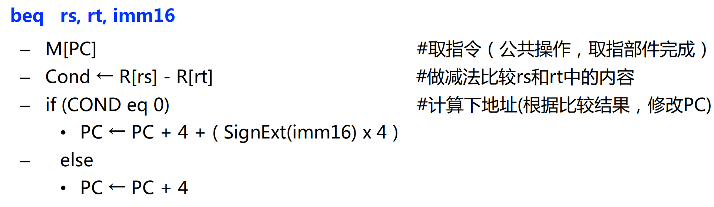

# Lec5: 中央处理器
## CPU概述

CPU执行指令的过程：取指、译码、执行、回写
取指令一定在最开始做，然后在执行之前译码

异常是CPU内部发生，中断是外部事件引起

### CPU基本组成

CPU包含：
- 数据通路(执行部件) 
- 控制器（控制部件）

#### 控制器
对指令进行**译码**，生成指令对应的**控制信号**，控制数据通路的动作。能对执行部件发出控制信号，是指令的**控制部件**

#### 数据通路
指令执行过程中，数据**所经过的路径，包括路径中的部件**。它是指令的**执行部件**。

数据通路是由操作元件和存储元件通过**总线方式或分散方式**连接而成的进行数据存储、处理、传送的路径。
数据通路由组合逻辑元件（操作元件）和时序逻辑元件（状态元件，存储元件）组成
- 组合逻辑元件与时钟信号无关，直接进行操作
- 时序逻辑元件受时钟信号控制，时钟信号到来时状态改变，写入元件状态；未到来时就可以存储

数据通路的功能就是进行数据存储、处理和传送。

##### 操作元件
比如加法器、多路选择器、ALU、译码器等等
组合逻辑元件的特点：
- 其输出只取决于当前的输入。即：**若输入一样**，则其输出也一样
- 定时：所有输入到达后，经过一定的逻辑门延时，输出端改变，并保持到下次改变，**不需要时钟信号来定时**

##### 状态元件
具有**存储功能**，在时钟控制下输入被写到电路中，直到下个时钟到达，输入端状态**由时钟决定何时被写入**，输出端状态**随时可以读出**

定时方式：规定信号何时写入状态元件
通常采用**边沿触发**方式

最简单的状态单元：
- D触发器：一个时钟输入、一个状态输入、一个状态输出

这是一个D触发器例子，D读取，Q输出
输入D的数据要在时钟到达之前就稳定，在到达之后也要保持一段时间稳定，在Clock-to-Q之后Q的值和D保持一致
因此是有延迟存在的

状态元件通常有寄存器和存储器两种
- 寄存器：有一个写使能信号（WE），当他是0的时候时钟边沿到来但是输出不变，如果是1那么输出开始变为输入，如果每个时钟边沿都写入就不需要WE
- 寄存器组：两个读口，一个写口，RA，RB和RW都是寄存器的地址，busA和busB是其中的内容

取数时间并不是锁存延迟，而是寄存器组的延迟
RW选择的寄存器会置为1，这样他和输入的busW进行与操作之后就可以知道哪一个是指定的寄存器

- 存储器：有一个Data out，一个Data in，一个地址 address
- 读操作：地址address有效之后，经过取数时间，data out上的数据变为有效
- 写操作：写使能信号为1，时钟边沿到来，data in传来的值写入address指定的存储单元中

### 现代计算机的时钟周期
什么是指令周期？ 取并且执行一条指令的时间

那么什么是时钟周期？
一个下降沿（上升沿）到下一个下降沿（上升沿）的时间
在时钟周期之中，经过锁存时间，状态元件读入数据，操作元件进行运算，再传递到下一个状态元件，这之中是没有时钟控制的
因此时钟周期=锁存延迟+最长传输延迟+建立时间（setup）+时钟偏移

约束条件：存延迟+最短传输延迟-时钟偏移 必须大于保持时间，才可以保证数据在时钟边沿到来时保持稳定 最小最小要大于保持时间

## 单周期处理器设计

处理器设计涉及到**数据通路**的设计和**控制器**的设计
对MIPS的三种指令格式，要实现对应的数据通路，用RTL表示

### 加法指令

先从PC所指的内存单元中取出这个指令，然后从rs和rt指的寄存器中取数之后相加
如果结果不溢出，就存进rd所指的寄存器中
最后PC+4，使得他指向下一条指令
RTL主要是描述数据通路的行为，表示相应的立即数或者寄存器

### 装入指令

### 取指令部件
1760598607450.png

每条指令都有的公共操作：取指令和PC+4，如果指令里面有修改PC的值就直接更新，因此不能先更新PC之后取指令
下地址计算的逻辑部件会更新PC，在下一个时钟边沿触发的时候更新
如果是分支或者跳转指令，就不是PC+4，下地址逻辑部件就会计算相应的PC值

### 数据通路的设计
注意，所有图中的线路都是有数据的，而不是说没有数据，所以我们通过**多路选择器**来选择符合我们当前指令的功能的值，并且参与执行
因此，多路选择器的选择通过一些**控制信号**来决定，每种指令的控制信号是什么，我们要搞清楚。
#### 加法和减法指令（R型）
不考虑公共操作先，只考虑指令执行阶段

先不看粉红色的线，RegWr是写使能信号，如果是1就把busW写入rd指的寄存器中
黑色的线就是R型指令的数据通路
ALUctr是ALU的控制信号，用来选择ALU的操作，比如我可以选ALUctr=add ctr是control

#### 带立即数的逻辑指令（ori指令）

注意，这里的立即数是零扩展而不是符号扩展！

黑色的线就是刚才R型的数据通路，需要增加蓝色部分来支持逻辑运算
都是通过多路选择器来实现选择
RegDst是选择写回的寄存器，0是写回rd，表示R型指令，1是写回rt，表示ori型指令
ALUctr是ALU的控制信号，用来选择ALU的操作，比如我可以选ALUctr=or
ALUSrc是选择ALU的第二个操作数，0是从busB取数，1是从立即数取数

#### 访存指令中的数据装入指令 (lw指令)

注意这里是立即数符号扩展

再加入蓝色部分，在支持R和ori指令基础上添加
MemWr是存储器写使能信号，0是不写，1是写
ExtOp取0表示0扩展，1表示符号扩展
存储器只进行读操作，所以他的写使能信号必须始终是0
从memory里面读数据，MemtoReg选1表示选择来自存储器的数据写入busW当中
在存储器里面的Adr是通过加运算得到的，可以看lw指令的具体含义

#### 访存指令中的存数指令 (sw指令)

与lw相反，lw是从内存单元取内容存到寄存器，sw是把寄存器rt中的内容存到内存单元中

只需要再多加一条线就可以支持sw了（没有经过多路选择器，只是图画不下了）
把rt的内容通过busB读出来然后写入存储器（memory）
RegDst=x的意思是0或者1都可以，不影响，因为我不管他那边的输出是哪个寄存器
RegWr必须等于0，不允许busW改变
MemWr必须等于1，允许对memory进行写操作

#### 分支（条件转移）指令（beq指令）

如果rs和rt里面存的数相等就跳到立即数表示的地址，否则下一条指令

在原来的基础上，再添加蓝色部分。存储器因为画不下就没画，但是实际上还是存在的

busA和busB分别读出rs和rt，ALU计算判断是不是等于0，然后由下地址逻辑部件计算出下一个新的PC，再送到PC当中
如果Zero输入是0，代表不是Zero，那就直接PC+4，指向下一条指令
这个时候写使能信号都为0，ALUctr=subu，注意Branch=1因为是一个分支指令

##### 下地址计算逻辑
PC是一个32位地址，每次都是+4，那么每个地址的后两位都是00
所以每个PC都可以用30位表示，后面跟两个00就行了，这样计算逻辑更加简单

那么下地址计算的逻辑部件就如上所示
Mux取1就代表要计算branch指令的结果是PC值，需要Branch信号为1，并且Zero信号为1，
为什么不用ALU而用Adder是因为只执行一种加法操作，不需要ALU的其他功能

#### 无条件跳转（j指令）

只有target这26个比特的范围内变化跳转，前四个比特必须不变，最后两个一定是00
所以他只能在这个范围内跳转，是绝对寻址

新增蓝色线部分，支持j指令
把当位的4个比特和target的26个比特拼接起来，Jump信号为1说明选择了刚才拼接的30个比特，然后返回给PC更新
Branch和Jump信号不会同时为1

**所有写使能信号只要跟他没关系，必须置为0**

这样，所有数据通路就设计好了

### 单周期数据通路的控制器设计
设计方法：
1) 根据每条指令的功能，分析**控制信号的取值**，并在表中列出。
2) 根据列出的指令和控制信号的关系，写出每个**控制信号的逻辑表达式**

R型指令，每个控制信号赋什么值？

所有的写使能信号一定看他和指令有没有关系
MemWr就没关系，一定要置为0

最后阶段，执行PC+4，除了Branch和Jump指令以外，这个部分都是这样的

经过锁存时间，读入PC的值，然后取指令，经过各种取数时间和延迟之后，经过setup时间，写回目标寄存器，然后更新PC

ori指令，每个控制信号赋什么值？

R型指令写入Rd寄存器，而i型指令写入Rt寄存器，因此RegDst=1

load指令：

从存储器读内容存入Rt当中

store指令：

branch指令：

注意，在branch指令的最后阶段，取指部件会计算下一个PC的值

此时通过红色的路线来计算下一个PC的值，然后更新PC
注意Zero不是我设置的控制信号，而是ALU的输出信号，用来判断是否相等，如果相等那说明差是0，Zero是1

jump指令：

同样的计算下一个PC的值并且更新PC

控制器实际上由主控制单元和ALU局部控制单元组成
主控制单元产生ALUop，也就是当前的指令操作类型
然后ALU局部单元来确定对应的要加还是减或者其他的
最后得到一个ALUctr
如果是R型指令，ALUctr要取决于func字段
如果不是，那么ALUctr就直接等于ALUop

ALUop在4种到8种指令之间，因此至少有3个bit

ALUop的逻辑表达式

lw和sw在ALU里面都是用加法得到地址，因此ALUop是一样的，表示他们的运算类型是一样的

ALUop第2位的比特，只有beq的时候才取1，这种情况对应的op操作码是beq的op=000100，这个时候ALUop的第2位如果是1应该是由op的6、5、4、3、1、0这几个位取反，再和第2位一起与运算，如果是1那么ALUop的第2位就取1，否则取0

同样的我们可以得出ALUop其他位的逻辑表达式

ALU局部控制器的逻辑表达式

对照表就可以得到ALUctr的逻辑表达式

这样，ALU的运算就可以全部转换为跟操作码op相关的表示
