# Lec6: 指令流水线
## 流水线概述
如果将指令的每个阶段看成相应的**流水段**，则指令的执行过程构成了**一条指令流水线**

当后一条指令的第i步与前一条指令的第i+1步**同时进行**，可以使一串指令总的完成时间大为缩短。
理想情况下，每个时钟都有一条指令进入流水线，每个时钟周期都有一条指令完成，每条指令的时钟周期数（即CPI）都为1。

Load指令的流水线：

如此可以大大提高吞吐性能

适合流水线的指令集特征：
- 长度尽量一致,有利于简化取指令和指令译码操作
- 格式少，且源寄存器位置相同,有利于在指令未知时就可取操作数
- load / Store指令才能访问存储器,有利于减少操作步骤，规整流水线
- 内存中对齐存放,有利于减少访存次数和流水线的规整

## 流水线处理器的实现
R型指令：

整个过程，是不涉及memory的操作的，所以加一个空的Mem字段来使得流水线更加规整

Store指令：

不涉及写的操作，所以加一个空的Wr

Beq指令：

写阶段是空的。
按照上述方式，把所有指令都按照**最复杂的**“load”指令所需的五个阶段来划分，不需要的阶段加一个“NOP”操作（空）

J指令：

流水线的数据通路图：

### 取指令阶段

先从PC里面取出指令，到IUnit，涉及到两个功能：取出指令和PC+4

### 译码/取数阶段

已经取出相关信息之后，指令就不需要再保存了

### 执行阶段

执行部件，设计如下：

通过不同的控制信号，实现不同类型指令的功能
什么时候符号扩展，什么时候零扩展？
但凡是算术运算的时候，一定用符号扩展！Extop信号要为1
如果是逻辑运算，立即数的扩展都采用零扩展，Extop为0

### Mem阶段

### Wr阶段

### 流水线中的控制信号
在译码/取数阶段产生该指令的控制信号
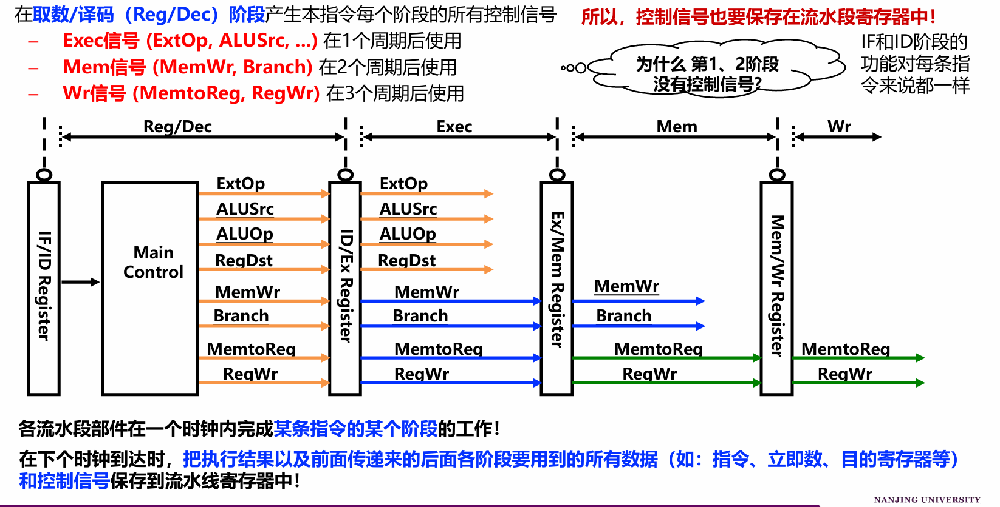
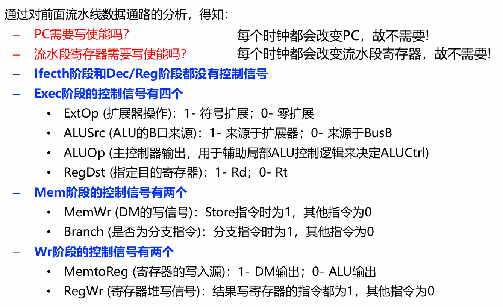

## 流水线冒险及其处理
冒险(Hazards)：指流水线**无法正确执行**后续指令或**执行了不该执行**的指令
- 结构冒险：硬件资源冲突，**同一个部件同时被不同指令所使用**。设计多个部件，避免冲突，比如指令存储器IM和数据存储器DM分开
- 数据冒险：后面指令用到前面指令结果数据时，前面指令的结果还没产生。
- 控制冒险：转移或异常改变执行流程，后继指令在目标地址产生前已被取出。

### 结构冒险
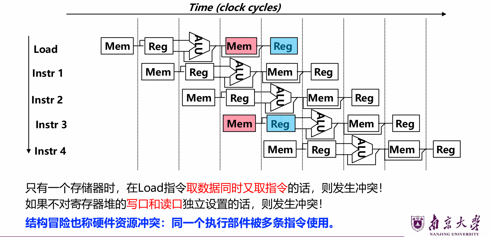
比如这里就同时用了Mem和Reg
取指令和访问主存的数据都需要访问Memory，如果是同一个存储器就会冲突
而且Reg也被同时用了
解决方法：
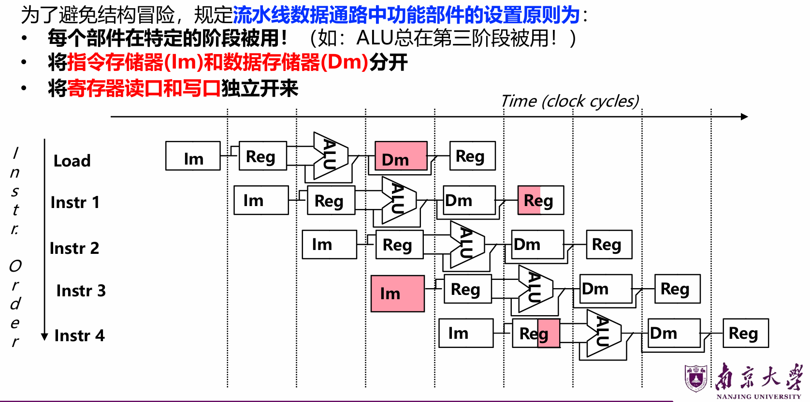

### 数据冒险
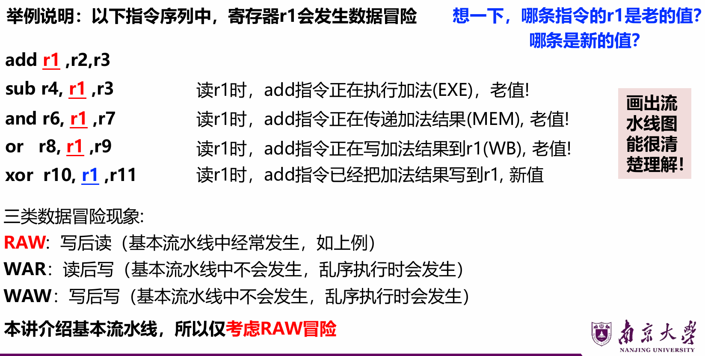
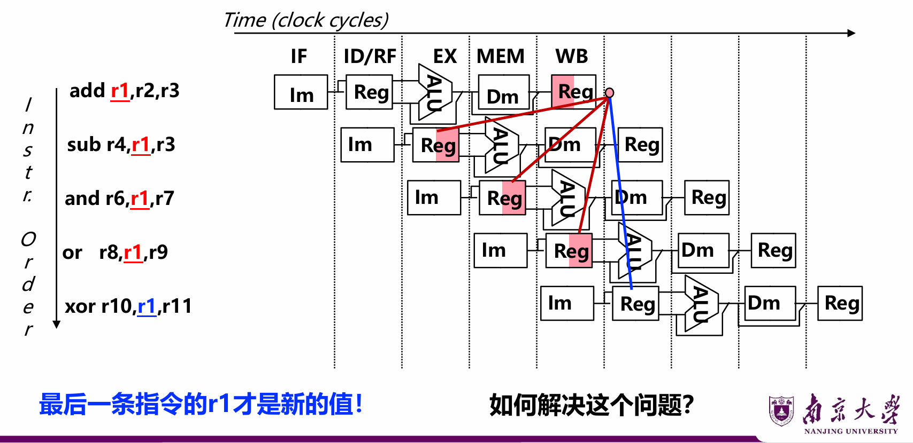
有很多方法可以解决数据冒险

#### 硬件阻塞
硬件上通过阻塞(stall)方式阻止后续指令执行，延迟到有新值以后。
这种做法称为**流水线阻塞**，也称为**插入气泡**Bubble
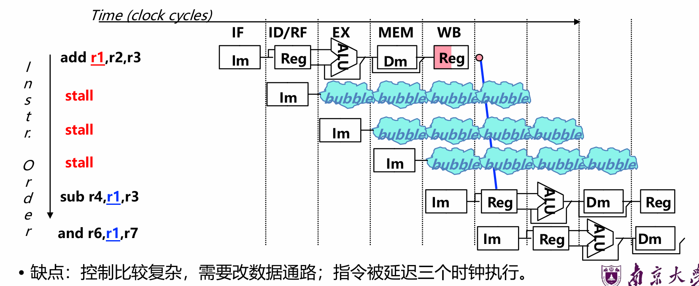

#### 软件上插入无关指令
由编译器插入**三条NOP指令**，浪费三条指令的空间和时间，是最差的做法。
(好处：数据通路简单，即无需改数据通路)
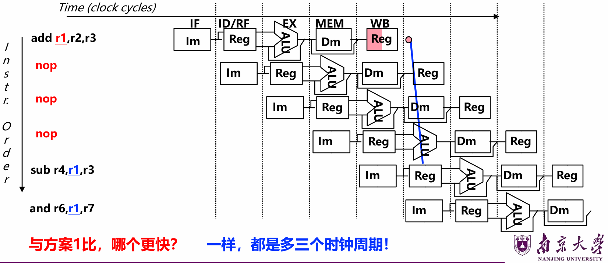

#### 同一周期内寄存器堆先写后读
寄存器堆的读口和写口是相互独立的部件
写口/读口分别在前/后半周期进行操作，使写入数据被直接读出。
但是，只能解决部分数据冒险
比如这个例子里面sub和and的数据冒险无法解决，但是or的可以
也就是必须要访问寄存器取数的阶段和写入寄存器的阶段在同一个周期

#### 利用数据通路中的中间数据：转发+阻塞（重要）
仔细观察后发现：**流水段寄存器**中已有需要的值r1
把数据从**流水段寄存器**中直接取到ALU的输入端，称为**转发**或**旁路**
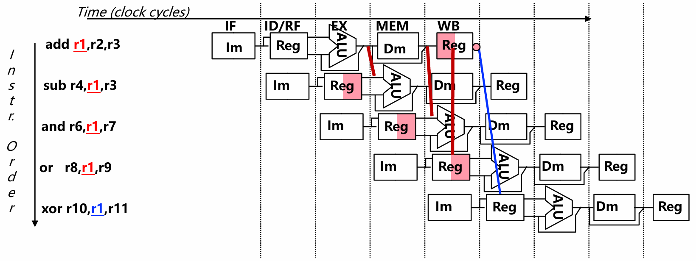
加MUX，使流水段寄存器值返送ALU输入端
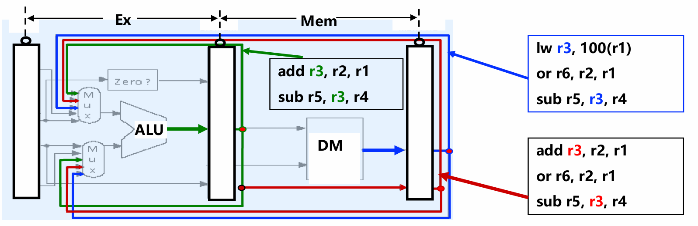
这样，每个流水段寄存器都可以作为ALU的输入源，只需要经过一个多路选择器MUX选择

不能！因为还没有访问主存，所以load指令的结果还没有准备好
所以只能阻塞一个周期，等load指令的结果准备好之后再转发
这种load指令和随后指令间的数据冒险，称为“装入-使用数据冒险(**load-use** Data Hazard)”

因此，数据冒险处理最佳方案：**“转发”+ “Load-use阻塞”**

#### 编译器进行指令顺序调整来解决数据冒险
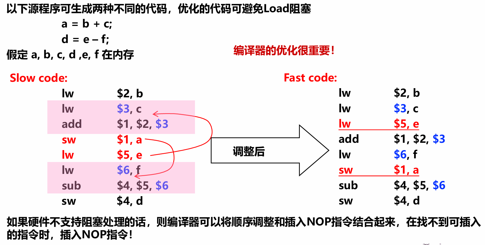

### 控制冒险
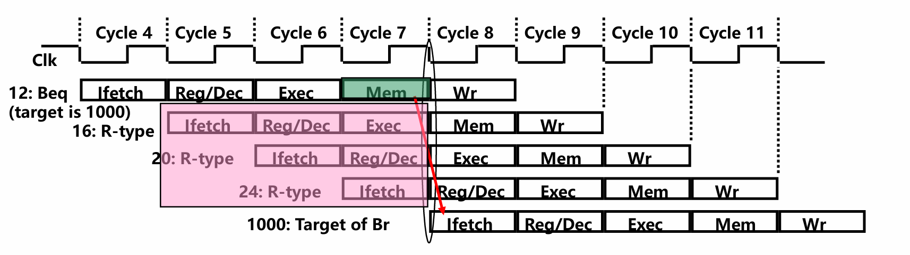
在判断是否转移的时候，beq指令在第四周期被取出，但是目标地址在第六周期执行完才知道
这之间的三个周期内，已经取出了3个指令，取出的指令都是错误的
因此发生转移时，应该在流水线中清除Beq后面的三条指令
**延迟损失时间片C**：发生转移时，给流水线带来的延迟损失，这里C=3

控制冒险的解决方法？
#### 硬件上阻塞（stall）分支指令后三条指令的执行
使后面三条指令清0或其操作信号清0，插入三条NOP指令

#### 软件上插入三条“NOP”指令
这两种方法的效率太低，应该结合分支预测来进行

#### 分支预测

##### 简单（静态）分支预测
基本做法
- 总预测条件不满足(not taken)，继续执行分支指令的后续指令
可加启发式规则：在特定情况下总是预测满足(taken)，其他情况总是预测不满足
- 预测失败时，需把流水线中三条错误预测指令丢弃掉，也就是将被丢弃指令的控制信号值或指令设置为0
如果是否跳转概率是50%，则预测正确率仅有50%
预测错误的代价与**何时能确定**是否转移有关。越早确定代价越少，那么是否可把判断转移的工作提前，而不等到MEM阶段才确定？

可以将“转移地址计算”和“分支条件判断”操作调整到ID（译码）阶段来缩短延迟：
• 将转移地址计算从MEM阶段移到ID阶段，可以吗？为什么？
（是可能的：IF/ID流水段寄存器中已经有PC的值和立即数）
• 将“判0”操作从EX阶段移到ID阶段，可以吗？为什么？
（用逻辑运算来直接比较Rs和Rt的值）
（简单判断用逻辑运算，复杂判断可以用专门指令生成条件码）

预测错误的检测和处理（称为“冲刷、冲洗”，Flush）
– 当Branch=1并且Zero=1时，发生转移，说明预测失败
– 增加控制信号：IF.Flush=Branch and Zero，取值为1时，说明预测失败
– 预测失败(条件满足) 时，完成以下两件事（延迟损失时间片C=1时）：
①将转移目标地址->PC
②清除IF段中取出的指令，即：将IF/ID中的指令字清0，转变为nop指令

之前要清除三条指令，调整到ID后只需要清除一条指令，因而只延迟一个时钟周期，每次预测错误减少了两个周期的代价！ 即：这里C=1

##### 动态分支预测
利用最近转移发生的情况，来预测下一次可能转移还是不转移
– 根据实际情况来调整预测，转移发生的历史情况记录在BHT中（有多个不同的名称）
• 分支历史记录表BHT（Branch History Table）
• 分支预测缓冲BPB（Branch Prediction Buffer）
• 分支目标缓冲BTB（Branch Target Buffer）

每个表项由**分支指令地址低位**作索引，故在**IF**阶段就可以取到预测位
• 低位地址相同的分支指令共享一个表项，所以，可能取的是其他分支指令的预测位。会
不会有问题？由于仅用于预测，所以不影响执行结果
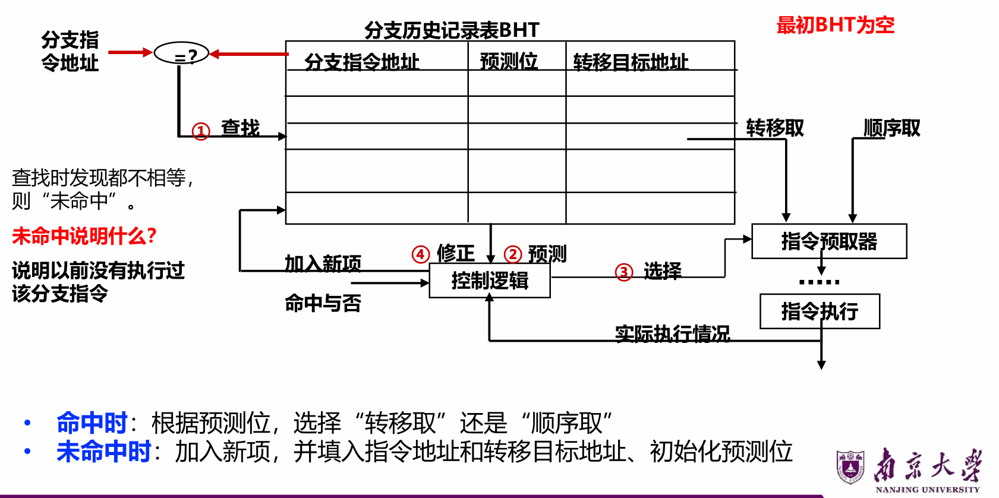

可能采用两种预测位方案：
– 1位方案：0表示not taken，1表示taken，若预测错，则该位取反，否则，该位不变
缺点：当连续两次的分支情况发生改变时，预测必然错误
– 2位方案：00和01表示not taken，10和11表示taken
在连续两次分支发生不同时，只会有一次预测错误

##### 分支延迟时间片的调度
属于静态调度技术，由编译程序重排指令顺序来实现
基本思想：把分支指令前面的**与分支指令无关**的指令调到分支指令后面执行，以填充延迟时间片（也称分支延迟槽Branch Delay slot），不够时用nop填充
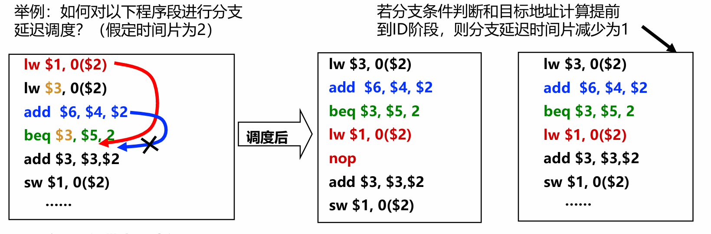
调度后可能带来其他问题：产生新的load-use数据冒险
调度后，无需在硬件线路中阻塞branch指令后面指令的执行

#### 另一种控制冒险：异常和中断
异常和中断会改变程序的执行流程，某条指令发现异常时，后面多条指令已被取到流水线中正在执行
例如ALU指令发现“溢出”时，已经到**EX**阶段结束了，此时，它后面已有两条指令进入流水线了
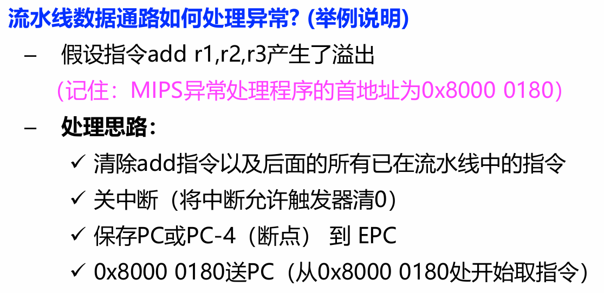
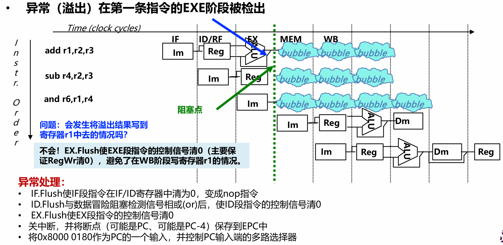
0x8000 0180是异常处理程序的入口地址

流水线中同时有5条指令，到底是哪一条发生异常？
– 根据异常发生的流水段可确定是哪条指令，因为各类异常发生的流水段不同
- “溢出”在EXE段检出
- “无效指令”在ID段检出
- “除数为0”在ID段检出
- “无效指令地址”在IF段检出
- “无效数据地址”在Load/Store指令的EXE段检出

**外部中断**与特定指令无关，如何确定处理点？
– 可在IF段或WB段中进行**中断查询**，需要保证当前WB段的指令能正确完成，并在有中断发生时，确保下个时钟开始执行中断服务程序

系统中只有一个EPC，多个中断发生时，一个EPC不够放多个断点，怎么办？
– 总是把优先级最高的送到EPC中