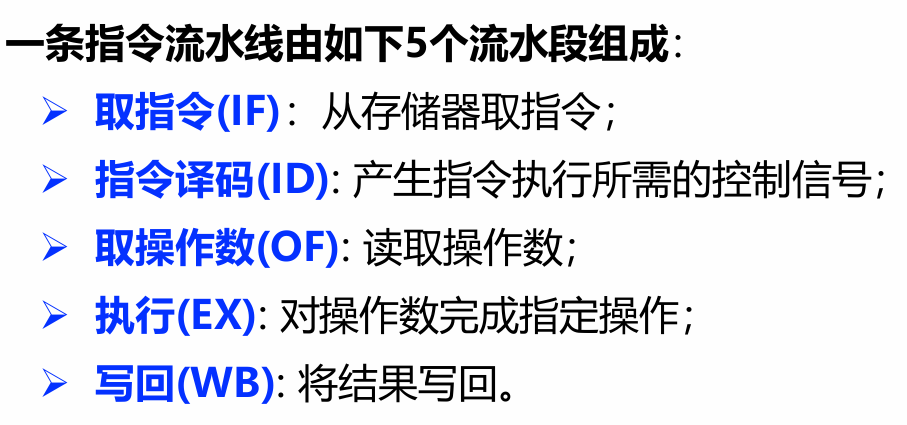
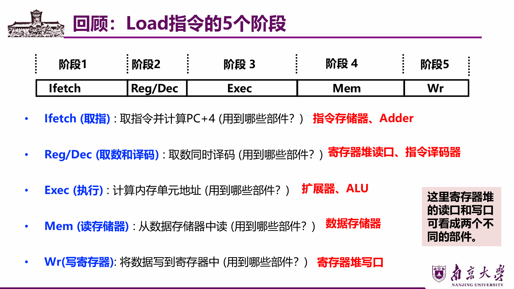
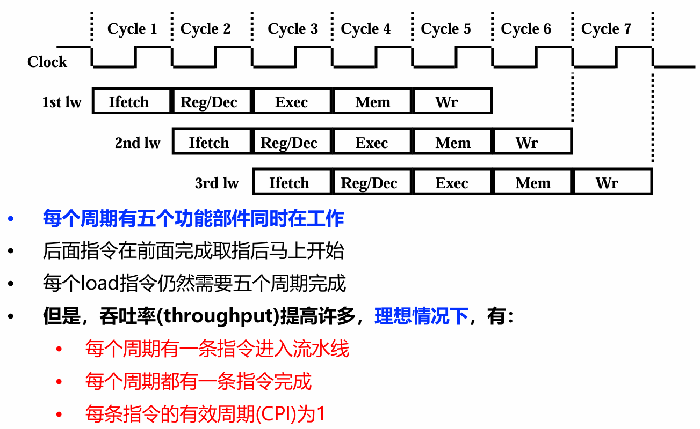
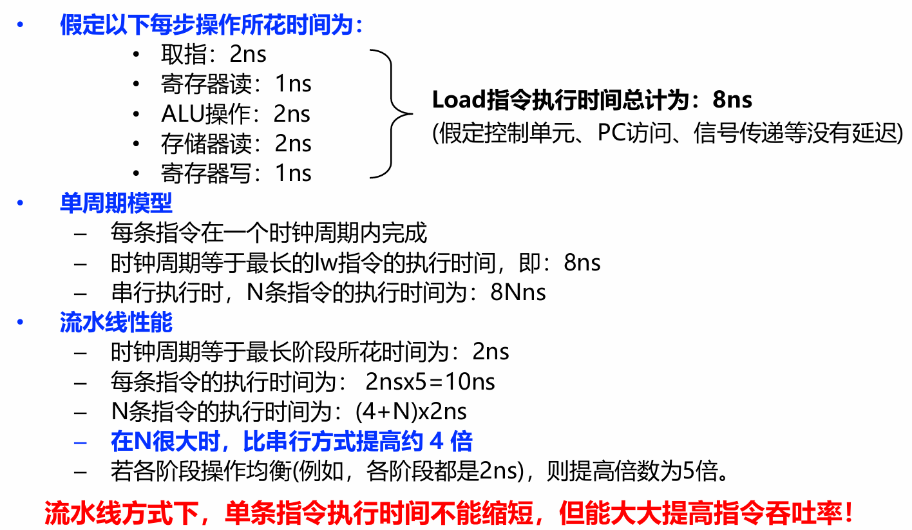
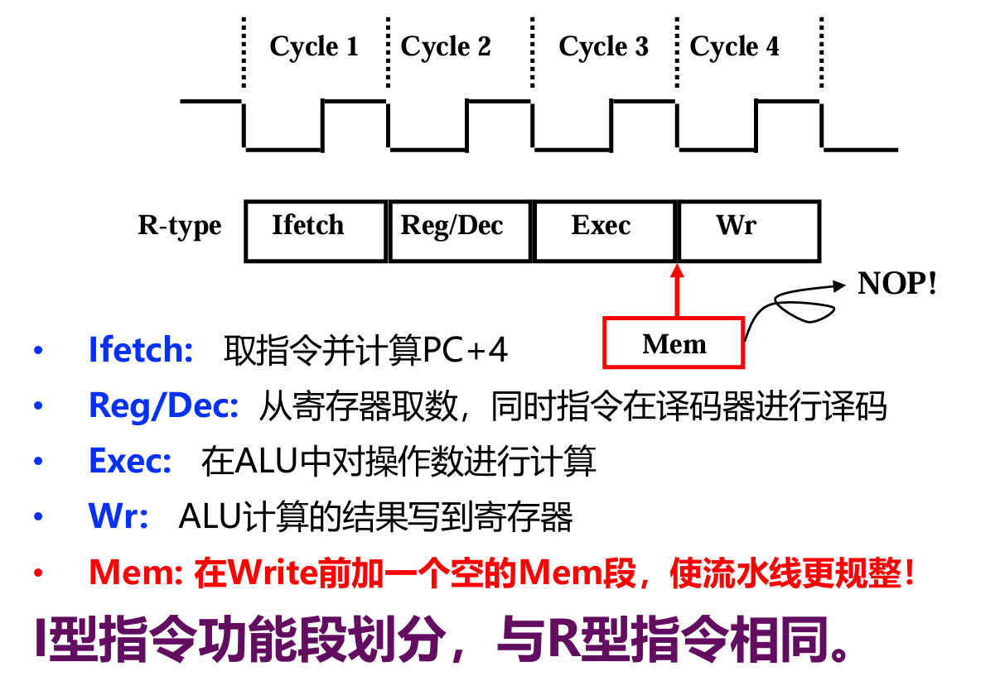

# Lec6: 指令流水线
## 流水线概述
如果将指令的每个阶段看成相应的**流水段**，则指令的执行过程构成了**一条指令流水线**

当后一条指令的第i步与前一条指令的第i+1步**同时进行**，可以使一串指令总的完成时间大为缩短。
理想情况下，每个时钟都有一条指令进入流水线，每个时钟周期都有一条指令完成，每条指令的时钟周期数（即CPI）都为1。

Load指令的流水线：

如此可以大大提高吞吐性能

适合流水线的指令集特征：
- 长度尽量一致,有利于简化取指令和指令译码操作
- 格式少，且源寄存器位置相同,有利于在指令未知时就可取操作数
- load / Store指令才能访问存储器,有利于减少操作步骤，规整流水线
- 内存中对齐存放,有利于减少访存次数和流水线的规整

## 流水线处理器的实现

整个过程，是不涉及memory的操作的，所以加一个空的Mem字段来使得流水线更加规整
