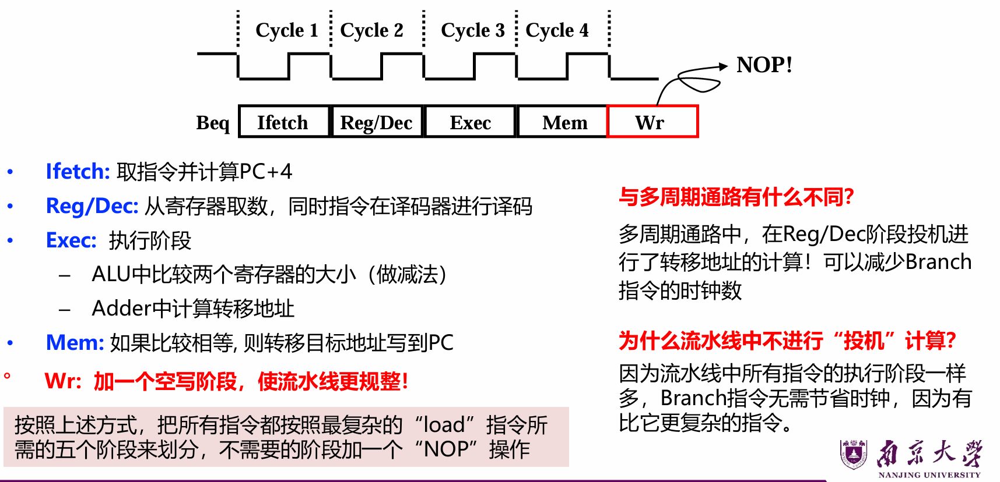
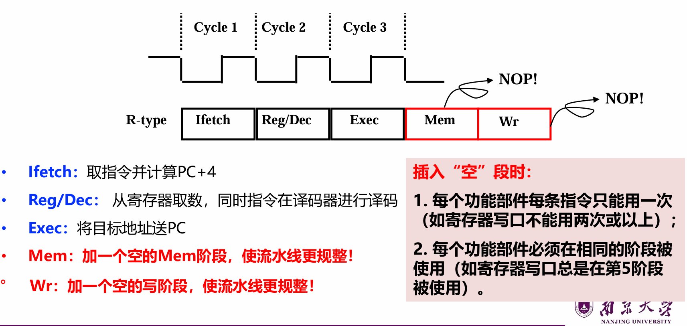
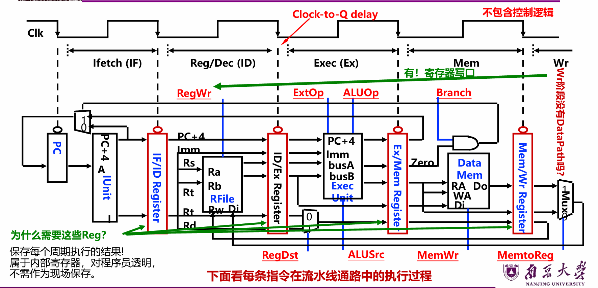
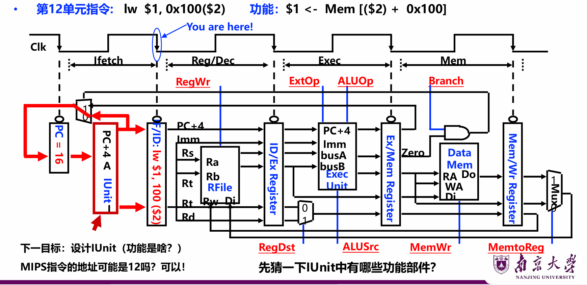
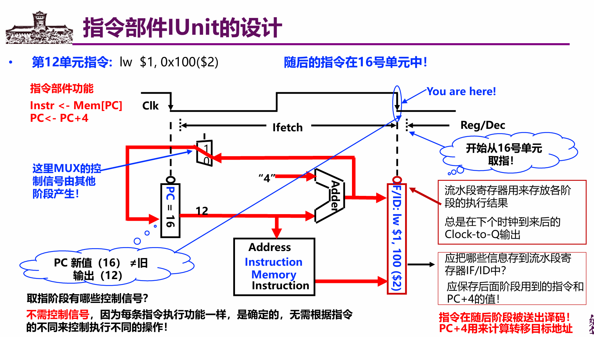
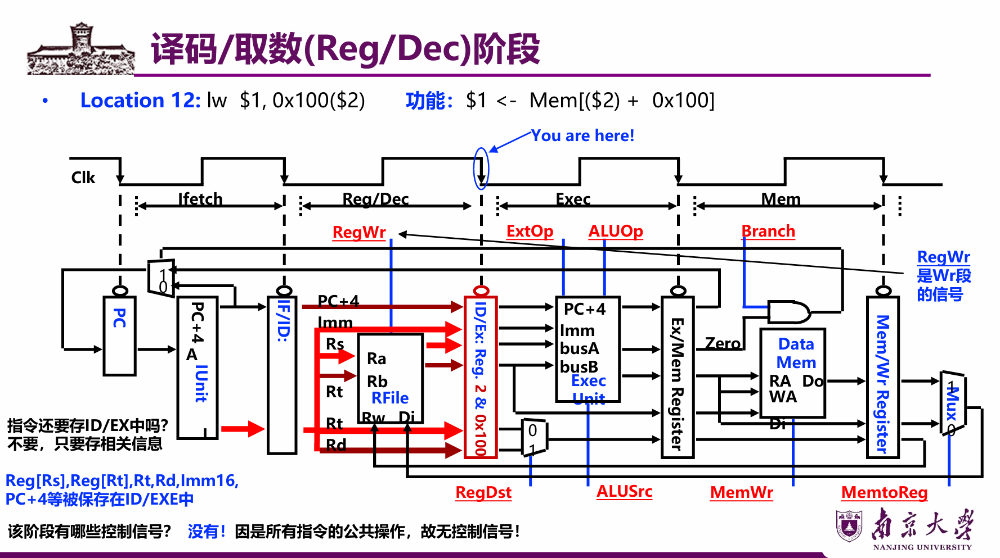
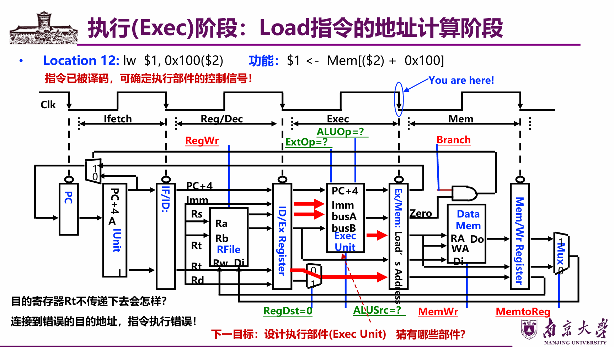
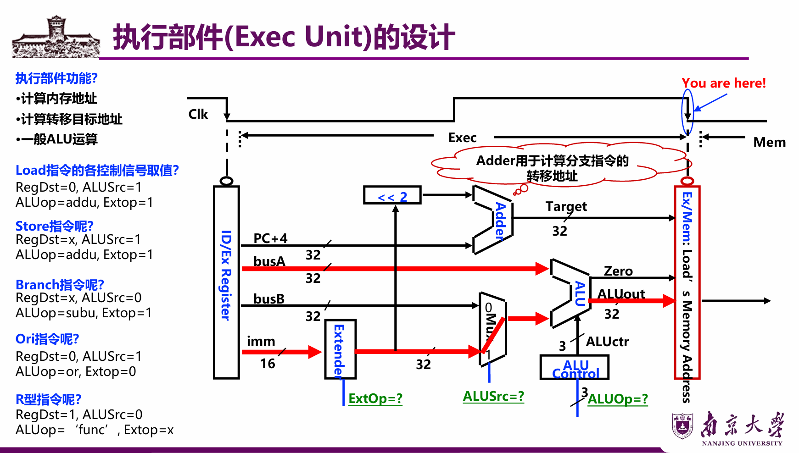
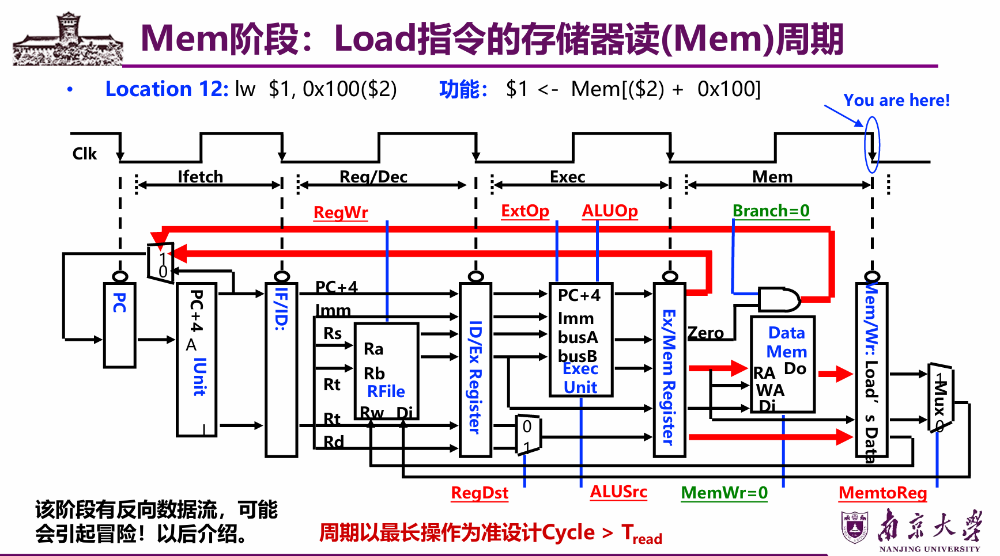
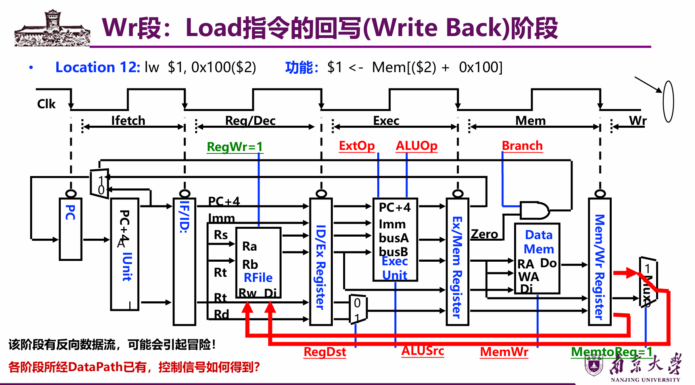

# Lec6: 指令流水线
## 流水线概述
如果将指令的每个阶段看成相应的**流水段**，则指令的执行过程构成了**一条指令流水线**

当后一条指令的第i步与前一条指令的第i+1步**同时进行**，可以使一串指令总的完成时间大为缩短。
理想情况下，每个时钟都有一条指令进入流水线，每个时钟周期都有一条指令完成，每条指令的时钟周期数（即CPI）都为1。

Load指令的流水线：

如此可以大大提高吞吐性能

适合流水线的指令集特征：
- 长度尽量一致,有利于简化取指令和指令译码操作
- 格式少，且源寄存器位置相同,有利于在指令未知时就可取操作数
- load / Store指令才能访问存储器,有利于减少操作步骤，规整流水线
- 内存中对齐存放,有利于减少访存次数和流水线的规整

## 流水线处理器的实现
R型指令：

整个过程，是不涉及memory的操作的，所以加一个空的Mem字段来使得流水线更加规整

Store指令：

不涉及写的操作，所以加一个空的Wr

Beq指令：

写阶段是空的。
按照上述方式，把所有指令都按照**最复杂的**“load”指令所需的五个阶段来划分，不需要的阶段加一个“NOP”操作（空）

J指令：

流水线的数据通路图：

### 取指令阶段

先从PC里面取出指令，到IUnit，涉及到两个功能：取出指令和PC+4

### 译码/取数阶段

已经取出相关信息之后，指令就不需要再保存了

### 执行阶段

执行部件，设计如下：

通过不同的控制信号，实现不同类型指令的功能
什么时候符号扩展，什么时候零扩展？
但凡是算术运算的时候，一定用符号扩展！Extop信号要为1
如果是逻辑运算，立即数的扩展都采用零扩展，Extop为0

### Mem阶段

### Wr阶段

### 流水线中的控制信号
