# Lec7: 存储器层次结构

## 存储器概述

### 基本术语

- 记忆单元/存储元（Cell）：具有两种稳态的能够表示二进制数码0和1的物理器件
- 存储单元（Addressing Unit）：具有相同地址的位构成一个存储单元，也称为一个编址单位
- 存储体/ 存储矩阵/ 存储阵列（Bank）：**所有存储单元**构成一个存储阵列
- 编址方式（Addressing Mode）：按字节编址、按字编址
- 存储器地址寄存器（Memory Address Register -MAR）：用于存放**主存单元地址**的寄存器
- 存储器数据寄存器（Memory Data Register-MDR）：用于存放主存单元中的**数据**的寄存器

### 存储器分类

（1）按工作性质/存取方式分类

- 随机存取存储器 RandomAccessMemory(RAM)
  按地址访问，每个单元的读写时间一样且与单元所在位置无关，比如内存
- 顺序存取存储器 SequentialAccess Memory(SAM)
  数据按顺序从存储载体的始端读入或写出，存取时间的长短与信息所在位置有关，比如磁带
- 直接存取存储器 DirectAccessMemory(DAM)
  直接定位到读写数据块，在读写数据块时按顺序进行。如磁盘。
- 相联存储器 AssociateMemory(AM)，Content Addressed Memory (CAM)
  按内容检索到存储位置进行读写。例如：快表

（2）按存储介质分类
半导体存储器：双极型，静态MOS型，动态MOS型
磁表面存储器：磁盘（Disk）、磁带（Tape）
光存储器：CD，CD-ROM，DVD

（3）按信息的可更改性分类
读写存储器（Read / Write Memory）：可读可写
只读存储器（Read Only Memory）：只能读不能写

（4）按断电后信息的可保存性分类
非易失（不挥发）性存储器(Nonvolatile Memory)
信息可一直保留， 不需电源维持。
（如：ROM、磁表面存储器、光存储器等）
易失（挥发）性存储器(Volatile Memory)
电源关闭时信息自动丢失。（如：RAM、Cache等）

（5）按功能/容量/速度/所在位置分类
离CPU越近，速度越快

- 寄存器(Register)
  • 封装在CPU内，用于存放当前正在执行的指令和使用的数据
  • 用触发器实现，**速度快**，容量小（几kB）
- 高速缓存(Cache)
  • 位于CPU内部或附近，用来存放当前要执行的局部程序段和数据
  • 用SRAM实现，速度可与CPU匹配，容量小（几MB）
- 主存储器MM（Main(Primary) Memory）
  • 位于CPU之外，用来存放已被启动的程序及所用的数据
  • 用DRAM实现，速度较快，容量较大（几GB）
- 外存储器AM(辅助存储器Auxiliary/Secondary Storage)
  • 位于主机之外，用来存放暂不运行的程序、数据或存档文件
  • 用磁表面或光存储器实现，容量大而速度慢

### 内存和外存关系及比较

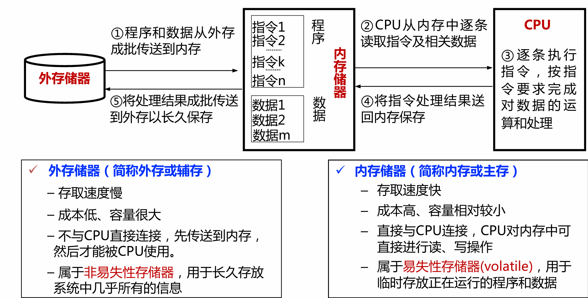

### 主存

主存中主要存放指令及其数据！CPU执行指令时需要取指令、取数据、存数据，这个时候会访问主存。
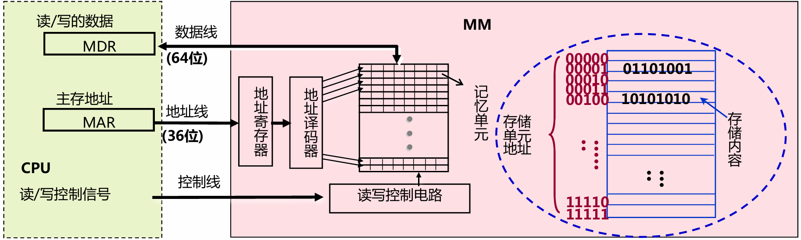
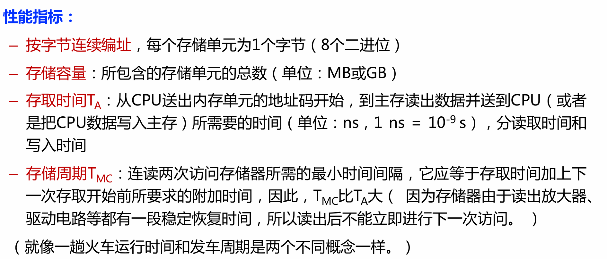

### 存储器层次化结构

为了缩小存储器和处理器两者之间在性能方面的差距，通常在计算机内部采用**层次化的存储器体系结构**。
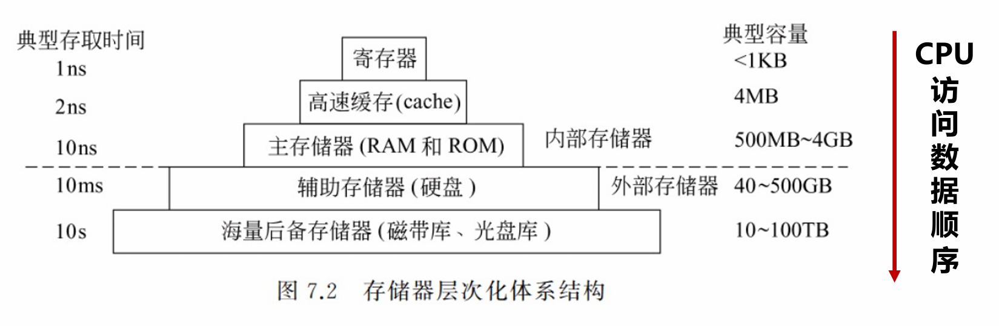
速度越快，容量越小，越靠近CPU
CPU可以直接访问内部存储器，而外部存储器需要先被取到主存，再被CPU访问
数据一般只在**相邻层之间**复制传输，而且总是从慢速存储器复制到快速存储器。

## 半导体随机存取存储器

### 六管静态MOS管存储元件

动态还是静态：数据是否需要周期性刷新
静态RAM（SRAM）中数据保存在一对正负反馈门电路中，只要供电，数据就一直保持，不是破环性读出，也无需重写，即无需刷新！
看作带时钟的RS触发器
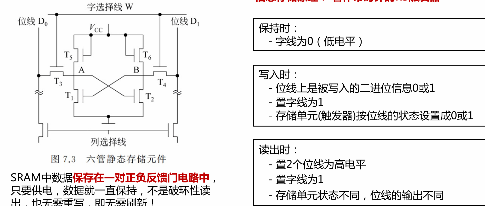

### 单管动态MOS管存储元件

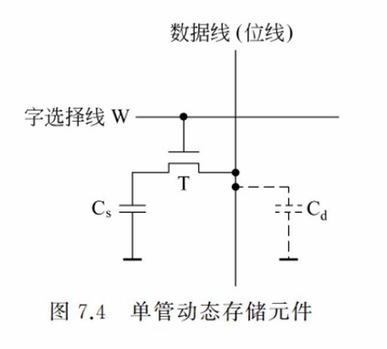
通过电容的充电放电的电流来判断是0还是1
动态RAM（DRAM）中数据保存在电容器中，由于电容器有漏电现象，存储的数据会随着时间的推移而逐渐消失，因此需要周期性地刷新（读出后重新写回）。

### 两种RAM的比较

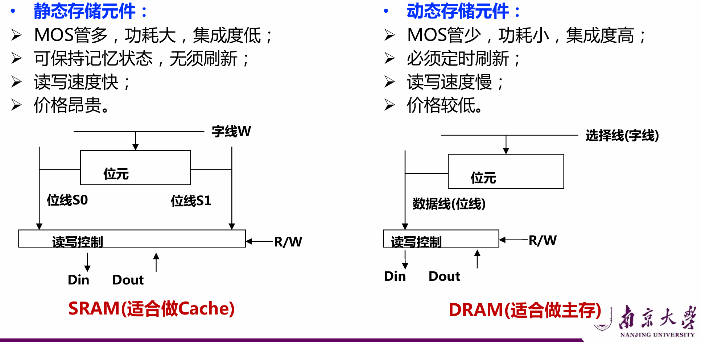
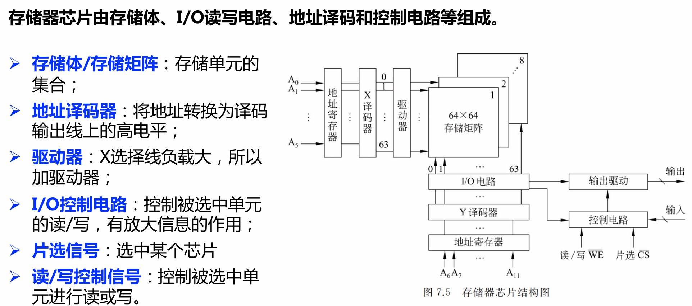
这里的“芯片”是实现数据存储的集成电路器件，通过上述模块配合完成 “存数据、取数据” 的功能

### CPU与存储器之间的通信方式

有异步和同步两种通信方式
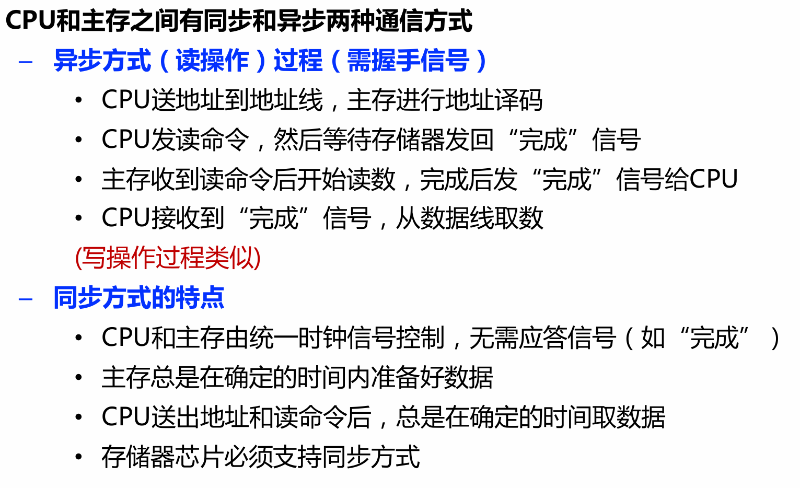

### SDRAM芯片技术

SDRAM是**同步存储芯片**

- 每步操作都在**系统时钟控制下**进行
- 有确定的等待时间（读命令开始到数据线有效的时间, 称为CAS潜伏期）CL，例如CL=2 clks
- 连续传送（Burst）数据个数BL=1 / 2 / 4 / 8
- 多体(缓冲器)交叉存取
- 利用总线时钟上升沿与下降沿同步传送
  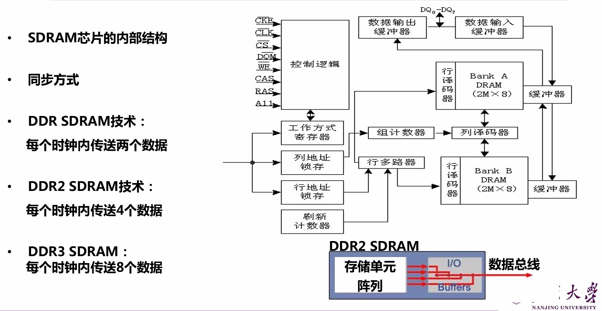
- DDRSDRAM技术：每个时钟内传送两个数据
- DDR2SDRAM技术：每个时钟内传送4个数据
- DDR3SDRAM：每个时钟内传送8个数据

### 内存条和内存条插槽

内存条：把若干片DRAM芯片焊在一小条电路板上
内存条插槽：存储器总线
内存条必须插在主板上的内存条插槽中才能使用（相同颜色插槽可以并行传输）
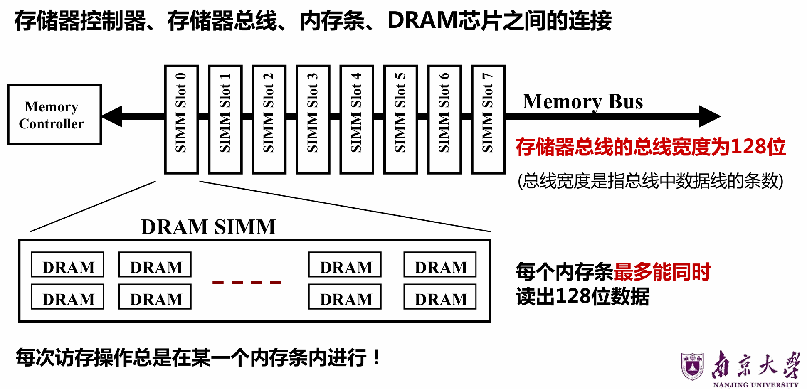
SIMM是内存条，Slot是内存条插槽，memory bus是内存总线

### 存储器芯片的扩展

核心是通过**组合多个小容量芯片**，得到更大容量或者更多位数的存储器

- 字扩展：每个芯片的字长相同，但是地址总线宽度增加，从而可以访问更多的地址
  例子：用16K×8位芯片做64K×8位存储器
  需4个芯片（容量从16K→64K，扩4倍）；每个芯片对应不同地址段（比如 0000-3FFFH、4000-7FFFH 等），靠 “片选信号” 选不同芯片。
- 位扩展：每个芯片的字长增加，但是地址总线宽度相同，从而可以访问更多的数据位
  例子：用4096×1位芯片做4K×8位存储器
  需8个芯片（位数从1位→8位扩8倍）；所有芯片地址范围相同，数据端**各自负责1位**，合起来是8位。
- 字位同时扩展：每个芯片的字长增加，地址总线宽度也增加，从而可以访问更多的地址和数据位
  例子：用16K×4位芯片做64K×8位存储器
  需8个芯片（容量扩4倍、位数扩2倍，4×2=8）；先按位扩（2个芯片凑8位），再按字扩（4组这样的芯片凑64K容量）

有两种容量扩展方式：交叉编址和连续编址。上述例子都是连续编址。

### DRAM芯片的扩展

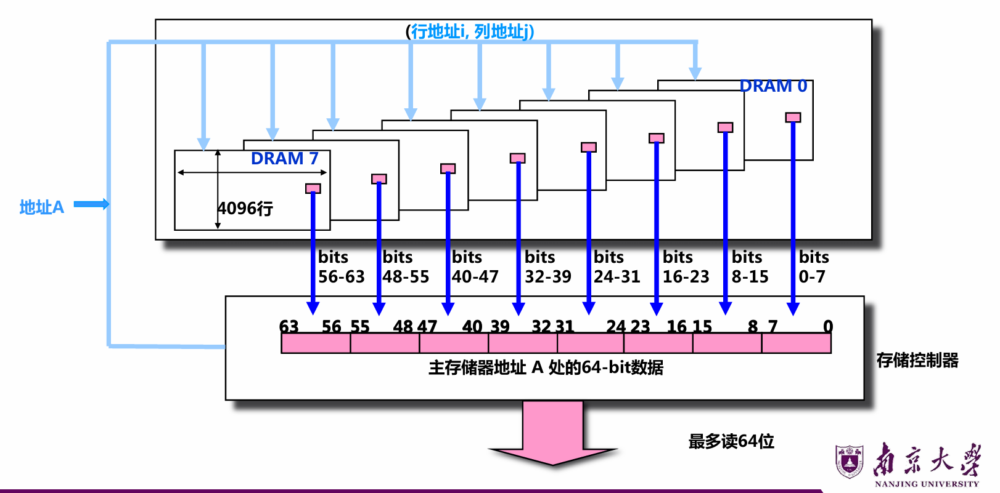
由8片DRAM芯片构成
芯片内地址是否连续？
不连续，交叉编址，可同时读写所有芯片。

主存地址和片内地址有何关系？
主存地址27位，片内地址24位，与高24位主存地址相同。

主存低3位地址的作用是什么？
确定8个字节中的哪个，即用来选片。
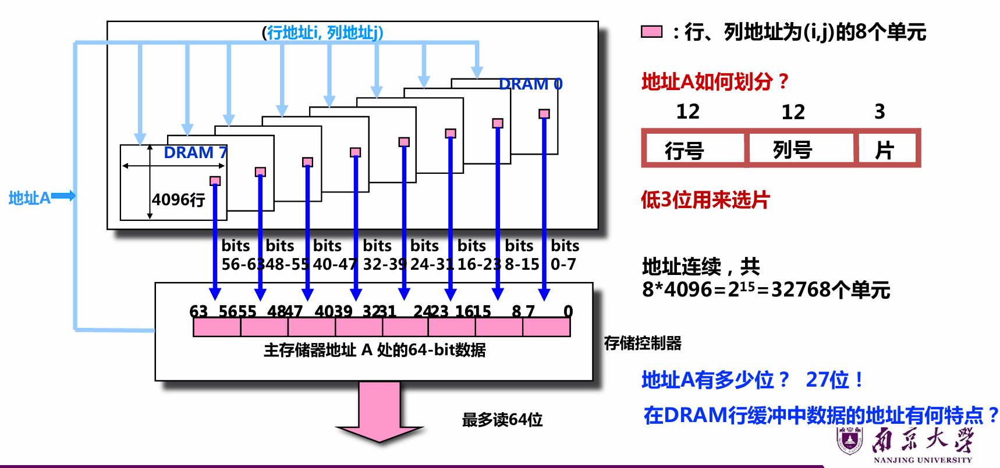
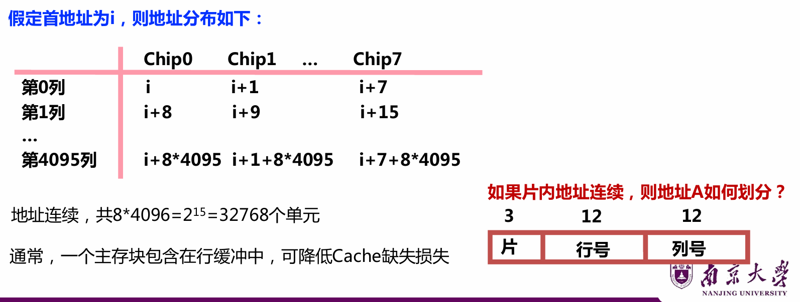
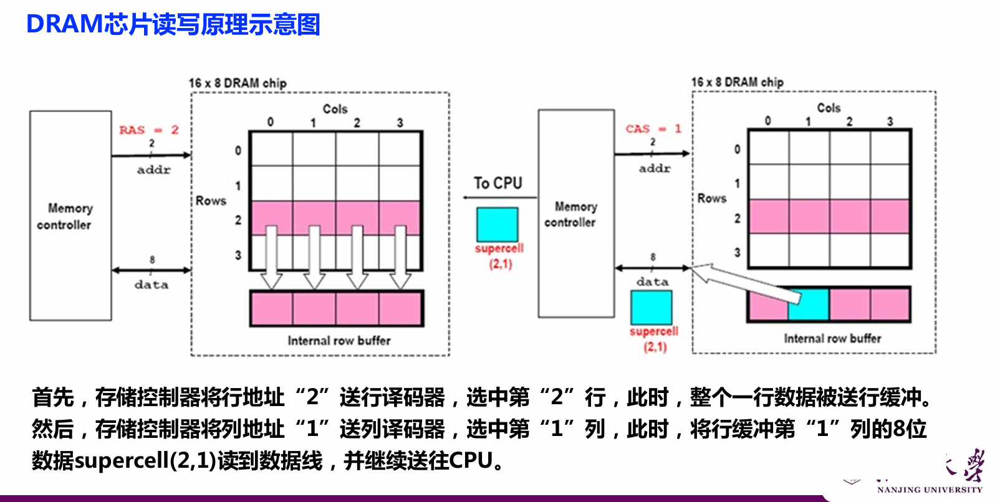

### 多模块存储器

2个、4个或多个存储器同时工作
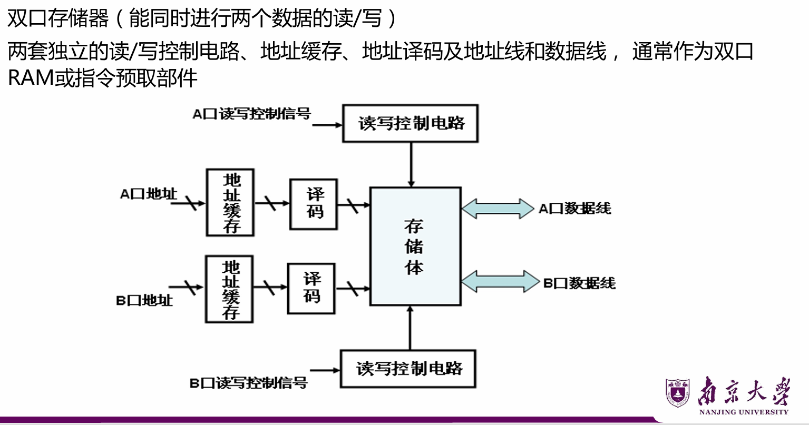
包含多个小体；每个体有其自己的MAR、MDR和读写电路；可独立组成一个存储模块；可同时对多个模块进行访问。

#### 连续编址方式

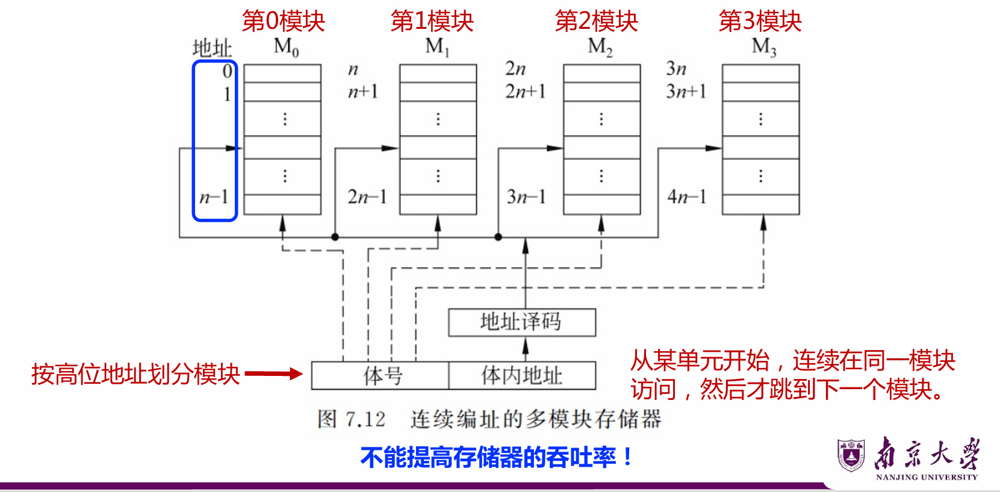
从某单元开始，连续在同一模块访问，然后才跳到下一个模块。

#### 交叉编址方式

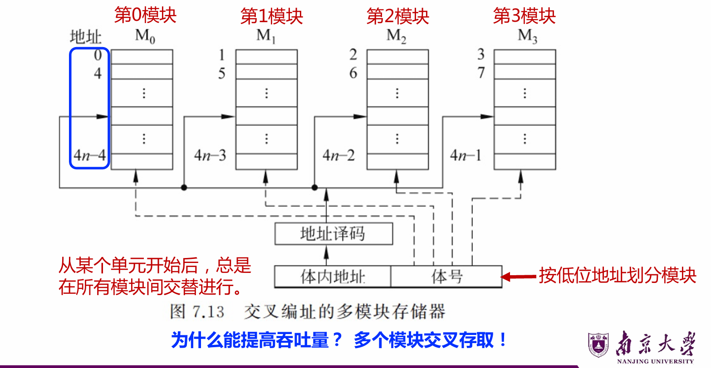
能够提高吞吐率，在模块间交替进行

如果所有存储模块一次**并行读写**的总位数正好等于存储器总线中的数据位数，则可以采用**同时启动**方式。
每个存储模块一次读写的位数（即存储字）正好等于存储器总线中的数据位数（即总线传输单位），则采用**轮流启动**方式；
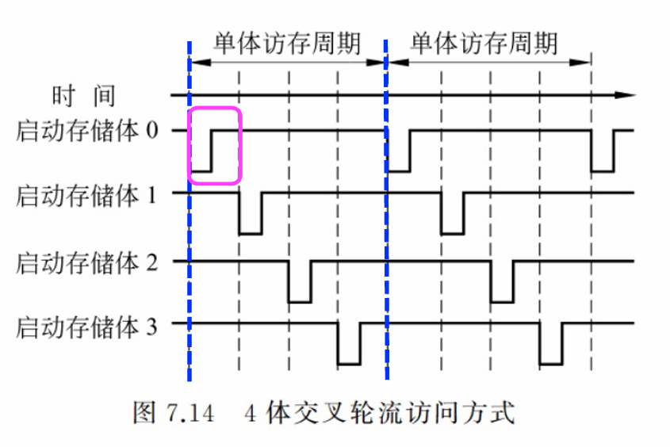
具有m个体的多模块存储器，每隔1/m个存储周期启动一个体，存取速度提高m倍。

## 外部辅助存储器

### 磁盘存储器

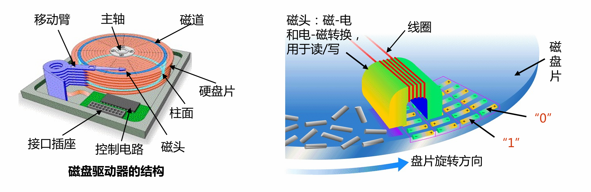

- 写入1：线圈通以正向电流，使呈N-S状态
- 写入0：线圈通以负向电流，使呈S-N状态
- 读取：磁头固定不动，载体运动。因为载体上小的磁化单元外部的磁力线通过磁头铁芯形成闭合回路，在铁芯线圈两端得到感应电压。根据感应电压的不同的极性，可确定读出为0或1。
  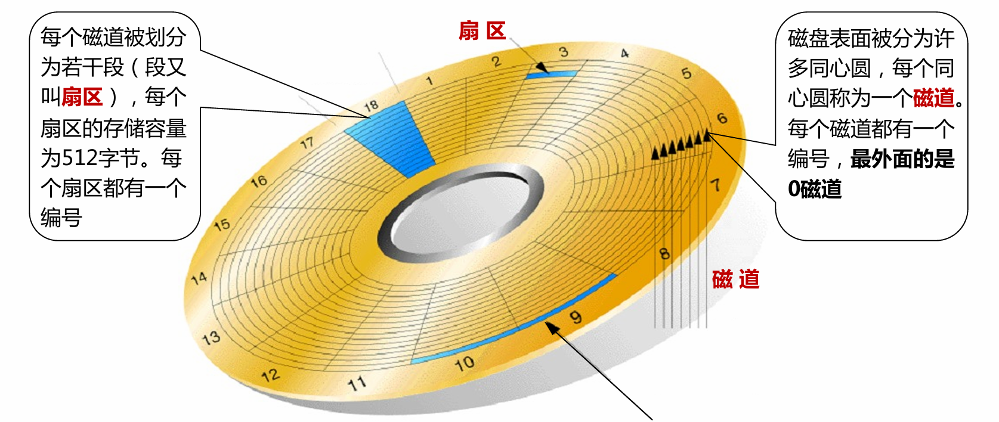
  早期扇区大小是512字节。但现在已经迁移到更大、更高效的**4096字节扇区**，通常称为**4K扇区**

#### 磁盘的内部逻辑结构

##### 寻道操作

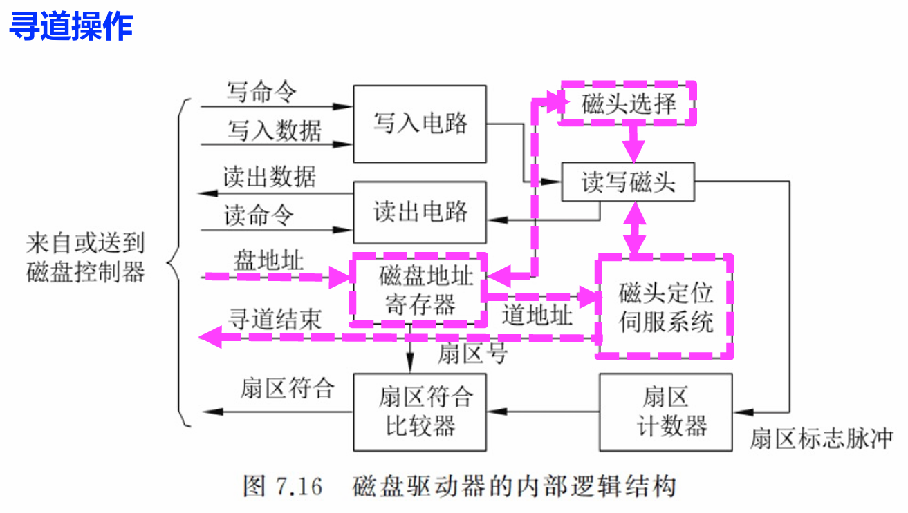
来自或送到磁盘控制器的命令（写命令、读命令、盘地址等）会触发磁头定位伺服系统进行**寻道**。
“寻道” 指的是将磁头移动到目标**磁道**正上方的**机械运动过程**
寻道结束后，等待目标扇区旋转到磁头下方，也就是旋转等待操作。

##### 旋转等待操作

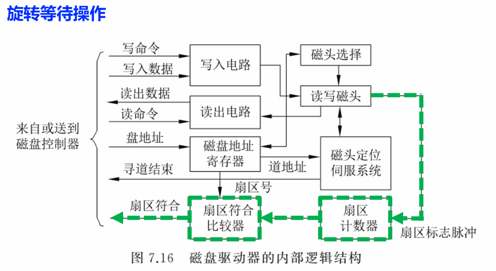
**扇区计数器**会持续追踪当前经过磁头的是哪个扇区
**磁盘地址寄存器**中存放着本次操作的目标地址（包括目标扇区号）。
**扇区符合比较器**会持续将扇区计数器的当前值，与地址寄存器中的目标扇区号进行比较。
当两个值匹配时，比较器会发出 “扇区符合” 信号，进入读写操作。

##### 读写操作

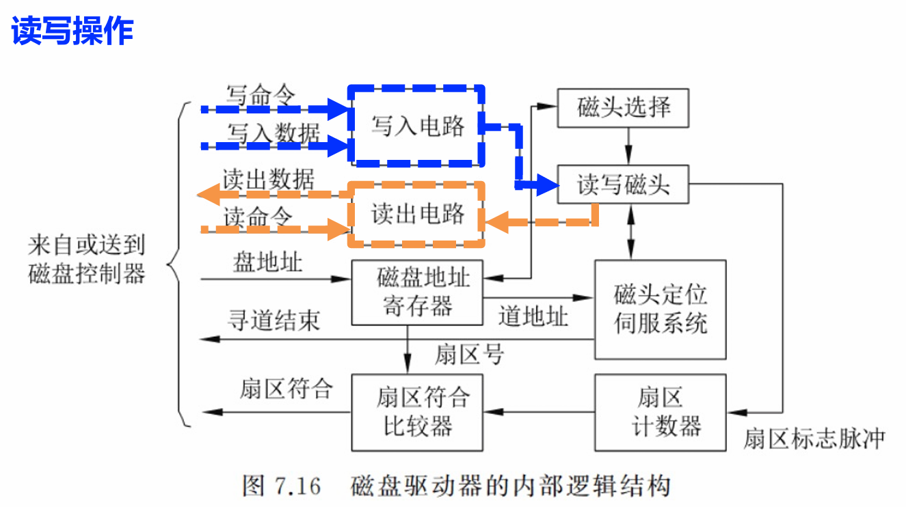

#### 磁盘存储器的性能指标

##### 记录密度

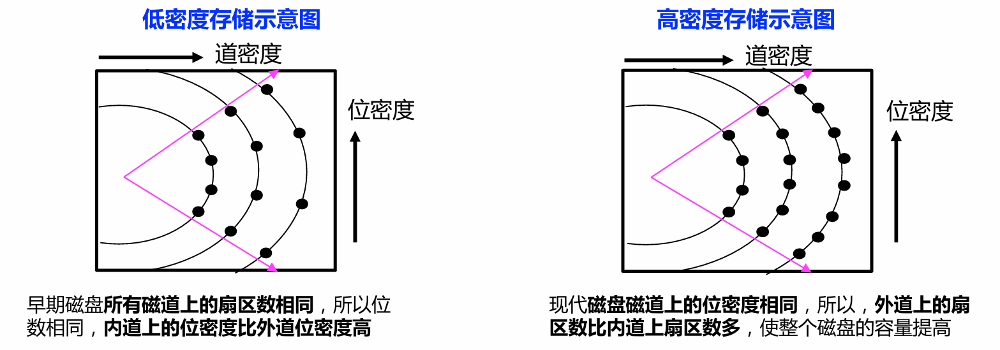
提高盘片上的信息记录密度：

- 增加磁道数目——提高磁道密度
- 增加扇区数目——提高位密度，并采用可变扇区数

##### 存储容量

存储容量指整个存储器所能存放的二进制信息量，它与磁表面大小和记录密度密切相关。
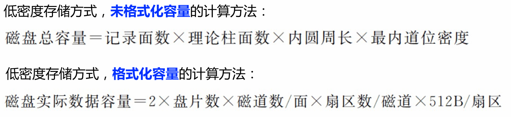

##### 数据传输速率

单位时间内从存储介质上读出或写入的二进制信息量。

##### 平均存取时间

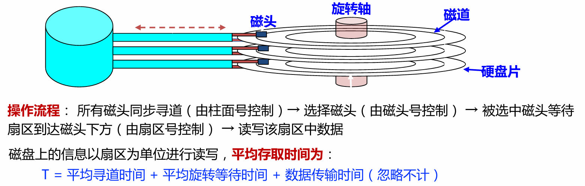

- 平均寻道时间——磁头寻找到指定磁道所需平均时间(大约5ms)
- 平均旋转等待时间——指定扇区旋转到磁头下方所需平均时间，取磁盘旋转一周所需时间的一半(大约4～6ms) (转速：4200/5400/7200/10000rpm)
- 数据传输时间——(大约0.01ms/扇区)

#### 磁盘存储器的连接

磁盘控制器连接在I/O总线上，I/O总线与其他总线（系统总线、存储器总线）之间用桥接器连接
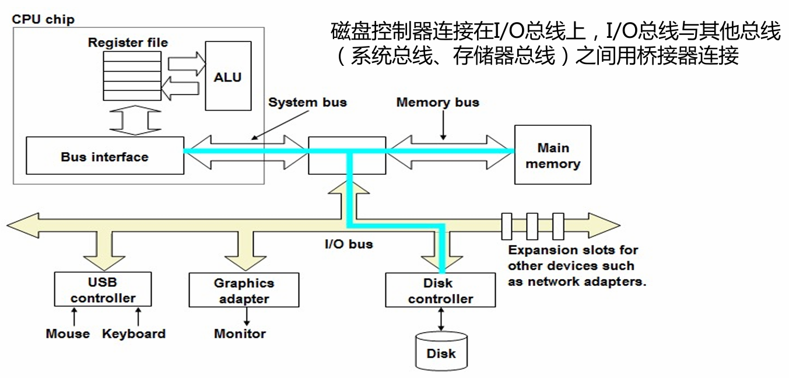
磁盘的最小读写单位是**扇区**.
因此，磁盘按**成批数据交换方式**进行读写，采用直接存储器存取（DMA，Direct Memory Access）方式进行数据输入输出，需用专门的DMA接口来控制外设与主存间直接数据交换，数据不通过CPU。
通常把专门用来控制总线进行DMA传送的接口硬件称为**DMA控制器**。

#### 冗余磁盘阵列

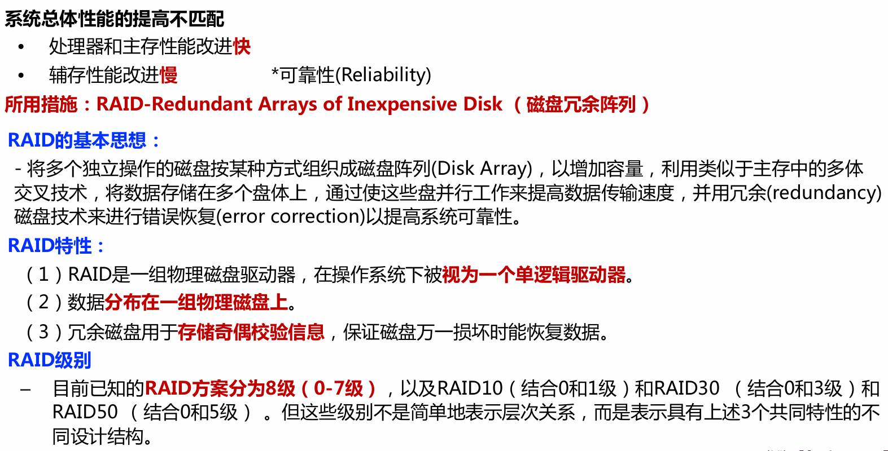

### Flash存储器和U盘

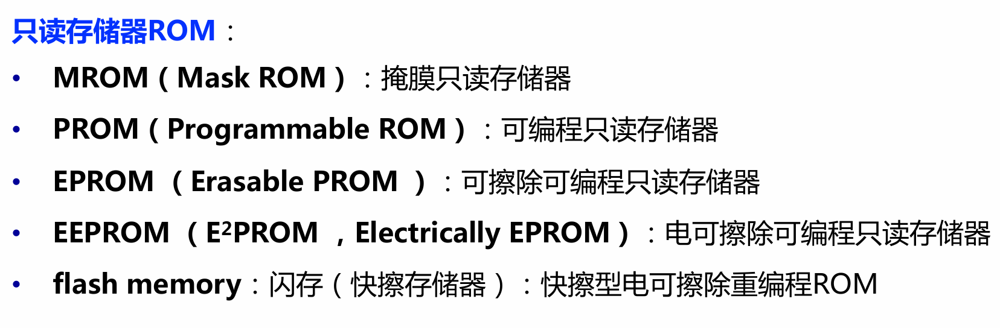
Flash存储元（闪存）：
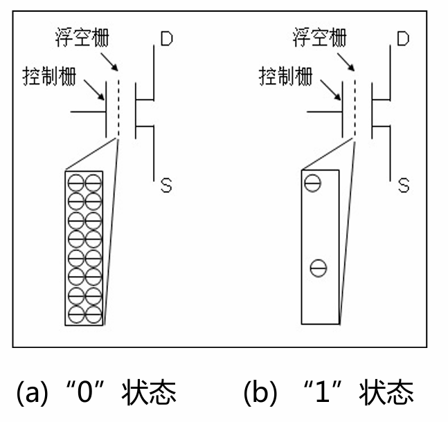
控制栅加**足够正电压**时，浮空栅储存大量负电荷，为“0”态；
控制栅**不加正电压**时，浮空栅少带或不带负电荷，为“1”态。

有三种操作：擦除、编程、读取
写入：**快擦**（所有单元为1），然后**编程**（将0写入）
读出：控制栅加**足够正电压**，若状态为0，则读出电路检测不到电流；若状态为1，则能检测到电流。

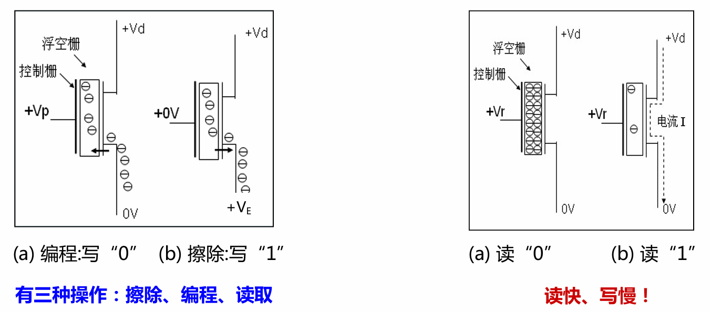

### 固定硬盘SSD

固态硬盘（Solid State Disk，简称SSD）也被称为**电子硬盘**
它并不是一种磁表面存储器，而是一种使用NAND**闪存**组成的外部存储系统，与U盘并没有本质差别，只是**容量更大，存取性能更好**。

它用**闪存颗粒**代替了磁盘作为存储介质，利用闪存的特点，以区块写入和抹除的方式进行数据的读取和写入。写操作比读操作慢得多。

电信号的控制使得固态硬盘的内部传输速率远远高于常规硬盘的传输速率。
闪存的擦写次数有限，所以频繁擦写会降低其写入使用寿命。

在SSD中有一个**闪存翻译层**，它将来自CPU的逻辑磁盘块读写请求翻译成对底层SSD物理设备的**读写控制信号**。因此，这个闪存翻译层相当于**磁盘控制器**

## 存储器的数据校验

### 数据校验基本原理

为什么要进行数据的错误检测与校正？存取和传送时，由于元器件故障或噪音干扰等原因**会出现差错**。
措施：
(1) 从计算机硬件本身的可靠性入手，在电路、电源、布线等各方面采取必要的措施，提高计算机的**抗干扰能力**；
(2) 采取相应的**数据检错和校正措施**，自动地发现并纠正错误。

大多采用“**冗余校验**”思想，即除原数据信息外，还增加若干位编码，这些新增的代码被称为**校验位**。
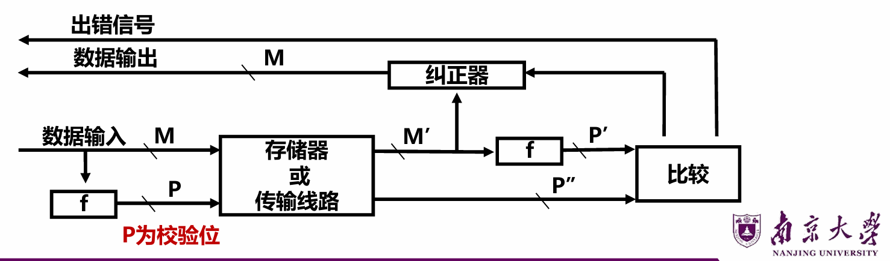
这个校验位p不是随便得到的，是输入的M经过了某个函数f映射而成的
把存储或者传输得到的M'经过同样的函数f映射，得到P'，并且与存储或者传输得到的校验位P''进行比较
比较的结果为以下三种情况之一：

- 没有检测到错误，直接输出数据位
- 检测到错误，无法纠错，输出错误信息
- 检测到错误并能自动纠正，数据位和比较结果送入纠错器进行纠错，输出纠错后的数据位

不能保证比较结果一定正确，判断可能不可靠，准确率取决于校验位的设计和实现。

### 码字和码距

在数据校验中，由数据位和校验位组成的一个二进制比特串叫**码字**
两个码字中**具有不同代码的位的个数**叫这两个码字间的“距离”
码制中各码字间最小距离为“码距”，它就是这个码制的距离。

### 奇偶校验码

奇校验和偶校验的统称
基本思想：增加一位奇（偶）校验位并一起存储或传送。
校验位的取值使整个数据中1的个数为奇数（偶），而不是说加入的校验位是奇数或者偶数
奇校验（校验位使 1 的个数为奇数）
偶校验（校验位使 1 的个数为偶数）

假设数据$B=b_{n-1}b_{n-2}...b_1b_0$从源部件传送至终部件。在终部件接收到的数据为$B'=b_{n-1}'b_{n-2}'...b_1'b_0'$
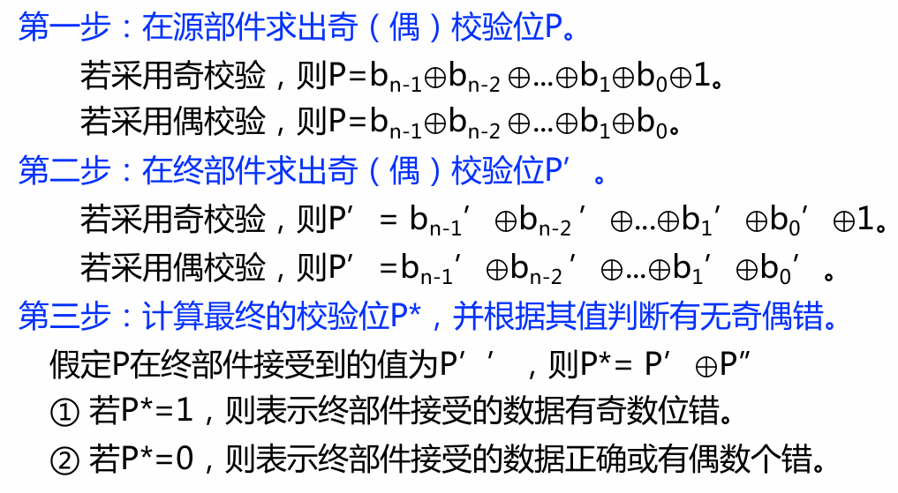
异或可以得到所有数据位的1的个数的奇偶性
再依据是奇校验或是偶校验，就可以得到校验位p的值是0还是1

奇偶校验码的码距是2，在奇偶校验码中，若两个数中有奇数位不同，则它们相应的校验位就不同；若有偶数位不同，则虽校验位相同，但至少有两位数据位不同。因而任意两个码字之间至少有两位不同。

根据码距和纠/检错能力的关系，它只能发现**奇数位出错**，不能发现偶数位出错，而且也不能确定发生错误的位置，不具有纠错能力。

但是开销小，适用于检验一字节长的代码

### 海明校验码

依赖于多组奇偶校验组成，是多重奇偶校验码
奇偶校验码对整个数据编码生成了一位的校验位，那么如果把数据按照某种规律分成若干组，对每组进行相应的奇偶校验，就能提供多位检错信息，从而可以定位并纠正

最终比较时按位进行异或，以确定是否有差错，这种异或操作所得到的结果称为**故障字**（syndrome word）。显然，校验码和故障字的位数是相同。
故障字指示了出错的位置，从而可以定位并纠正错误。

每一组一个校验位，**校验码位数等于组数**

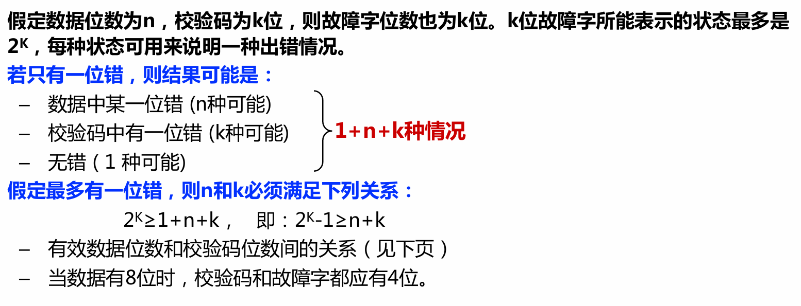
最多只有1位出错，分为在数据中出错和校验码出错和无错三种情况

4位故障字最多可表示16种状态，而单个位出错情况最多只有12种可能（8个数据位和4个校验位），再加上无错的情况，一共有13种。所以，用16种状态表示13种情况应是足够了。

#### 海明校验码的分组

n位数据位和k位校验位按某种方式排列为一个（n+k）位的码字，将该码字中每个出错位的位置与故障字的数值建立关系，通过故障字的值确定该码字中哪一位发生了错误，并将其取反来纠正

根据上述基本思想，按以下规则来解释各故障字的值。

- 规则1：若故障字每位全部是0，则表示没有发生错误。
- 规则2：若故障字中有且仅有一位为1，则表示**校验位中**有一位出错，因而不需纠正。
- 规则3：若故障字中多位为1，则表示有一个数据位出错，其在码字中的出错位置**由故障字的数值来确定**。纠正时只要将出错位取反即可。

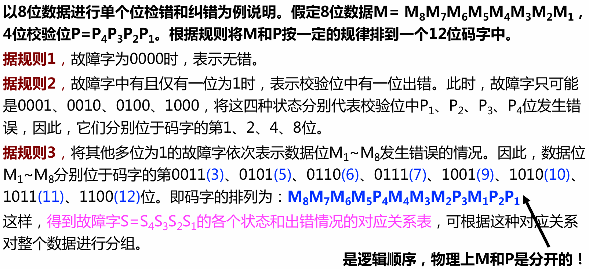
即码字的排列为：$M_8M_7M_6M_5P_4M_4M_3M_2P_3M_1P_2P_1$
单个1出现的位置对应校验码的位
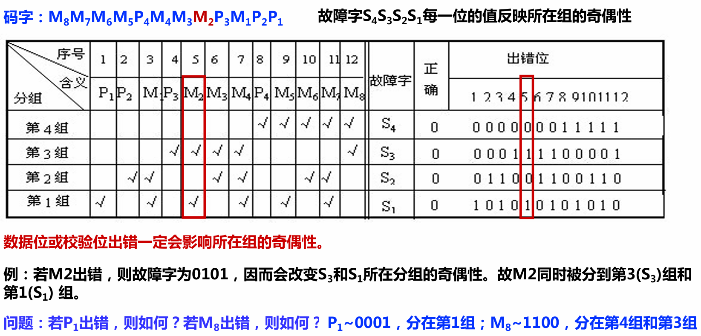
比如说$M_2$是0101的故障字，那么他就参加第一组和第三组的奇偶校验
如果$M_2$出错，那么会改变第一组和第三组的奇偶校验，从而改变校验码的位，从而导致故障字相应比特为1，指向出错的$M_2$
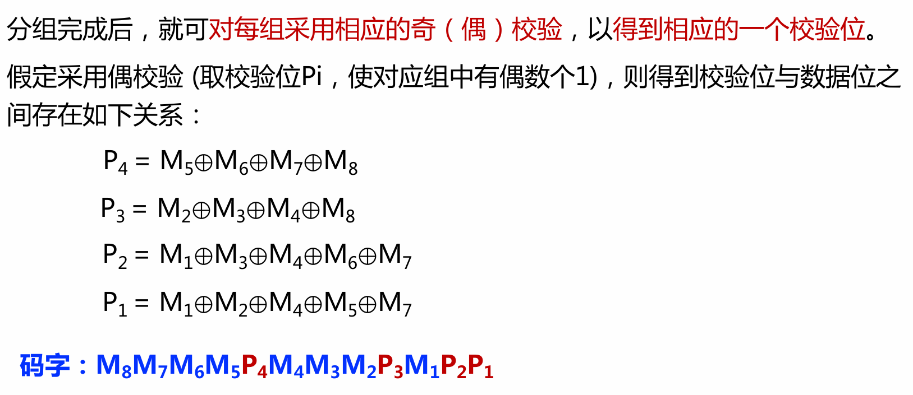
按照分组，得到各位校验位的数值
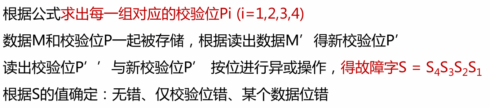
故障字和校验位是不同的哦！故障字是这样异或得到的

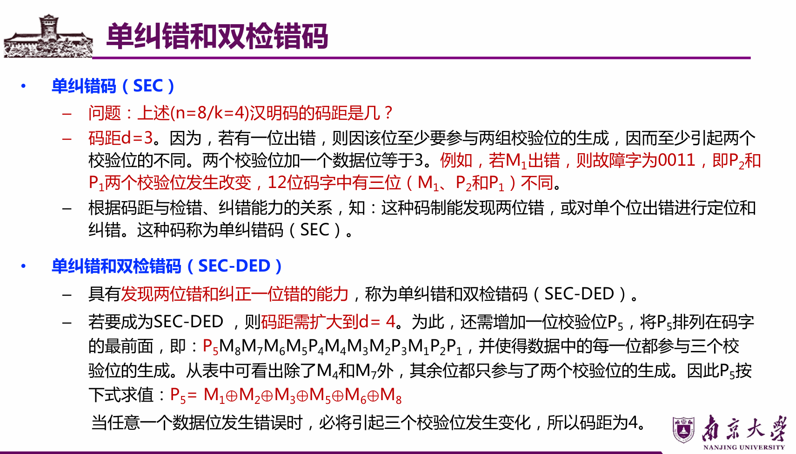
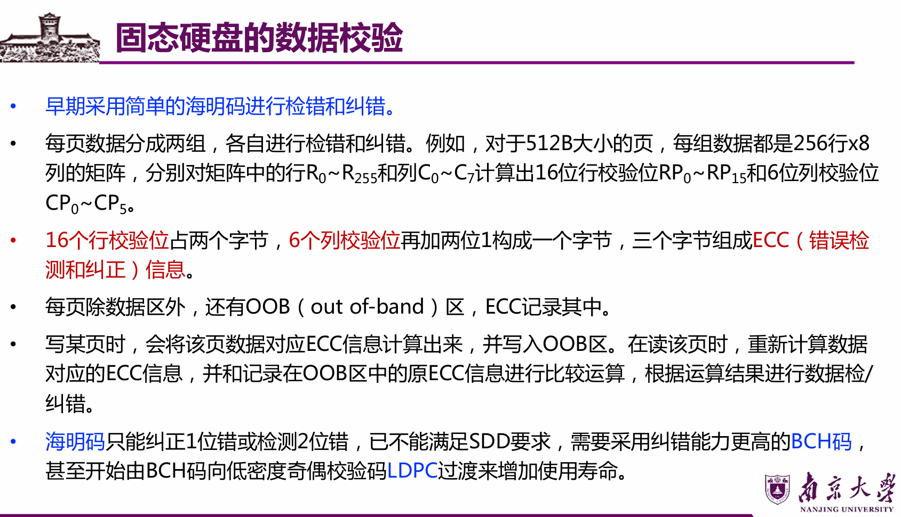

### 循环冗余校验码

循环冗余校验码（Cyclic Redundancy Check），简称CRC码
主要是检错，检错能力很强，可信度很高，纠错能力较弱
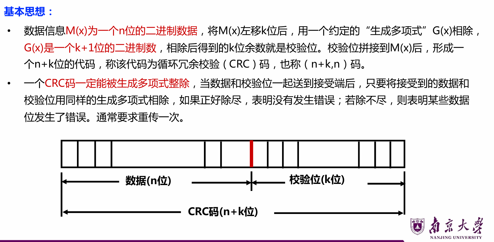
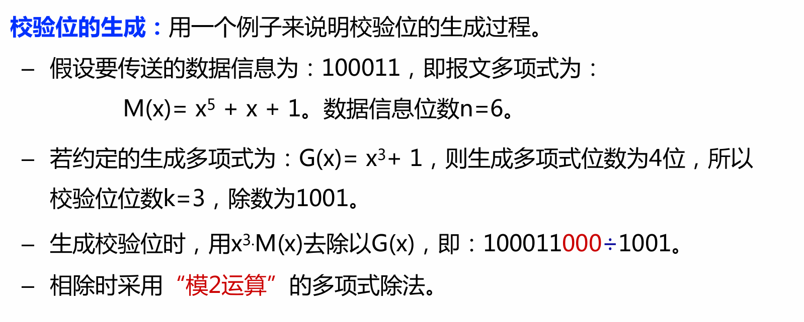
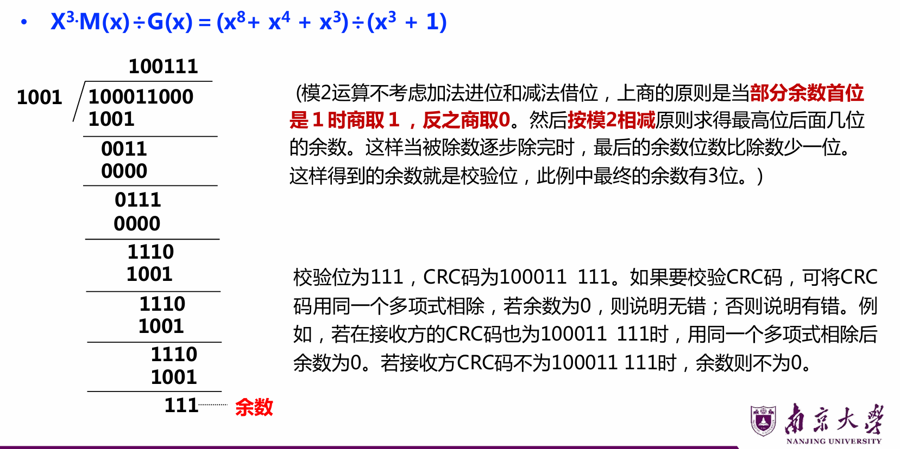

## 高速缓冲存储器

在较短时间间隔内，程序产生的地址往往集中在一个很小范围内，这种现象称为**程序访问的局部性**：空间局部性、时间局部性

- 指令：指令按序存放，地址连续，循环程序段或子程序段重复执行
- 数据：连续存放，数组元素重复、按序访问
  因此程序具有**程序访问的局部性**
  为什么引入Cache能够加快访存速度？
  在CPU和主存之间设置一个**快速小容量的存储器**，其中总是存放最活跃（被频繁访问）的程序和数据，由于程序访问的局部性特征，大多数情况下，CPU能直接从这个高速缓存中取得指令和数据，而**不必访问主存**。
  这个高速缓存就是位于主存和CPU之间的Cache。

### 程序访问的局部性原理

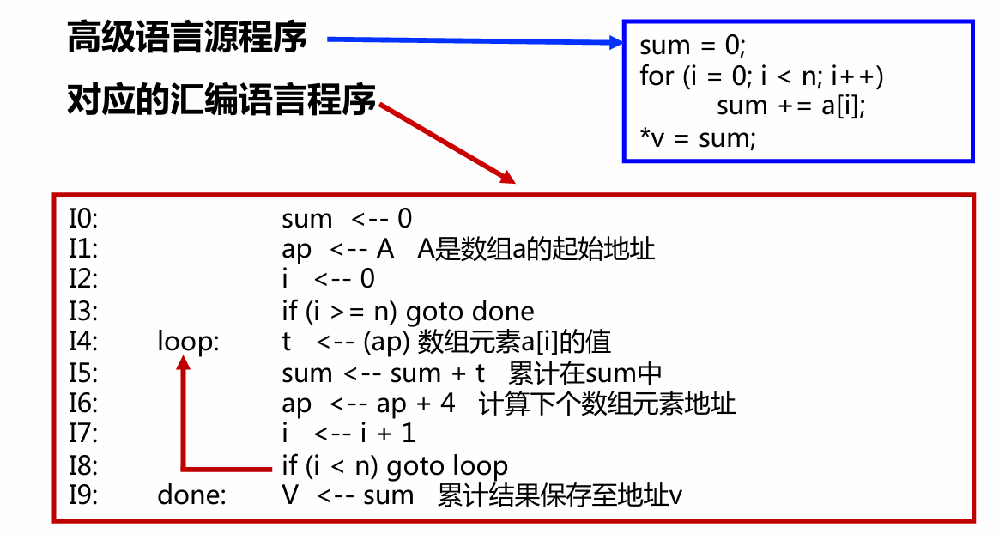
I4和到I8指令在loop中，是循环访问的，因此这一段指令具有非常好的局部性
对于数组这个数据，由于数组元素连续按顺序访问，因此也具有良好的局部性
引入了缓存之后，对于这样连续存储的数据单元，会直接一批一批地从主存中读取到缓存中，而不是一个一个地读取，从而提高了访存效率
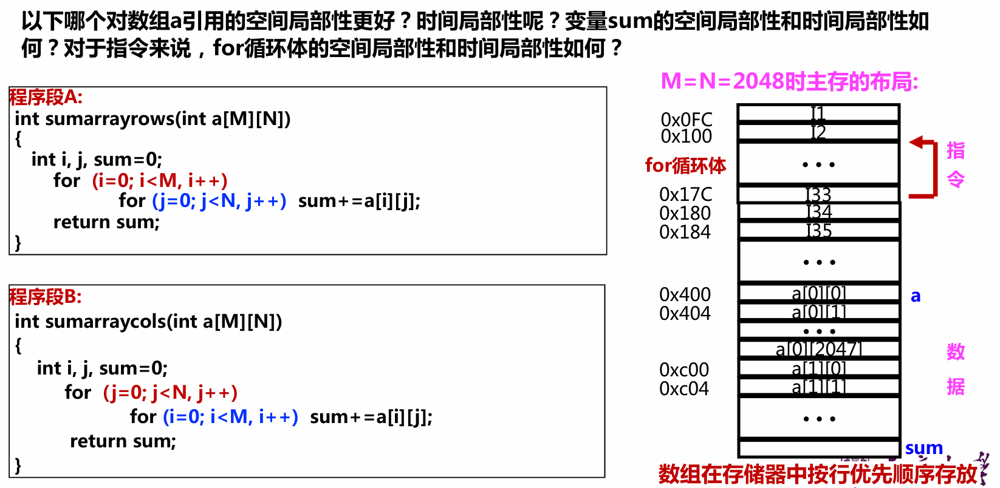
对于程序段A，访问数组a的顺序与存放顺序一致，所以空间局部性好
因为每个a[i][j]只被访问一次，时间局部性差
而对于程序段B，数组a：访问顺序与存放顺序不一致，每次跳过2048个单元，若**交换单位**（一次从主存中调入缓存的数据块）小于2KB，意味着下一次的数据一定在下一个数据块中，还需要再一次调入，没有空间局部性！
（时间局部性差，同程序A）

实际运行发现，A比B快了20.5倍

### 高速缓存(Cache)简介

Cache是一种小容量高速缓冲存储器，它由SRAM组成。
Cache直接制作在CPU芯片内，速度几乎与CPU一样快。
程序运行时，CPU使用的一部分数据和指令会预先**成批拷贝**在Cache中，Cache的内容是主存储器中部分内容的映象
当CPU需要从内存读(写)数据或指令时，**先检查Cache**，若有，就直接从Cache中读取，而**不用访问主存储器**。
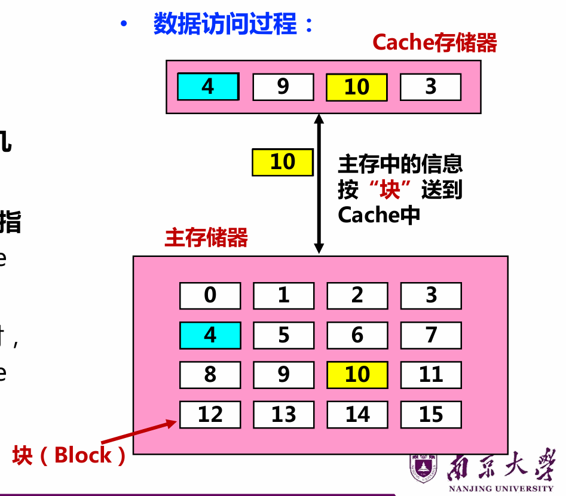

### Cache的操作过程

执行指令时，CPU产生访存要求。
若被访问信息在cache中，称为**命中(hit)**
若被访问信息不在cache中，称为**缺失或失靶(miss)**，就需要去主存单元中找到该信息，然后将其调入Cache中。

主存被分成若干大小相同的块，称为主存块(Block)，Cache也被分成相同大小的块，称为Cache行（line）或槽（Slot）

### Cache的具体实现

#### Cache行和主存块之间的映射方式

Cache行比主存块少，**多个主存块映射到一个Cache行中**
Cache 的 “行（Line）” 和主存的 “块（Block）” 大小是完全一致的
Cache 被划分为若干个 “行”，每行的物理存储空间刚好能存下一个主存块
主存中所有 “索引相同” 的块（比如主存块 0、主存块 4K、主存块 8K……），都会映射到 Cache 的同一行；
但 Cache 行的物理空间仍然**只存当前有效的那一个主存块**（通过标记区分不同的主存块）

把主存空间划分成大小相等的主存块（Block），Cache中存放一个主存块的对应单位称为槽（Slot）或行（line）
主存块的大小等于Cache行的大小也就等于数据在主存和Cache间的传输单位的大小

将主存块和Cache行按照以下三种方式进行映射：
• 直接(Direct)：每个主存块映射到Cache的**固定行**
• 全相联(Full Associate)：每个主存块映射到Cache的**任一行**
• 组相联(Set Associate)：每个主存块映射到Cache**固定组中任一行**

##### 直接映射

直接映射把主存的每一块映射到一个固定的Cache行（槽），也称**模映射**
映射关系为：Cache行号=主存块号mod Cache行数，块（行）都从0开始编号
特点：容易实现，命中时间短，但是不够灵活，Cache的存储空间**得不到充分利用**，导致命中率低

例如，需将主存第0块与第16块同时复制到Cache中时，由于它们都只能复制到Cache第0行，即使Cache其它行空闲，也不能写到其他行里面。这样就会产生频繁的Cache装入。
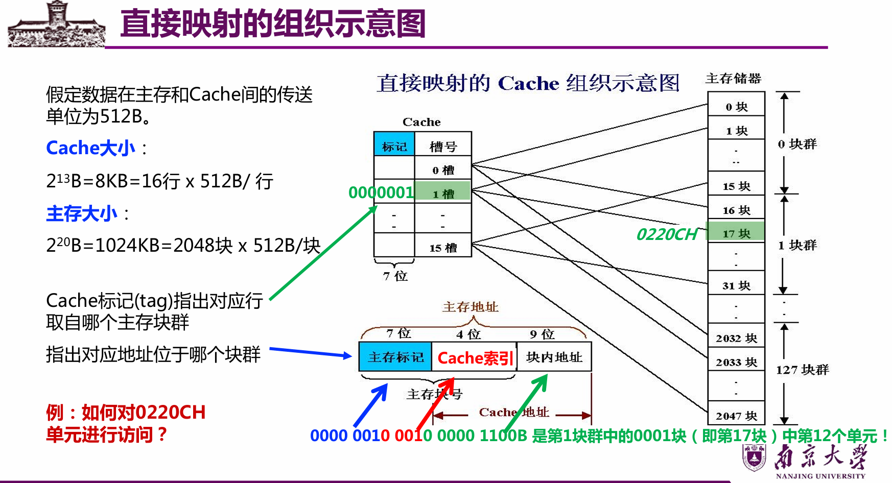
块内地址是精确到数据块里的某一个单元，因为主存每个数据块有512B，所以有9位来表示块内地址
4位的Cache索引来确定Cache中的哪一行
剩下主存标记，7位是用20-9-4得到的，比较缓存行的标记是否与主存块的标记相同，如果相同说明当前缓存行就是要访问的主存块
为什么要有主存标记？因为是一个多对一的映射，如果有多个数据块都映射到同一个Cache行，就需要用主存标记来区分它们

这个图中有对0220CH这个单元访问的示意

**有效位**
在缓存里面，还有一个有效位
V为有效位，为1表示信息有效，为0表示信息无效
开机或复位时，使所有行的有效位V=0，某行被替换后使其V=1，某行装入新块时使其V=1
通过使 V=0 来**冲刷**Cache
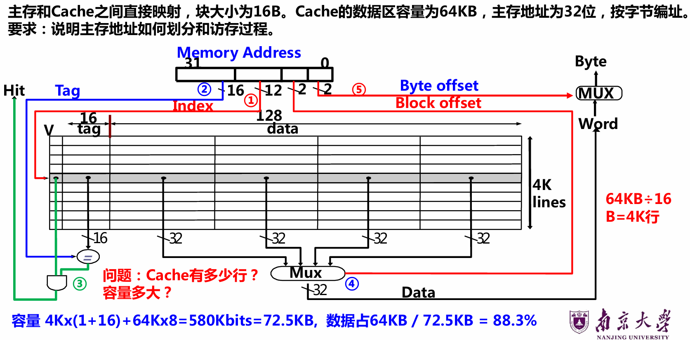
块大小是16B，因此块内地址要4个bit
然后Cache是64KB，Cache 的 “行（Line）” 和主存的 “块（Block）” 大小是完全一致的，也就是4k行，所以要12个bit来表示Cache行号
主存地址有32位，因此剩下的32-4-12=16位是主存标记

计算Cache的总容量，数据区容量题目给出是64KB，每行需要1个有效位和16个主存标记bit，这样乘起来就可以得到是8.5KB，和数据区容量加起来就是Cache的总容量72.5KB

如何计算Cache的容量？
Cache：64行，块大小为16字节，那么地址1200存放在哪一行？
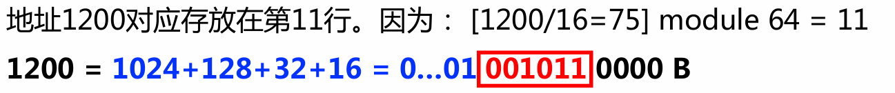
先用除法算出在哪一个主存块，然后用mod算出映射到Cache的哪一行
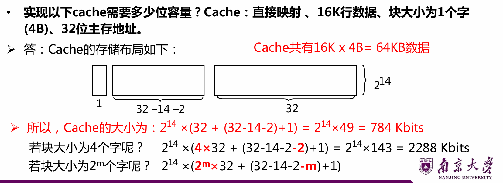
1位有效位，32-14-2是主存标记，32是4B的主存块大小，也就是数据区，要32个bit
这样就可以算出Cache的总容量

##### 全相连映射

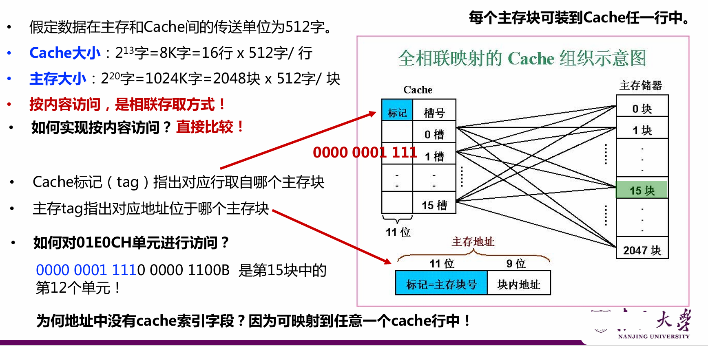
遍历每一行逐一比较标记位，直接映射是先找到Cache行号，再比较标记位，全相连映射是直接比较标记位，找到第一个匹配的行，就可以命中
如果没有命中，取出一行进行替换，随机放入空的Cache行中
也就是说这个主存地址的前11位是标记，也是主存的块号，比如0000 0001 111就表示第15个主存块
所以不需要Cache索引，因为主存块可以映射到Cache的任意行

##### 组相联映射

组相联映射结合直接映射和全相联映射的特点
将Cache**所有行分组**，把主存块映射到Cache固定组的任一行中

映射关系为：Cache组号=主存块号mod Cache组数
举例：假定Cache划分为：8K字=8组x2行/组x512字/行
4=100 mod 8 (主存第100块应映射到Cache的第4组的任意行中)
通常每组2或4行，更多的不常见
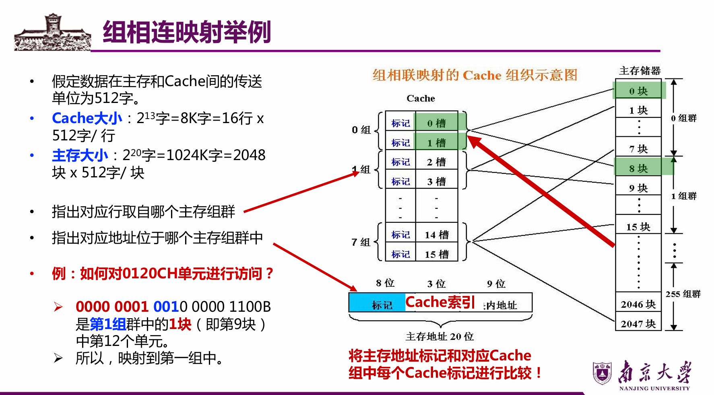
一个主存里面的组群的块数就等于Cache里面的组数
这里总共有8组，因此主存的一个组群有8块，这样就知道总共有256个组群
块内地址是9位，因为块大小是512B
分了256个组群，因此主存标记需要8位来表示，Cache索引指示这一个数据块映射到哪一个Cache组里面，总共8个组所以3位来表示Cache标记
然后Cache里面有多少行表示能同时存储多少个主存块，如果多了的话就需要进行替换

##### 三种映射方式的比较

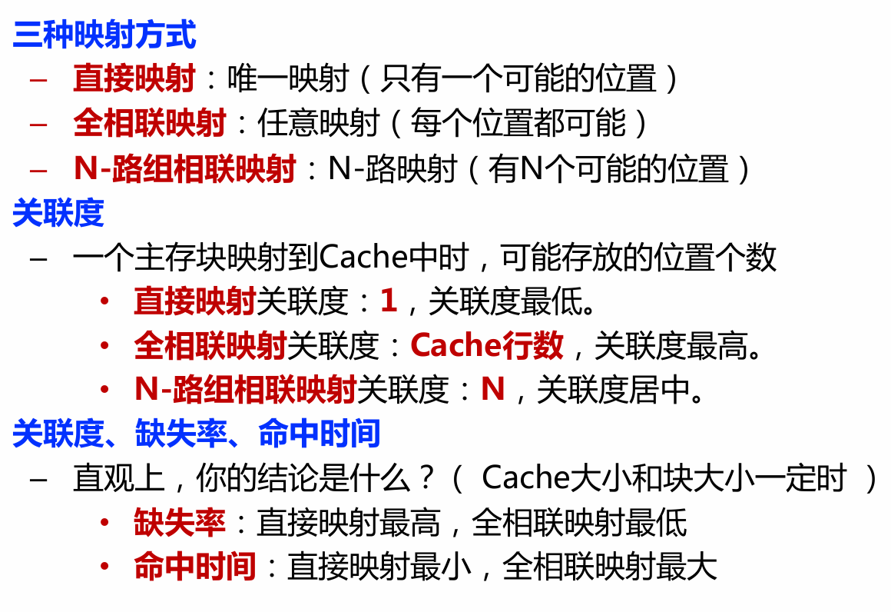

### 命中率、缺失率、缺失损失

命中Hit: 要访问的信息在Cache中，命中率Hit Rate=命中次数/总访问次数，命中时间Hit Time=在Cache中的访问时间
命中时间包括判断时间+Cache访问时间

缺失Miss，缺失率=1-命中率
缺失损失=访问一个主存块所花的时间（实际上不止，还有缓存访问时间，但是缓存访问时间远小于访问主存，可以忽略不计）
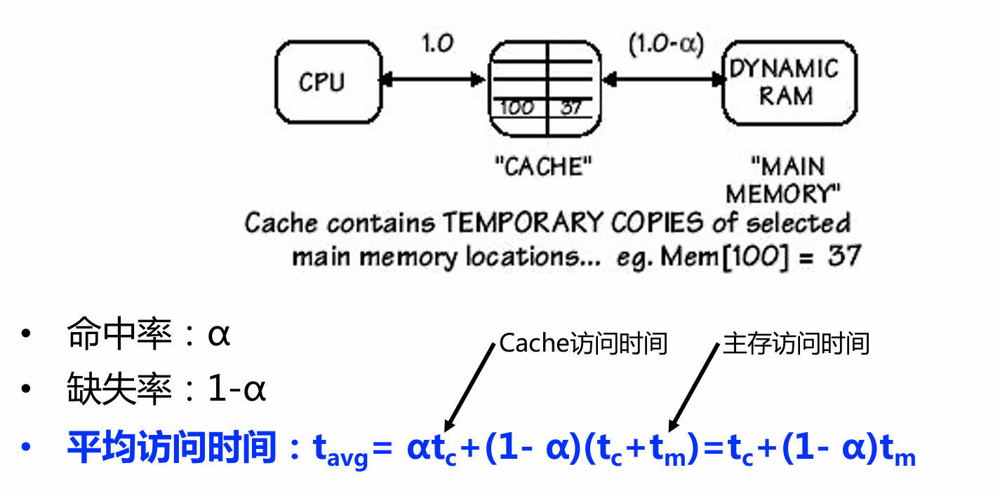
可以算出期望的访问时间

### 标记位大小与关联度

组相连映射，假如按字节编址，块大小为4B，故块内地址占2位
下面这个图是4路组相连映射
总共分了$2^8=256$个组，然后有4个路也就是说每个组有4行，所以有8个bit的组索引，2位的块内地址，剩下22位是标记位
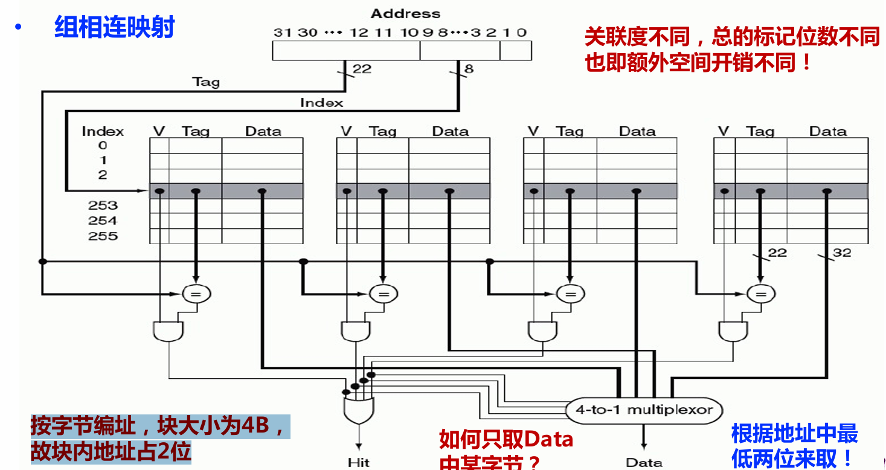
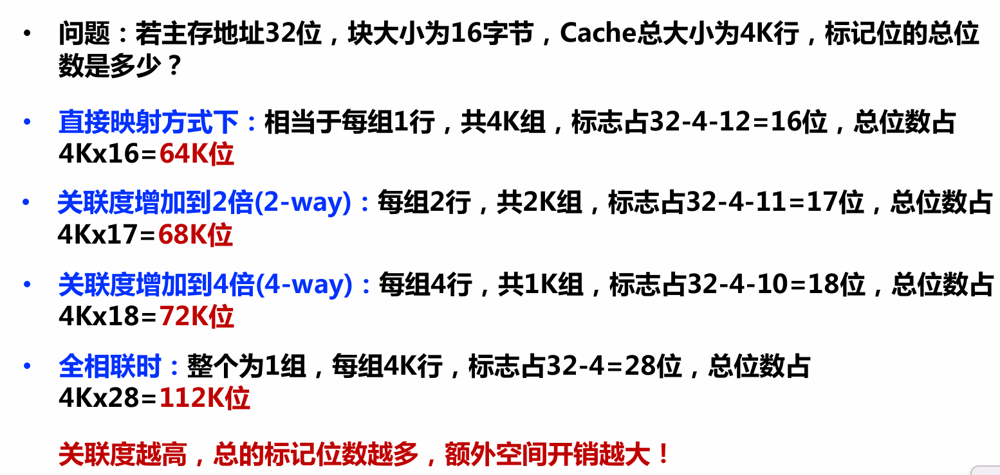

### Cache中主存块的替换算法

组相联映射时，假定第0组的两行分别被主存第0和8块占满，此时若需调入主存第16块，根据映射关系，它只能放到Cache第0组，因此，第0组中**必须调出一块**，那么调出哪一块呢？这就是淘汰策略问题，也称**替换算法**。

#### 先进先出FIFO（first-in-first-out）

总是把**最先进入的那一块**淘汰掉。
例：假定主存中的5块{1,2,3,4,5}同时映射到Cache同一组中，对于同一地址流，考察3行/组、4行/组的情况。
注：通常一组中含有2k行，这里3行/组主要为了简化问题而假设
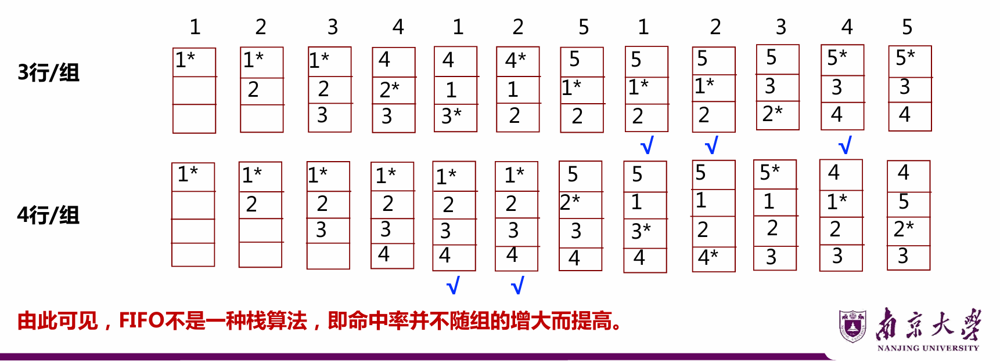
标*的表示是当前组里最早进入的那一块

#### 最近最少用LRU（least-recently used）

总是把**最近最少用的那一块**淘汰掉。
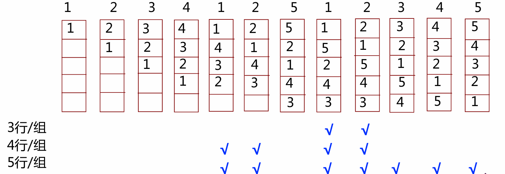
最近最少用算法LRU是一种**栈算法**，它的命中率**随组的增大而提高**。

当分块局部化范围(即：某段时间集中访问的存储区)超过了Cache存储容量（行数）时，命中率变得很低。**极端情况下**，假设地址流是1,2,3,4,1 2,3,4,1,……，而Cache每组只有3行，那么，不管是FIFO，还是LRU算法，**其命中率都为0**。这种现象称为颠簸(Thrashing / PingPong)。
每一次要加入的新块，都是上一次操作刚刚被替换掉的那一块，这就导致了命中率为0的情况。

LRU具体实现时，并不是通过移动块来实现的，而是通过给每个cache行设定一个**计数器**，根据计数值来记录这些主存块的使用情况。这个计数值称为**LRU位**。

通过计数值来确定cache行中主存块的使用情况
即：计数值为0的行中的主存块最常被访问，计数值为n-1的行中的主存块最不经常被访问，先被淘汰！
n是行数
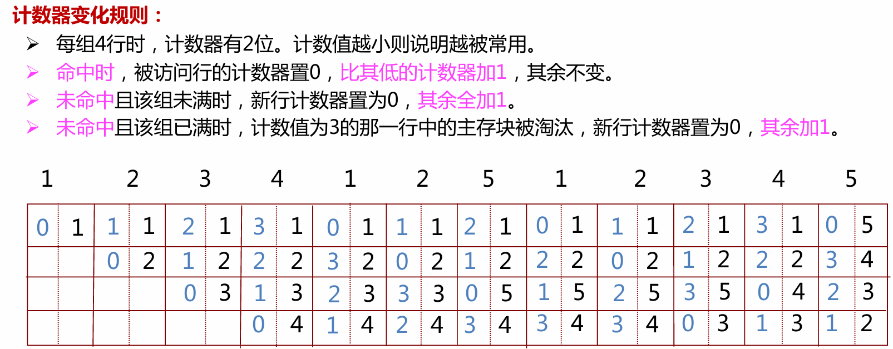
蓝色的是计数器

#### 最不经常用LFU（least-frequently used）

也用与每个行相关的计数器来实现，有LRU算法类似，但不完全相同。

#### 随机替换算法（Random）

从候选行的主存块中随机选取一个淘汰掉，与使用情况无关。（在性能上只稍逊于基于使用情况的算法，而且代价低。）

#### 何时需要替换？

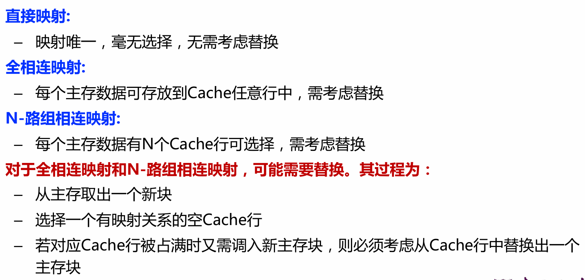

#### 替换算法举例（这是个例题，尚待掌握）

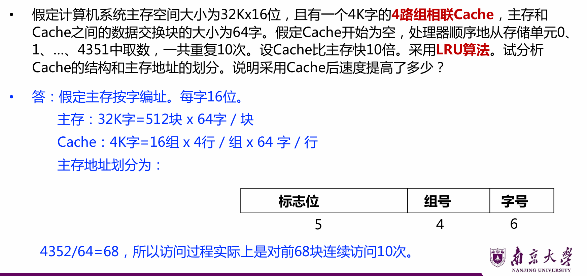
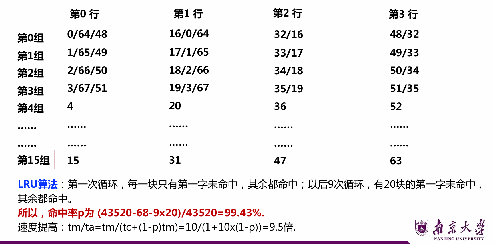
相当于访问这68个数据块10次，这个图的意思是模拟LRU算法的过程，由于68个数据块，所以64、65、66、67这4个数据块会被映射到第0123组，然后就需要进行替换。

### Cache的一致性问题

为何要保持在Cache和主存中数据的一致？ 因为Cache中的内容是主存块副本，当对Cache中的内容进行更新时，就存在Cache和主存如何保持一致的问题。
写操作有两种情况：

- 写命中（Write Hit）：要写的单元已经在Cache中
- 写不命中（Write Miss）：要写的单元不在Cache中

处理Cache读比Cache写更容易，故指令Cache比数据Cache容易设计

对于写命中，有两种处理方式

- 全写法Write Through(通过式写、写直达、直写)
  同时写Cache和主存单元，假定一次写主存需要100个CPU时钟周期，10%的存储指令使CPI增加到：1.0+100x10%=11
  使用写缓冲（Write Buffer）
- 回写法Write Back(一次性写、写回、回写)
  只写cache不写主存，缺失时**一次写回**，每行有个**修改位**（“dirty bit，脏位”），大大降低主存带宽需求，控制可能很复杂
全写法：改 Cache 的同时，立刻改主存，不管 Cache 是否命中，只要CPU写数据，主存一定会被同步更新，因此一致性好
回写法：改 Cache 时只改 Cache，等这个 Cache 行被淘汰替换时，才把修改过的 Cache 数据写回主存，给这个被修改过的 Cache 行，打上一个专属标记：脏位（Dirty Bit）=1
只有 Cache 命中才会触发，等要替换的时候，看脏位是否为1，为1则写回主存，否则不写回，直接丢弃

对于写不命中，有两种处理方式

- 写分配Write Allocate
  将主存块装入Cache，然后**更新相应单元**，试图利用空间局部性，但每次都要从主存读一个块
- 非写分配Not Write Allocate
  **直接写主存单元**，不把主存块装入到Cache

#### 全写法：写缓冲

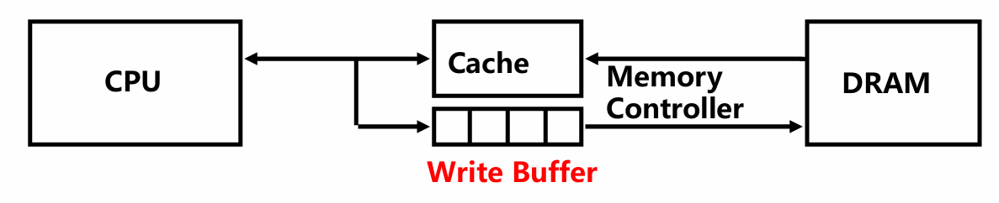
CPU同时写数据到Cache和**Write Buffer**，Memory controller（存控）将缓冲内容写主存
Write buffer (写缓冲) 是一个FIFO队列，一般有4项，在存数**频率不高**时效果好
频繁写，容易出现缓冲饱和的问题，发生阻塞，导致性能下降
如何解决？加一个二级Cache，或者使用回写法Write Back

### Cache与程序性能

- Cache大小：Cache越大，Miss率越低，但**成本越高**！
- Block大小：Block大小与Cache大小有关，且不能太大，也不能太小！

程序的性能指**执行程序所用的时间**，程序执行所用时间与程序执行时**访问指令和数据**所用的时间有很大关系，而指令和数据的访问时间与cache**命中率、命中时间和缺失损失**有关
对于给定的计算机系统而言，命中时间和缺失损失是确定的，因此，指令和数据的访存时间主要由cache**命中率**决定

Cache命中率主要由程序的空间局部性和时间局部性决定。因此，为了提高程序的性能，程序员须编写出具有**良好访问局部性**的程序
考虑程序的访问局部性通常在**数据的访问局部性**上下工夫，数据的访问局部性主要是指数组、结构等类型数据访问时的局部性，这些数据结构的数据元素访问通常是通过**循环语句**进行的，所以，如何合理地处理循环对于数据访问局部性来说是非常重要的。

举例
某32位机器主存地址空间大小为256 MB，按字节编址。指令cache和数据cache均有8行，主存块为64B，数据cache采用直接映射。假定编译时i, j, sum均分配在寄存器中，数组a按**行优先方式**存放，其首址为320。
（1）不考虑用于一致性和替换的控制位，数据cache的总容量为多少？
（2）a[0][31]和a[1][1]各自所在主存块对应的cache行号分别是多少？
（3）程序A和B的数据访问命中率各是多少？哪个程序的执行时间更短？
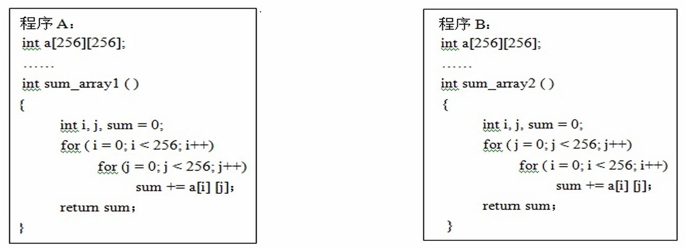
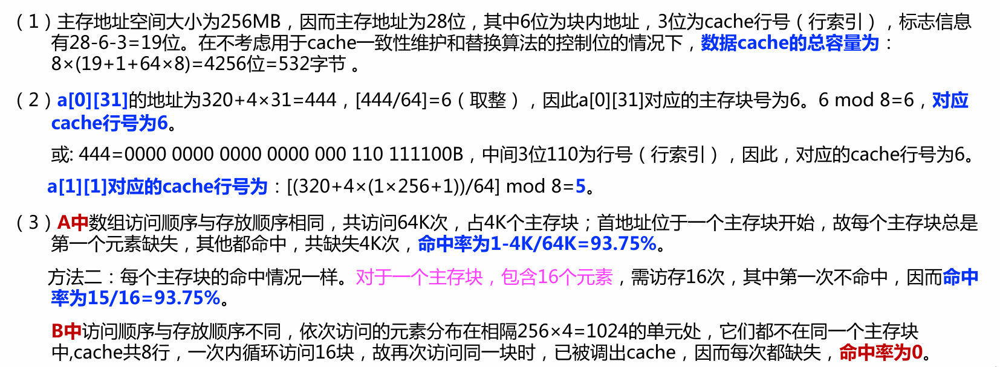
显然程序A的局部性更好

### Cache设计考虑的问题

刚引入Cache时只有一个Cache。近年来**多Cache系统**成为主流
需要考虑两个方面：

- 单级？多级？
  外部(Off-chip)Cache：不做在CPU内而是**独立设置**一个Cache
  片内(On-chip)Cache：将Cache和CPU作在**一个芯片上**
  单级Cache：只用一个片内Cache
  多级Cache：同时使用L1 Cache（一级缓存）和L2 Cache（二级缓存），甚至有L3 Cache，L1 Cache更靠近CPU，其速度比L2快，其容量比L2小
- 联合？分立？
  分立：指数据和指令**分开存放**在各自的数据和指令Cache中
  一般L1Cache都是分立Cache，为什么？
  L1 Cache的命中时间比命中率更重要！为什么？
  联合：指数据和指令都**放在一个**Cache中
  一般L2Cache都是联合Cache，为什么？
  L2 Cache的命中率比命中时间更重要！为什么？

采用L2 Cache的系统，其缺失损失的计算如下：

- 若L2 Cache包含所请求信息，则缺失损失为L2 Cache访问时间
- 否则访问主存，并取到L1 Cache和L2 Cache（缺失损失更大）
  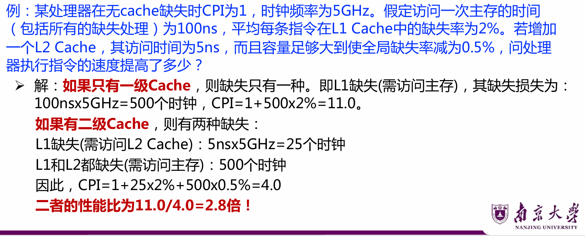
  在计算一级Cache的CPI的时候是用$1+500\times2\%$而不是 $1\times98\%+500\times2%$ 因为不管这条指令命中与否，一级Cache都一定会被访问！2%是缺失率而不是不访问的概率！
  通过有二级Cache前后的**时钟周期**做比，我们可以得到执行速度提高的比例。

### 主存-总线-Cache间的连接结构问题

CPU从主存取一块信息到Cache：发送地址和读命令到主存(1个周期)、主存准备好一个数据(10个周期)、从总线传送一个数据(1个周期)。
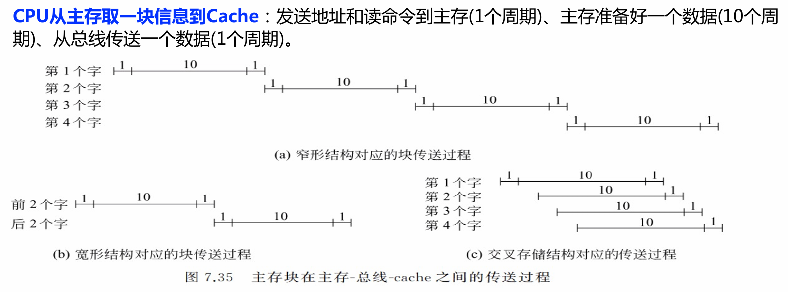
主存、总线、cache之间有三种连接方式：

- 窄形结构：每次传送一个字
- 宽形结构：每次传送多个字
- 多模块交叉存取结构：轮流启动多个存储模块进行读写，按一个字的宽度进行传送。（有点类似指令流水线）

## 虚拟存储器

虚拟存储技术的引入用来解决一对矛盾：一方面，由于技术和成本等原因，主存容量受到限制；另一方面，系统程序和应用程序要求主存容量越来越大

虚拟存储器和缓存有一些相似的地方，比如说地址的转换，但是有不同：
主存和缓存的映射不是一一映射，并且CPU有主存真实的物理地址
但是虚拟存储器有虚拟地址，CPU有虚拟地址而不知道主存的物理地址，用页表将虚拟地址转换为物理地址
页表和主存是一一映射，如果在页表中没有查找到那在主存里肯定也没有，叫缺页
页表不存储数据，只建立虚拟地址和物理地址之间的映射，而缓存存的是主存备份的数据

程序员在比实际主存空间大得多的**逻辑地址空间**中编写程序，程序执行时，把当前需要的程序段和相应的数据块调入主存，其他暂不用的部分存放在**磁盘上**
指令执行时，通过硬件将逻辑地址（也称虚拟地址或虚地址）转化为物理地址（也称主存地址或实地址），在发生程序或数据访问失效(**缺页**)时，由操作系统进行主存和磁盘之间的信息交换
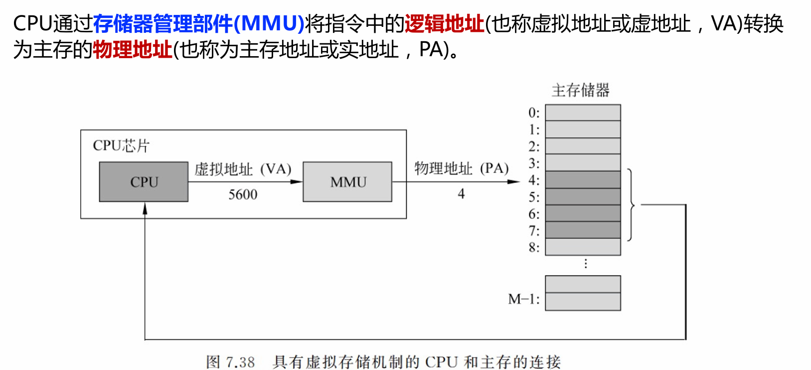
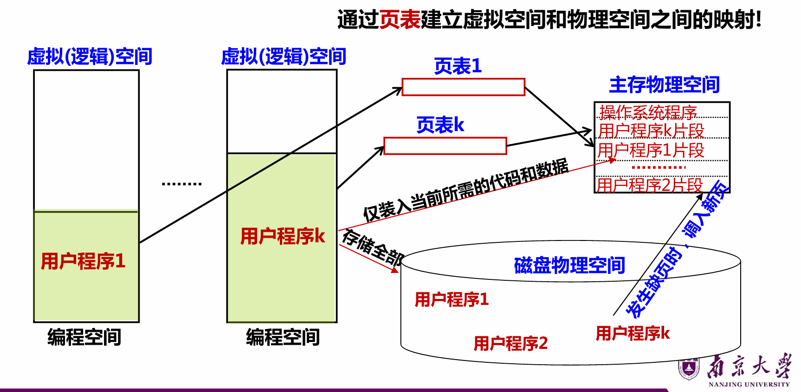

### 虚拟地址空间
Linux在X86上的虚拟地址空间分为
- 用户空间：每个进程有独立的4GB虚拟地址空间
- 内核空间：所有进程共享的4GB虚拟地址空间

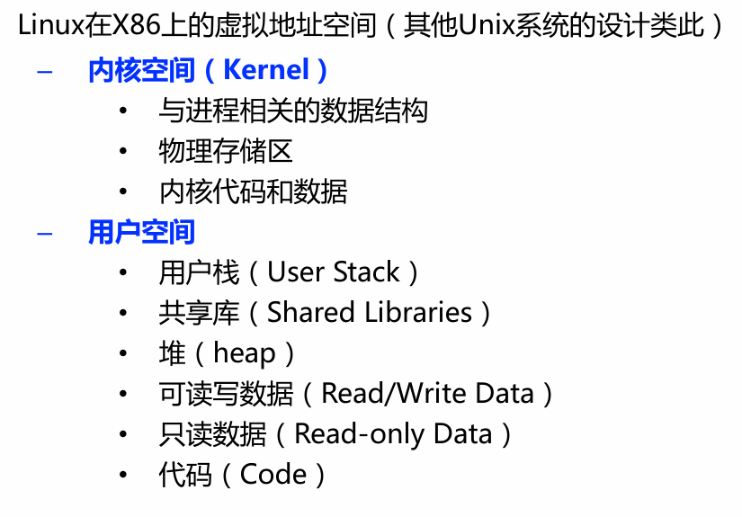
问题：加载时是否真正从磁盘调入信息到主存？
实际上不会从磁盘调入，只是将虚拟页和磁盘上的数据/代码建立对应关系，称为“映射”。

一个程序在“编辑、编译、汇编、链接、装入”过程中的哪个环节确定了每条指令及其操作数的虚拟地址？

- **链接**时确定虚拟地址；**装入**时**生成页表**以建立虚拟地址与物理地址之间的映射。

### 虚拟存储器管理

虚拟存储器的块称为**页**（Page），而Cache里面的块称为**行**（Line）
有三种虚拟存储器实现方式：分页式、分段式、段页式

### 分页式虚拟存储器

最为典型，着重讲这一种

#### 虚拟存储器与Cache的比较

- 页的大小远大于行的大小，因为对页来说命中很重要，而且他和主存是一一映射的
- 采用全相连映射，因为缺页的开销比缓存缺失的开销大得多，磁盘访问速度很慢，命中很重要！
- 通过软件来处理缺页，用硬件实现访问磁盘太慢了
- 采用Write Back回写策略，因为写磁盘很慢，避免频繁的写磁盘操作
- 地址转换用硬件实现，加快指令执行

#### 页表

不存储数据，只有跟存放位置相关的，建立和物理地址之间的映射
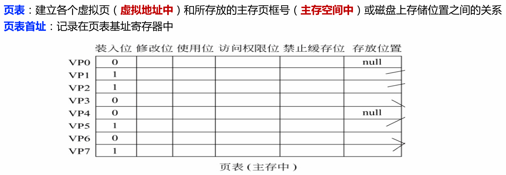
页表首地址在寄存器中，页表本身在主存中
页表的一行叫做页表项，VP0是页表号
每个进程有一个页表，项数由虚拟地址空间大小决定，理论上由于各进程有相同虚拟空间，页表大小是一样的。
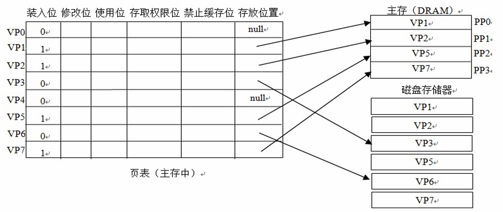
装入位取0或1表示不同状态
未分配页：进程的虚拟地址空间中“null”对应的页（如VP0、VP4）
已分配的缓存页：有内容对应的**已装入主存**的页（如VP1、VP2、VP5等）装入位是1
已分配的未缓存页：有内容对应但**未装入主存**的页（如VP3、VP6，对应的是磁盘上的页）装入位是0

#### 逻辑地址转换为物理地址的过程

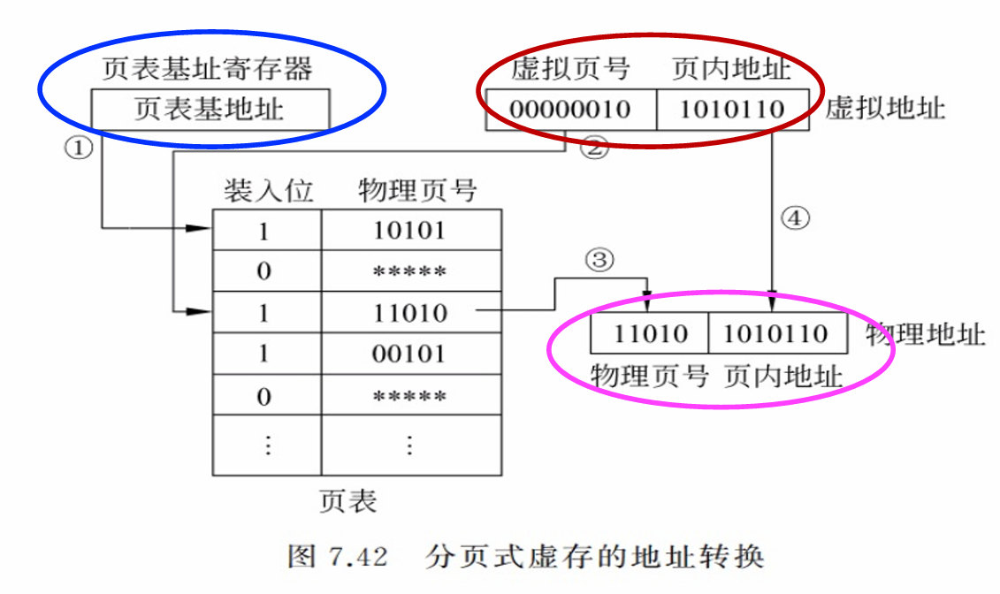
虚拟地址分为两个部分，虚拟页号和页内地址
比如这里虚拟页号是00000010也就是2，就到第2行找，装入位是1，然后看他的物理页号就是11010，在把页内地址和物理页号拼接在一起组成物理地址
页表的基地址存在页表基址寄存器中

#### 信息访问中可能出现的异常情况

1.缺页
产生条件：当Valid（装入位）为0时
相应处理：从磁盘读到内存，若内存没有空间，则还要从内存选择一页替换到磁盘上，替换算法类似于Cache，采用回写法，淘汰时，根据“dirty”位确定是否要写磁盘

2.保护违例或访问违例
当Access Rights (存取权限)与所指定的具体操作不相符时，产生保护违例或访问违例
在屏幕上显示“内存保护错”或“访问违例”信息，当前指令的执行被阻塞，当前进程被终止

#### 快表

把**经常要查的页表项放到Cache中**，这种在Cache中的页表项组成的页表称为后备转换缓冲器(Translation Lookaside Buffer, TLB)，通常称为**快表**
TLB中的页表项，需要**tag+主存中的页表项**
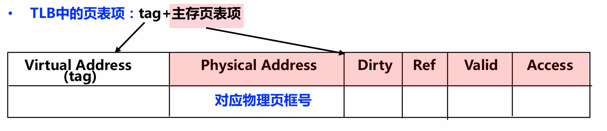
CPU访存时，地址中虚页号（虚拟地址分为虚页号和页内地址）被分成tag+index，tag用于和TLB页表项中的tag比较，index用于定位需要比较的项
TLB全相联时，没有index，只有Tag，虚页号需与每个Tag比较；TLB组相联时，则虚页号高位为Tag，低位为index，用作**组索引**

因此快表具备Cache的一些特性

先在TLB中找，再去页表找，页表中也没有，才会发生缺页
减少到内存查页表的次数，提高了访存效率
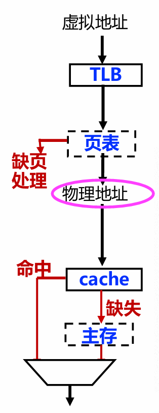
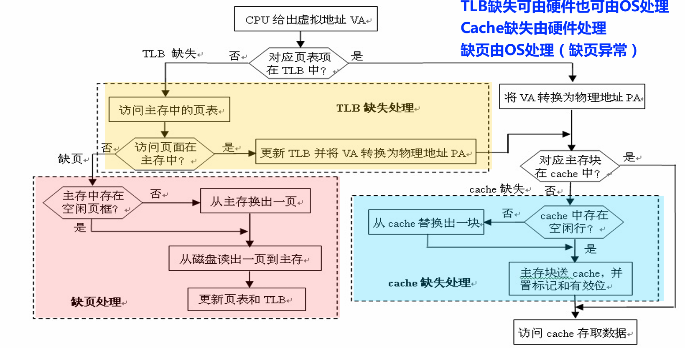
这个是完整的CPU访存过程，总共可能会有三种缺失的发生

#### 三种不同缺失的组合：举例

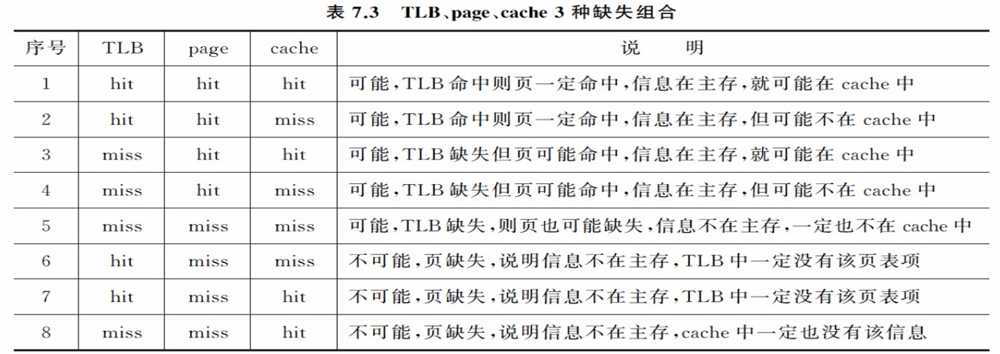
最好的情况是hit、hit、hit，此时，访问主存几次？
不需要访问主存！

以上组合中，最好的情况是？
hit、hit、miss和miss、hit、hit，访存1次
以上组合中，最坏的情况是？
miss、miss、miss，需访问磁盘、并访存至少2次
介于最坏和最好之间的是？ miss、hit、miss，不需访问磁盘、但访存至少2次

### 分段式虚拟存储器

程序员或OS将程序模块或数据模块分配给**不同的主存段**，一个大程序有多个代码段和多个数据段构成，是按照程序的逻辑结构划分而成的多个相对独立的部分。
段通常带有**段名或基地址**，便于编写程序、编译器优化和操作系统调度管理
分段系统将主存空间按实际程序中的段来划分，每个段在主存中的位置记录在段表中，并附以“**段长**”项
段表由**段表项**组成，段表本身也是主存中的一个可再定位段

与分页式的不同，分段的每一段的大小可以不同
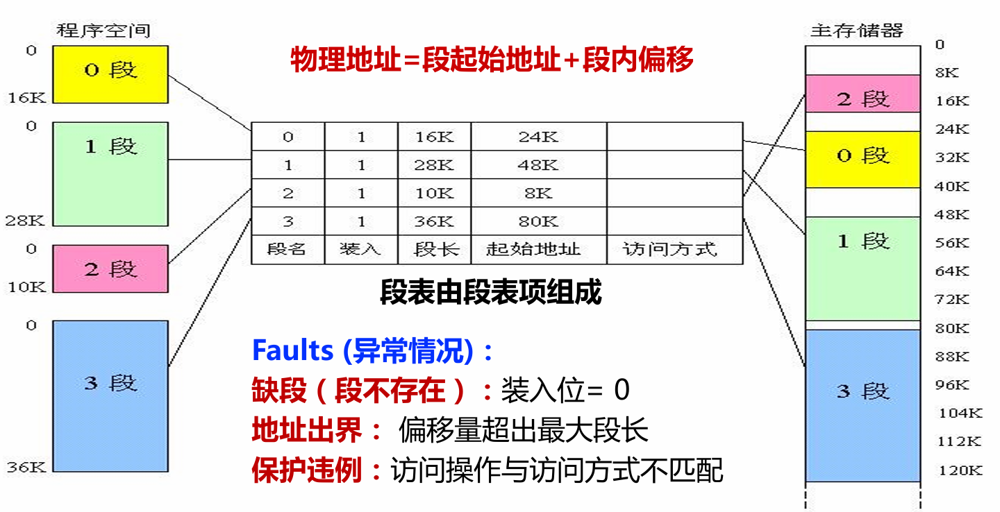
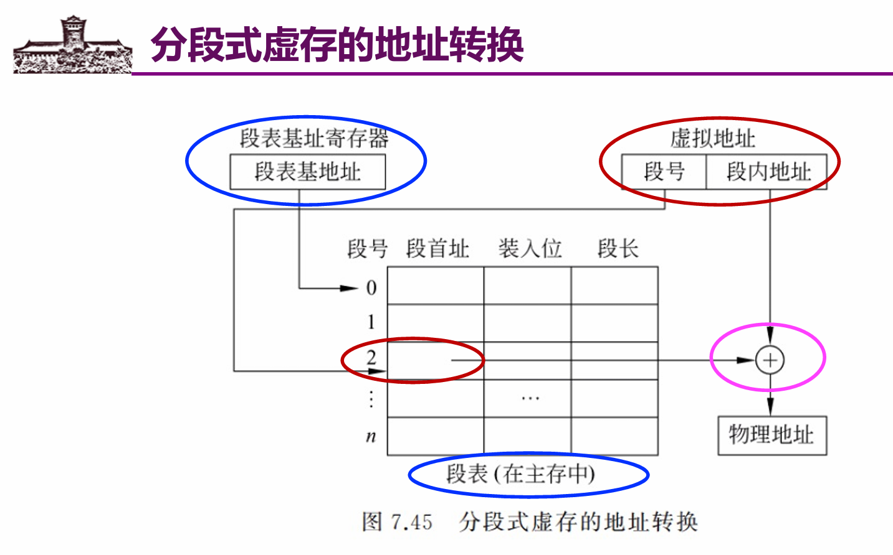
段号找到段表里面的某一段表项，段表项中包含了段的基地址和段长
将段首址与段内地址拼接成物理地址

### 段页式虚拟存储器

把段和页结合
按模块分段，段内再分页，在主存里面仍然以页为基本单位
所以他要两级定位找到物理页号，逻辑地址由段地址、页地址和偏移量组成

### 存储保护

为避免多道程序**相互干扰**，防止某程序出错而破坏其他程序的正确性或不合法地访问其他程序或数据区，应对每个程序进行**存储保护**
访问属性的设定：数据段可指定R/W或RO；程序段可指定R/E或RO
最基本的保护措施：规定各道程序**只能访问属于自己所在的**存储区和共享区：
对于属自己存储区的信息：可读可写，只读/只可执行
对共享区或已获授权的其他用户信息：可读不可写
对未获授权的信息（如OS内核、页表等）：不可访

为了对操作系统的存储保护提供支持，硬件必须具有以下**三种基本功能**：

- 支持至少两种运行模式：
  1.管理模式(Supervisor Mode)
  执行系统程序（内核）时处理器所处的模式称为管理模式(Supervisor Mode)，或称管理
  程序状态，简称管态、管理态、核心态、**内核态**
  2.用户模式(User Mode)
  CPU执行非操作系统的**用户程序**时，处理器所处的模式就是用户模式，或称用户状态、目
  标程序状态，简称为目态或**用户态**
- 使一部分CPU状态只能由内核程序读写而不能由用户程序读写
- 提供让CPU在管理模式（内核态）和用户模式（用户态）相互转换的机制
