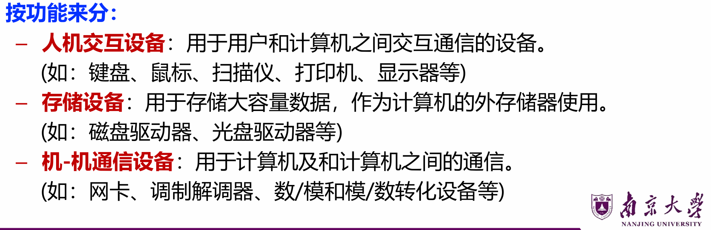
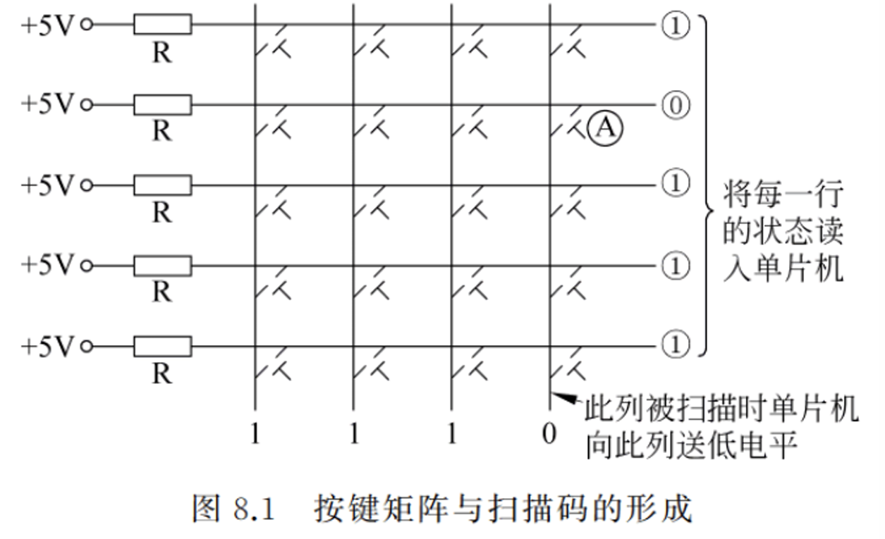
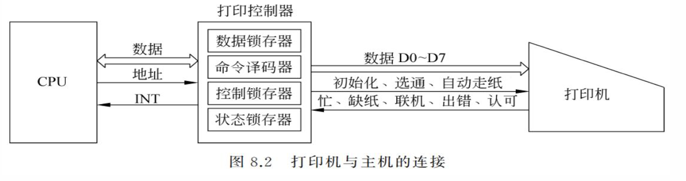
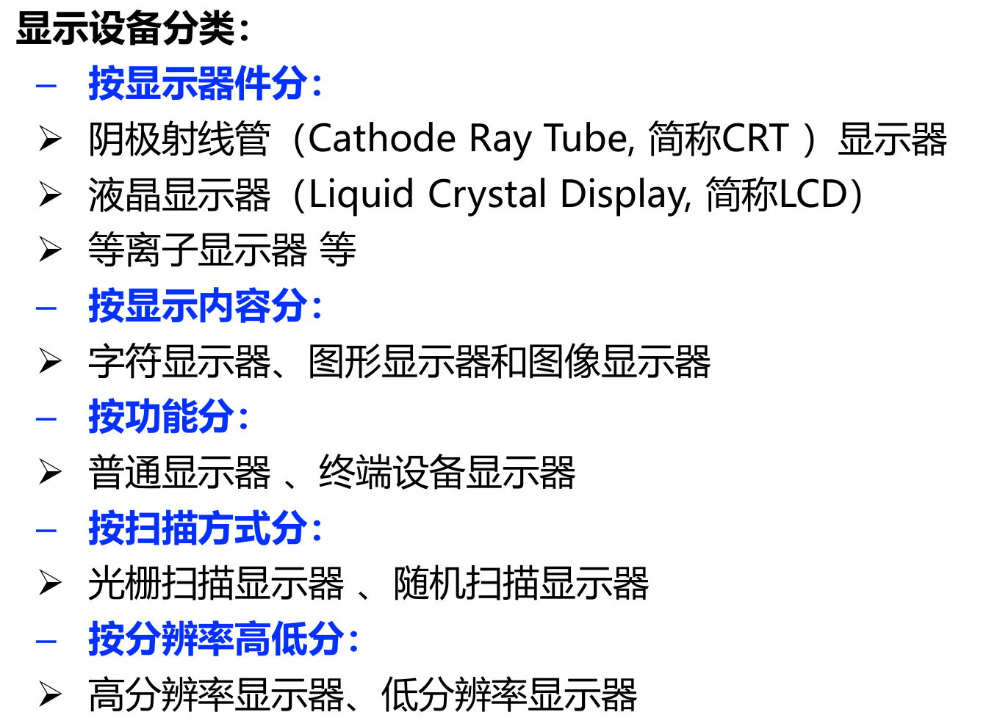
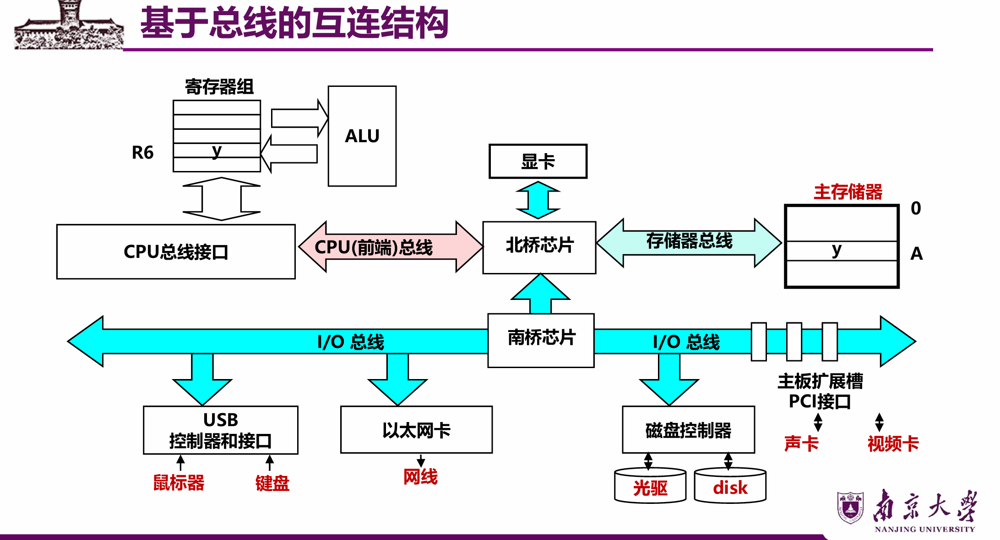
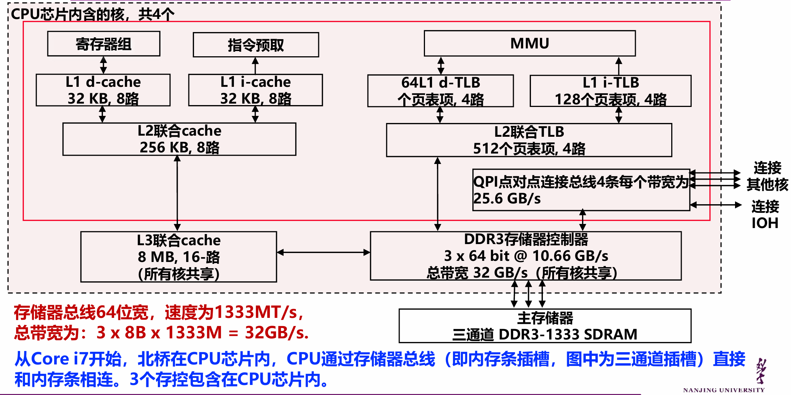
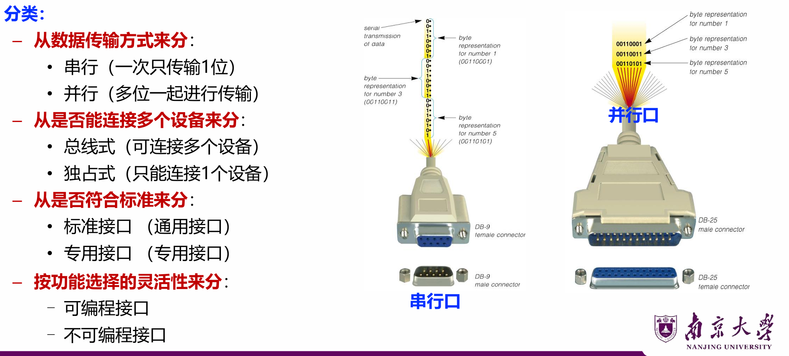
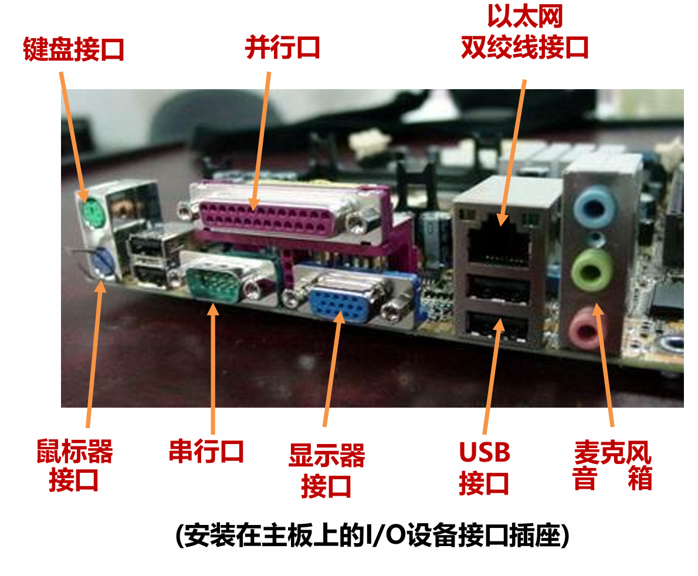
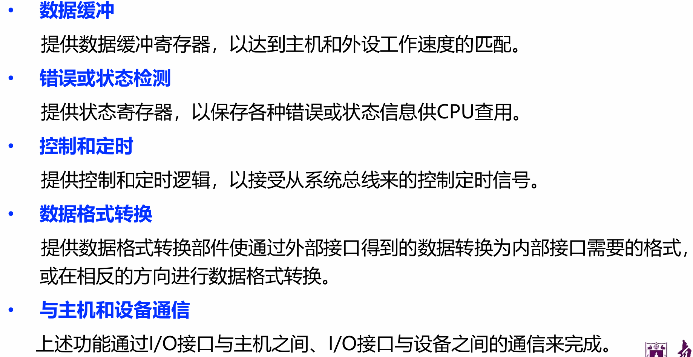
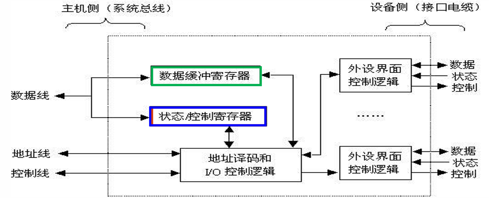

# Lec8: 系统互联及输入输出组织
## 外部设备的分类与特点
### 外设分类

### 外设特点
- **异步性**：外设与CPU之间是完全异步的工作方式，两者之间无统一的时钟。
- **实时性**：CPU必须及时按不同的**传输速率和传输方式**接收来自多个外设的信息或向多个外设发送信息，否则高速设备可能丢失信息。
- **多样性**：不同外设的数据传输方式不同，外设的多样性造成了主机与外设之间连接的复杂性。

## 常用输入输出设备
### 键盘
通过键盘输入字符，并在显示器上显示，信息交换的基本单位是**字符**
普遍使用的代码是ASCII码
通常在7位代码后跟一位奇偶校验位，组成一个字节。

键盘输入信息过程
- 按下一个键
- 查出按下的是哪个键：**列扫描法**等
- 将按键**位置信息**转换为对应的ASCII码，保存到计算机中。

按功能可分为以下两类：
- 编码键盘：检测被按键，并**提供相应的ASCII码**送CPU，传送的是ASCII码。
- 非编码键盘：只简单提供键盘的**行列矩阵**，识别按键位置，提供相应的**位置码**送CPU，传送的是位置码。

#### 列扫描法

按列扫描法，依次向每一列输送低电平，然后检测每一行的列线是否为高电平。
如果是高电平，则说明该键未被按下；如果是低电平，则说明该键被按下。

### 打印机
- **击打式打印机**：最早研制成功的计算机打印设备，以**机械力量**击打字锤从而使字模隔着色带在纸上打印出字来。
- **非击打式打印机**：激光打印机（由打印机控制器和打印装置两部分组成）和喷墨打印机（利用喷墨头喷射出**可控的墨滴**，在打印纸上形成文字或图片）等

打印控制器由以下几个部分组成：
- **指令锁存器**：用于暂存CPU送来的打印数据和打印指令。
- **命令译码器**：对CPU送来的命令进行译码，产生打印控制器内部使用的命令。
- **控制锁存器**：锁存CPU送来的控制命令。
- **状态锁存器**：保存打印机送来的状态信息（缺纸、忙等）。

### 显示器

#### CRT显示器
阴极射线管（CRT）是图形显示器的核心组件，负责将电子束扫描到屏幕上，形成图像。

分辨率：屏幕上能显示的**像素**数，CRT的分辨率是可以无重叠显示的最多点数
通常称分辨率为**水平和垂直方向的总点数**，但更精确的分辨率定义是在x和y方向上**每厘米可绘制的点数**(水平分辨率和垂直分辨率) 

灰度级是指像素点的**亮度级差**，在彩色显示器中表现为**色彩的差别**,即颜色数

纵横比(aspect ratio)指在屏幕两个方向生成同等长度的线段所需垂直点数对水平点数的比值

物理尺寸指屏幕对角线的长度。

光栅扫描
光栅扫描方式中，电子束总是不断地**从左到右、从上到下**反复扫描整个屏幕
刷新率：一般刷新是按每秒60到80帧的速率进行的，但有些系统设计成更高的刷新速率。每秒60帧的刷新频率为60HZ
可分为**逐行扫描和隔行扫描**两种，一般都采用隔行方式。每帧显示分为先后扫描奇数场和偶数场两趟。

#### LCD显示器
具有体积小、耗电低、不闪烁等优点和良好的综合性能，广泛应用于各类计算设备中。
基本原理：**液晶通电时会改变其排列次序**，从而影响光线的通过

工作模式：
- 字符模式：显示存储器中存放**字符编码**及其属性，字形信息存放在字符发生器中。
- 图形模式：字符的**点阵信息**直接存储在显示存储器中，可显示彩色或单色多级灰度图像，能够实现画图功能。

显卡：核心是**绘图处理器**。早期的绘图功能由CPU在内存中完成，再将生成的图像从内存传到显存。目前显卡中的**GPU**专门用来绘图，减轻了CPU的负担。

## 外设与CPU和主存的互连
### 总线
总线是计算机内数据传输的**公共路径**，用于实现两个或两个以上部件之间的信息交换。
系统总线指连接处理器芯片、存储器芯片和各种I/O模块等**主要部件**的总线。
系统总线通常由一组控制线、一组数据线和一组地址线构成。也有些总线没有单独的地址线，地址信息通过数据线来传送，这种情况称为**数据/地址复用**。
- **数据线**（Data Bus）：承载在源和目部件之间**传输的信息**。数据线的宽度反映一次能传送的数据的**位数**。
- **地址线**（Address Bus）：给出源数据或目的数据所在的主存单元或I/O端口的**地址**。地址线的宽度反映**最大的寻址空间**。
- **控制线**（Control Bus）：控制对数据线和地址线的访问和使用。用来传输**定时信号和命令信息**。
控制线典型的控制信号包括：
- 时钟（Clock）：为总线操作提供同步信号，用于总线同步
- 复位（Reset）：初始化所有设备
- 总线请求（Bus Request）：外设请求使用总线
- 总线允许（Bus Grant）：总线控制器允许外设使用总线
- 中断请求（Interrupt Request）：某个中断正在请求
- 中断回答（Interrupt Acknowledge）：CPU响应中断请求，某个中断请求已经被接受
- 存储器读（Memory Read）：从指定的主存单元读数据到数据总线
- 存储器写（Memory Write）：向指定的主存单元写数据
- I/O读（I/O Read）：从指定的I/O端口读数据到数据总线
- I/O写（I/O Write）：向指定的I/O端口写数据
- 传输确认（Transmission Acknowledge）：数据传输完成的确认信号，已被接收或已送总线

#### 总线的性能指标
- **总线宽度**：数据线的条数，决定了总线一次能同时传送的数据位数。
- **总线工作频率**：早期的总线通常一个时钟周期传送一次数据，此时，工作频率等于总线时钟频率；现在有些总线一个时钟周期可以传送**2次或4次数据**，因此，工作频率是时钟频率的2倍或4倍。
- **总线带宽**：总线的最大数据传输率，单位是**字节/秒**。
带宽计算公式：$B=W\times F\div N$
其中，$W$是总线宽度（单位是位），$F$是总线时钟频率（单位是赫兹），$N$是完成一次数据传输所需的时钟周期数。
$F\div N$实际上是**总线工作频率**
- **总线寻址能力**：由地址线位数所确定的**可寻址地址空间的大小**，即总线能直接访问的内存单元的数量。
- **总线定时方式**：分为**同步总线，异步总线和半同步总线**。
- **总线传送方式**：突发传送和非突发传送
- **总线负载能力**：总线上所连接的设备数量及其对总线性能的影响。

#### 处理器总线
- 前端总线（Front-Side Bus, FSB）：
– **并行传输、同步定时**方式
– 早期Intel架构使用，位于**CPU芯片与北桥芯片**之间互连
– 从Pentium Pro开始，FSB采用quad pumped技术：每个总线时钟周期传送**4次数据**。
– 若工作频率为1333MHz（实际单位应是MT/s，表示每秒传送1333M次数据，T是Transfer表示次数，实际时钟频率为333MHz），总线宽度为64位，也就是8B，则总线带宽为1333MT/s×8B=10.5GB/s。

- 快速通道互联（QuickPath Interconnect, QPI）：
– 目前在Intel架构中CPU芯片内部核之间、CPU芯片之间、CPU芯片与IOH（I/O Hub）芯片之间，都通过QPI总线互连
– QPI是基于包交换的**串行、高速点对点**连接：发送方和接收方各有时钟信号，双方**同时传输数据**（各有20条数据线），每个QPI数据包含80位，分两个时钟周期传送，每个时钟周期传两次，故每次传20位（16位数据+4位校验位，2B），QPI总线带宽为：每秒传送次数×2B×2（2B是每次传16位数据也就是2个Byte，乘2是因为发送和接收两边）。
– QPI总线的速度单位（工作频率）为GT/s，表示每秒传送多少G次。若QPI时钟频率为2.4GHz，则速度为4.8GT/s，带宽为4.8G×2B×2=19.2GB/s.

#### 存储器总线

页面展示了 CPU 芯片内的一个核（共 4 个核）的内部结构
存储器总线的参数与带宽：存储器总线是三通道 DDR3-1333
总线位宽 64 位、速度 1333MT/s；
总带宽计算：3（通道数）× 8B（64位=8字节）× 1333M（速度）= 32GB/s（与 DDR3 存储器控制器的总带宽一致）。

#### I/O总线
I/O总线用于为系统中的各种I/O设备**提供输入输出通道**，在物理上可以是主板上的I/O扩展槽
- PCI-Express总线
– 两个PCI-Express设备之间以一个**链路（link）**相连
– 每个链路包含多条**通路（lane）**，可以是1,2,4,8,16或32条
– PCI-Express×n表示一个具有**n条通路**的PCI-Express链路
– 每条通路可同时发送和接受，每个数据字节被转换为**10位信息**被传输
– PCI-Express1.0下，每条通路的发送和接受速率都是2.5Gb/s，故PCI-Express×n的带宽为：2.5Gb/s×2×n/10=0.5GB/s×n。
– PCI-Express1.0下，PCI-Express×2的带宽为1GB/s，PCI-Express×4的带宽为2GB/s，PCIExpress×16的带宽为8GB/s。

#### I/O接口
##### I/O设备控制器

##### I/O设备接口插座（连接器）

##### I/O接口的职能

##### I/O接口的通用结构
I/O控制器的一般结构：不同I/O模块在复杂性和控制外设的数量上**相差很大**

左侧更靠近主机、CPU，右侧靠近外设
- 通过发送命令字到**I/O控制寄存器**来向设备发送命令
- 通过从**状态寄存器**读取状态字来获取外设或I/O控制器的状态信息
- 通过向**I/O控制器**发送或读取数据来和外设进行数据交换

将I/O控制器中**CPU能够访问的各类寄存器**称为**I/O端口**，对外设的访问通过向I/O端口发命令、读状态、读/写数据来进行

##### I/O端口及其编址
