# Lec8: 系统互联及输入输出组织
## 外部设备的分类与特点
### 外设分类

### 外设特点
- **异步性**：外设与CPU之间是完全异步的工作方式，两者之间无统一的时钟。
- **实时性**：CPU必须及时按不同的**传输速率和传输方式**接收来自多个外设的信息或向多个外设发送信息，否则高速设备可能丢失信息。
- **多样性**：不同外设的数据传输方式不同，外设的多样性造成了主机与外设之间连接的复杂性。

## 常用输入输出设备
### 键盘
通过键盘输入字符，并在显示器上显示，信息交换的基本单位是**字符**
普遍使用的代码是ASCII码
通常在7位代码后跟一位奇偶校验位，组成一个字节。

键盘输入信息过程
- 按下一个键
- 查出按下的是哪个键：**列扫描法**等
- 将按键**位置信息**转换为对应的ASCII码，保存到计算机中。

按功能可分为以下两类：
- 编码键盘：检测被按键，并**提供相应的ASCII码**送CPU，传送的是ASCII码。
- 非编码键盘：只简单提供键盘的**行列矩阵**，识别按键位置，提供相应的**位置码**送CPU，传送的是位置码。

#### 列扫描法

按列扫描法，依次向每一列输送低电平，然后检测每一行的列线是否为高电平。
如果是高电平，则说明该键未被按下；如果是低电平，则说明该键被按下。

### 打印机
- **击打式打印机**：最早研制成功的计算机打印设备，以**机械力量**击打字锤从而使字模隔着色带在纸上打印出字来。
- **非击打式打印机**：激光打印机（由打印机控制器和打印装置两部分组成）和喷墨打印机（利用喷墨头喷射出**可控的墨滴**，在打印纸上形成文字或图片）等

打印控制器由以下几个部分组成：
- **指令锁存器**：用于暂存CPU送来的打印数据和打印指令。
- **命令译码器**：对CPU送来的命令进行译码，产生打印控制器内部使用的命令。
- **控制锁存器**：锁存CPU送来的控制命令。
- **状态锁存器**：保存打印机送来的状态信息（缺纸、忙等）。

### 显示器

#### CRT显示器
阴极射线管（CRT）是图形显示器的核心组件，负责将电子束扫描到屏幕上，形成图像。

分辨率：屏幕上能显示的**像素**数，CRT的分辨率是可以无重叠显示的最多点数
通常称分辨率为**水平和垂直方向的总点数**，但更精确的分辨率定义是在x和y方向上**每厘米可绘制的点数**(水平分辨率和垂直分辨率) 

灰度级是指像素点的**亮度级差**，在彩色显示器中表现为**色彩的差别**,即颜色数

纵横比(aspect ratio)指在屏幕两个方向生成同等长度的线段所需垂直点数对水平点数的比值

物理尺寸指屏幕对角线的长度。

光栅扫描
光栅扫描方式中，电子束总是不断地**从左到右、从上到下**反复扫描整个屏幕
刷新率：一般刷新是按每秒60到80帧的速率进行的，但有些系统设计成更高的刷新速率。每秒60帧的刷新频率为60HZ
可分为**逐行扫描和隔行扫描**两种，一般都采用隔行方式。每帧显示分为先后扫描奇数场和偶数场两趟。

#### LCD显示器
具有体积小、耗电低、不闪烁等优点和良好的综合性能，广泛应用于各类计算设备中。
基本原理：**液晶通电时会改变其排列次序**，从而影响光线的通过

工作模式：
- 字符模式：显示存储器中存放**字符编码**及其属性，字形信息存放在字符发生器中。
- 图形模式：字符的**点阵信息**直接存储在显示存储器中，可显示彩色或单色多级灰度图像，能够实现画图功能。

显卡：核心是**绘图处理器**。早期的绘图功能由CPU在内存中完成，再将生成的图像从内存传到显存。目前显卡中的**GPU**专门用来绘图，减轻了CPU的负担。

## 外设与CPU和主存的互连
### 总线
总线是计算机内数据传输的**公共路径**，用于实现两个或两个以上部件之间的信息交换。
系统总线指连接处理器芯片、存储器芯片和各种I/O模块等**主要部件**的总线。
系统总线通常由一组控制线、一组数据线和一组地址线构成。也有些总线没有单独的地址线，地址信息通过数据线来传送，这种情况称为**数据/地址复用**。
- **数据线**（Data Bus）：承载在源和目部件之间**传输的信息**。数据线的宽度反映一次能传送的数据的**位数**。
- **地址线**（Address Bus）：给出源数据或目的数据所在的主存单元或I/O端口的**地址**。地址线的宽度反映**最大的寻址空间**。
- **控制线**（Control Bus）：控制对数据线和地址线的访问和使用。用来传输**定时信号和命令信息**。
控制线典型的控制信号包括：
- 时钟（Clock）：为总线操作提供同步信号，用于总线同步
- 复位（Reset）：初始化所有设备
- 总线请求（Bus Request）：外设请求使用总线
- 总线允许（Bus Grant）：总线控制器允许外设使用总线
- 中断请求（Interrupt Request）：某个中断正在请求
- 中断回答（Interrupt Acknowledge）：CPU响应中断请求，某个中断请求已经被接受
- 存储器读（Memory Read）：从指定的主存单元读数据到数据总线
- 存储器写（Memory Write）：向指定的主存单元写数据
- I/O读（I/O Read）：从指定的I/O端口读数据到数据总线
- I/O写（I/O Write）：向指定的I/O端口写数据
- 传输确认（Transmission Acknowledge）：数据传输完成的确认信号，已被接收或已送总线

#### 总线的性能指标
- **总线宽度**：数据线的条数，决定了总线一次能同时传送的数据位数。
- **总线工作频率**：早期的总线通常一个时钟周期传送一次数据，此时，工作频率等于总线时钟频率；现在有些总线一个时钟周期可以传送**2次或4次数据**，因此，工作频率是时钟频率的2倍或4倍。
- **总线带宽**：总线的最大数据传输率，单位是**字节/秒**。
带宽计算公式：$B=W\times F\div N$
其中，$W$是总线宽度（单位是位），$F$是总线时钟频率（单位是赫兹），$N$是完成一次数据传输所需的时钟周期数。
$F\div N$实际上是**总线工作频率**
- **总线寻址能力**：由地址线位数所确定的**可寻址地址空间的大小**，即总线能直接访问的内存单元的数量。
- **总线定时方式**：分为**同步总线，异步总线和半同步总线**。
- **总线传送方式**：突发传送和非突发传送
- **总线负载能力**：总线上所连接的设备数量及其对总线性能的影响。

#### 处理器总线
- 前端总线（Front-Side Bus, FSB）：
– **并行传输、同步定时**方式
– 早期Intel架构使用，位于**CPU芯片与北桥芯片**之间互连
– 从Pentium Pro开始，FSB采用quad pumped技术：每个总线时钟周期传送**4次数据**。
– 若工作频率为1333MHz（实际单位应是MT/s，表示每秒传送1333M次数据，T是Transfer表示次数，实际时钟频率为333MHz），总线宽度为64位，也就是8B，则总线带宽为1333MT/s×8B=10.5GB/s。

- 快速通道互联（QuickPath Interconnect, QPI）：
– 目前在Intel架构中CPU芯片内部核之间、CPU芯片之间、CPU芯片与IOH（I/O Hub）芯片之间，都通过QPI总线互连
– QPI是基于包交换的**串行、高速点对点**连接：发送方和接收方各有时钟信号，双方**同时传输数据**（各有20条数据线），每个QPI数据包含80位，分两个时钟周期传送，每个时钟周期传两次，故每次传20位（16位数据+4位校验位，2B），QPI总线带宽为：每秒传送次数×2B×2（2B是每次传16位数据也就是2个Byte，乘2是因为发送和接收两边）。
– QPI总线的速度单位（工作频率）为GT/s，表示每秒传送多少G次。若QPI时钟频率为2.4GHz，则速度为4.8GT/s，带宽为4.8G×2B×2=19.2GB/s.

#### 存储器总线

页面展示了 CPU 芯片内的一个核（共 4 个核）的内部结构
存储器总线的参数与带宽：存储器总线是三通道 DDR3-1333
总线位宽 64 位、速度 1333MT/s；
总带宽计算：3（通道数）× 8B（64位=8字节）× 1333M（速度）= 32GB/s（与 DDR3 存储器控制器的总带宽一致）。

#### I/O总线
I/O总线用于为系统中的各种I/O设备**提供输入输出通道**，在物理上可以是主板上的I/O扩展槽
- PCI-Express总线
– 两个PCI-Express设备之间以一个**链路（link）**相连
– 每个链路包含多条**通路（lane）**，可以是1,2,4,8,16或32条
– PCI-Express×n表示一个具有**n条通路**的PCI-Express链路
– 每条通路可同时发送和接受，每个数据字节被转换为**10位信息**被传输
– PCI-Express1.0下，每条通路的发送和接受速率都是2.5Gb/s，故PCI-Express×n的带宽为：2.5Gb/s×2×n/10=0.5GB/s×n。
– PCI-Express1.0下，PCI-Express×2的带宽为1GB/s，PCI-Express×4的带宽为2GB/s，PCIExpress×16的带宽为8GB/s。

#### I/O接口
##### I/O设备控制器

##### I/O设备接口插座（连接器）

##### I/O接口的职能

##### I/O接口的通用结构
I/O控制器的一般结构：不同I/O模块在复杂性和控制外设的数量上**相差很大**

左侧更靠近主机、CPU，右侧靠近外设
- 通过发送命令字到**I/O控制寄存器**来向设备发送命令
- 通过从**状态寄存器**读取状态字来获取外设或I/O控制器的状态信息
- 通过向**I/O控制器**发送或读取数据来和外设进行数据交换

将I/O控制器中**CPU能够访问的各类寄存器**称为**I/O端口**，对外设的访问通过向I/O端口发命令、读状态、读/写数据来进行

##### I/O端口及其编址
一个I/O控制器可能会占有多个端口地址，I/O端口必须**编号**后，CPU才能访问它
I/O设备的寻址方式就是I/O端口的**编号方式**

###### 独立编址方式（特殊I/O指令方式）
不和主存单元一起编号，而是单独编号，使成为一个独立的I/O地址空间
指令系统必须设计**专门的I/O指令**。
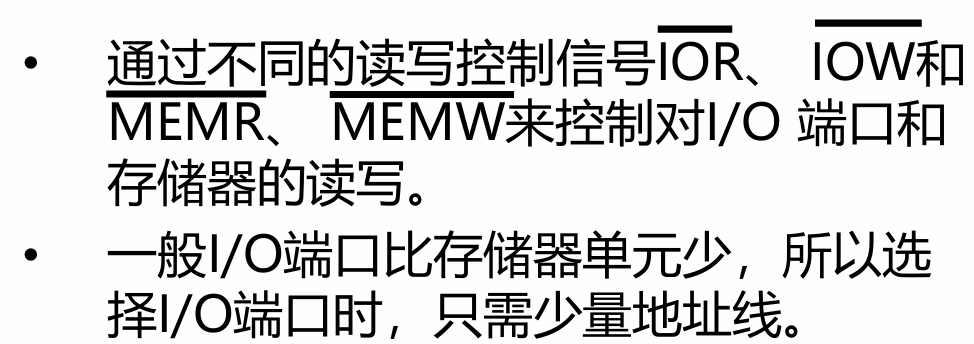
地址可能相同，怎么知道是访问主存还是I/O端口呢？通过**不同的指令**来区分
- 访问主存时使用**存储器访问指令**，如MOV、LDR等
- 访问I/O端口时使用**特殊的I/O指令**，如IN、OUT等
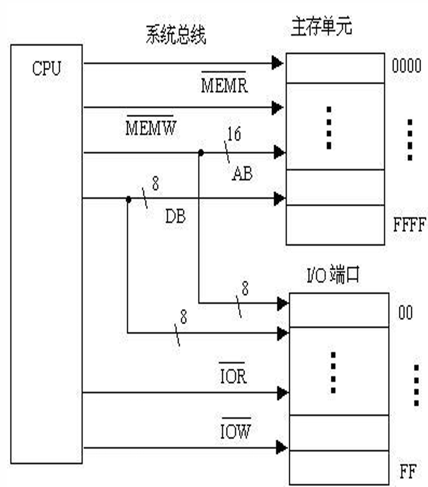

###### 统一编址方式（内存映射方式）
与主存空间统一编址，将主存空间分出一部分地址给I/O端口进行编号。
该方法是将I/O端口映射到某主存区域，故也称为“存储器映射方式”
根据I/O端口在地址空间的位置，通过**地址译码**来实现。
也由访存指令发出，只是访问的地址范围不同！
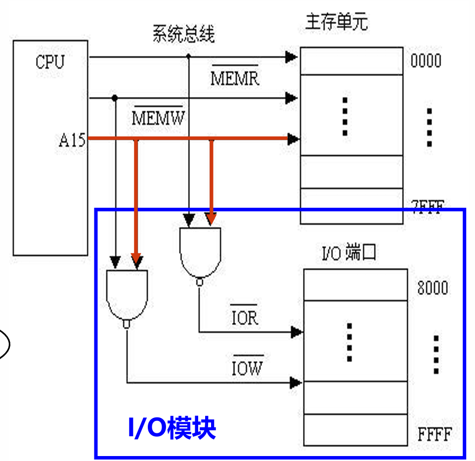
地址不能重叠，否则会出现冲突
地址线的**高位**参与片选控制逻辑，高地址线用于选择I/O端口

## I/O数据传送控制方式
- 程序直接控制方式
– 无条件传送：对简单外设定时（同步）进行数据传送
– 条件传送：Polling (轮询，查询):  OS主动查询，也称为程序查询方式
I/O设备（包括I/O接口）将自己的状态放到一个状态寄存器中
OS阶段性地查询状态寄存器中的特定状态，以决定下一步动作
- I/O Interrupt (中断I/O方式): 几乎所有系统都支持的中断I/O方式
– 若一个I/O设备需要CPU干预，它就通过中断请求通知CPU
– CPU中止当前程序的执行，调出OS（中断处理程序）来执行
– 处理结束后，再返回到被中止的程序继续执行
– OS是被动调出的，也称为中断驱动I/O方式
- DMA方式（直接存储器存取方式）：磁盘等高速外设特有的I/O方式
– 磁盘等高速外设**成批地**直接和主存进行数据交换
– 需要专门的DMA控制器控制总线，完成数据传送
– 当外设准备好数据后，向DMA控制器发DMA请求信号，DMA控制器再向CPU发总线请求，CPU让出总线后，由DMA控制器控制总线进行传输，无需CPU干涉

### 程序直接控制方式
#### 无条件传送
CPU**默认**I/O 设备 “随时准备好数据”，直接发起读写操作，不需要检查设备状态
CPU通过端口发起读写信号
锁存器：用于输出操作，暂存要输出的数据
三态缓冲器：用于输入操作，暂存从外设读入的数据
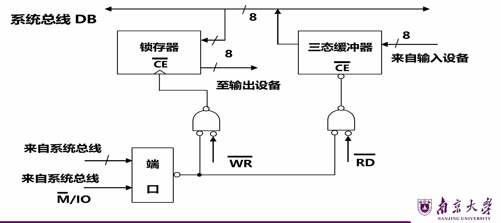

#### 条件传送
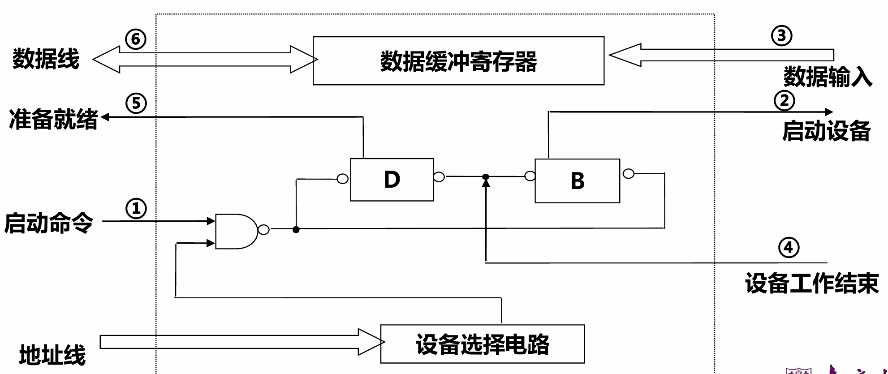
启动的时候，把B置为1，然后外设把数据输入数据缓冲寄存器，外设再向B、D发送工作结束的信号，这个时候D=1，B=0，代表准备就绪，外设工作结束，然后CPU把数据读到数据线里面去

### I/O中断方式
基本思想：
当外设准备好时，便向CPU发**中断请求**，CPU响应后，中止现行程序的执行，转入一个“**中断服务程序**”进行输入/出操作，实现主机和外设接口之间的数据传送，并启动外设工作。
“中断服务程序”执行完后，返回原被中止的程序断点处继续执行。此时，外设和CPU**并行工作**。
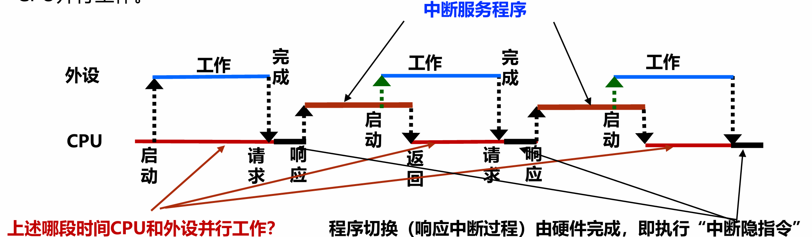
响应称为**程序切换**的过程

#### 中断系统的基本职能

#### 中断处理的过程
包括**中断相应+中断处理**两个阶段
**中断响应**的结果就是**调出**相应的中断服务程序（处在“**禁止中断**”状态）
**中断处理**是指**执行**相应中断服务程序的过程

典型的**多重中断**处理（中断服务程序）分为三个阶段
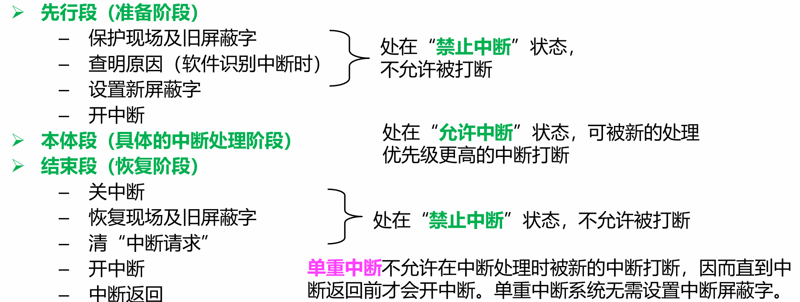

#### 多重中断的处理
在一个中断处理（即**执行**中断服务程序）过程中，若又有**新的中断请求**发生，而新中断**优先级高于**正在执行的中断，则应立即中止正在执行的中断服务程序，转去处理新的中断。这种情况为**多重中断**，也称**中断嵌套**。
中断优先级的概念：
- 中断响应优先级----由**查询程序或硬联排队线路**决定的优先权，反映多个中断同时请求时选择哪个**响应**。
- 中断处理优先级----由各自的**中断屏蔽字**来动态设定，反映本中断与其它中断间的关系。
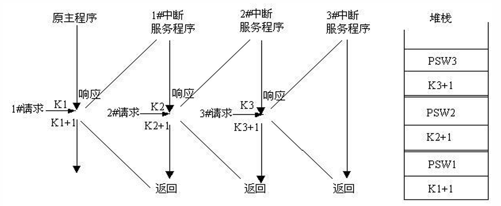
1的屏蔽字不会屏蔽2、3
2的屏蔽1不会屏蔽3
3的屏蔽1、2

另外一个例子，假定某中断系统有四个中断源，其响应优先级为1>2>3>4。
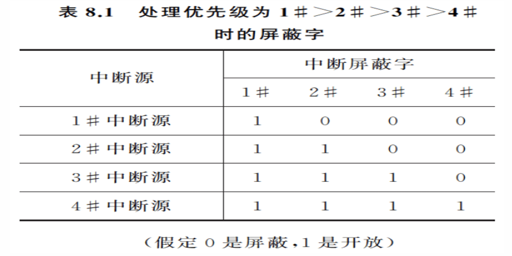
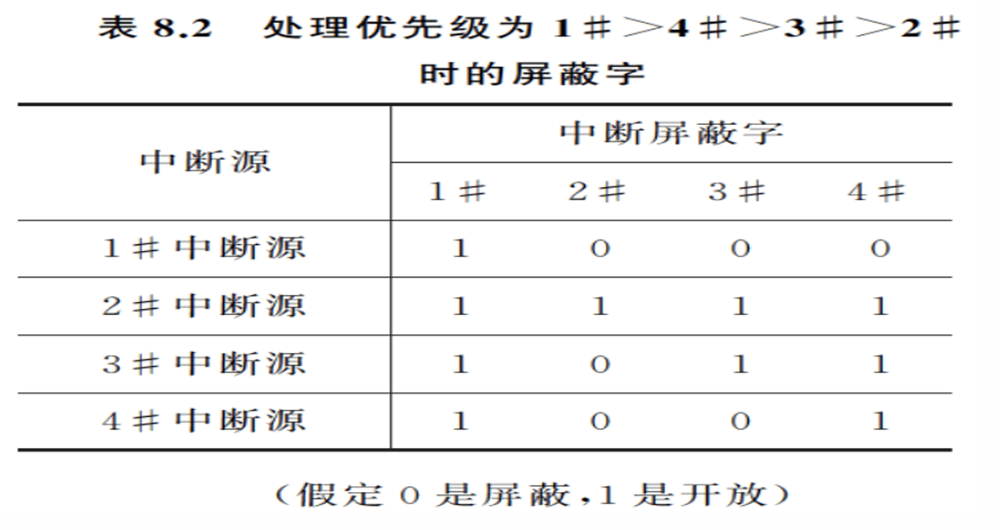

#### 程序控制方式和中断方式的比较
假定某机控制一台设备输出一批数据。数据由主机输出到接口的数据缓冲器OBR，需要1μs。再由OBR输出到设备，需要1ms。设一条指令的执行时间为1μs(包括隐指令)。试计算采用程序传送方式和中断传送方式的数据传输速度和对主机的占用率。

CPU如何把数据送到OBR，I/O接口如何把OBR中的数据送到设备？ CPU执行I/O指令来将数据送OBR；而I/O接口则是自动把数据送到设备。
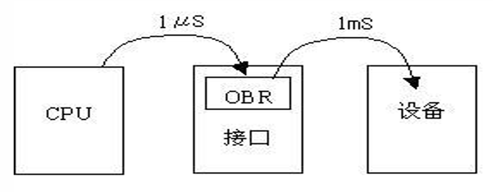
**对主机占用率**：在进行I/O操作过程中，处理器有多少时间花费在输入/出操作上。
**数据传送速度**（吞吐量、I/O带宽）：单位时间内传送的数据量。
（1）**程序直接控制传送方式**
若查询程序有10条，第5条为启动设备的指令，则：
- 数据传输率为：1/(1000+5) μs，约为每秒995个数据。
- 主机占用率=100%
（2）**中断传送方式**
若中断服务程序有30条，在第20条启动设备，则：
- 数据传输率为：1/(1000+1+20)μs，约为每秒979个数据。
- 主机占用率为：(1+30)/(1000+1+20)=3%
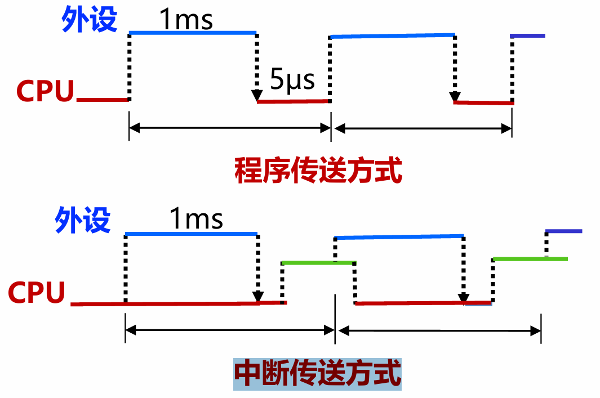
为什么中断服务程序比查询程序长？
因为中断服务程序有额外开销，如：保存现场、保存旧屏蔽字、开中断、（查询中断源）等

#### 中断响应过程
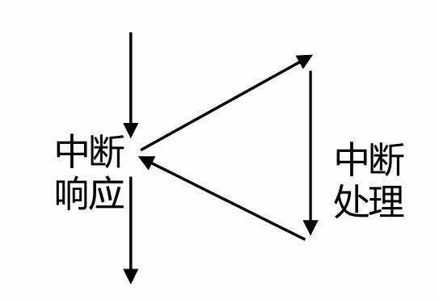
(1) 中断响应的条件
① CPU处于开中断状态
② 在一条指令执行完
③ 至少要有一个未被屏蔽的中断请求
通常在**一条指令执行结束后**开始查询有无中断请求，有的话立即响应，所以，一般在**指令执行完时响应中断**；而“异常”发生在指令执行过程中，所以，**不能等到指令执行完才进行异常处理**。
(2) 中断响应过程
执行一条隐指令，需完成一次总线操作，从总线上取**中断类型号**
具体来说，处理器做三件事：
①关中断
0 => 中断允许触发器$C_{IEN}$
②保护断点和程序状态
PC => 堆栈（或特殊寄存器EPC）
PSW => 堆栈
③识别中断源：
取得中断服务程序首地址和初始PSW分别送PC和PSWR

#### 中断识别和判优方法
- 软件方法（轮询）
中断查询程序根据中断请求状态，按**优先级顺序**来识别（如：MIPS的异常/中断查询程序入口为：0x80000180）
- 硬件方法（向量中断）
将所有中断请求状态送到一个排队电路中，根据中断优先级识别出最高优先级的中断请求
– 链式查询（菊花链）
– 独立请求（并行判优）
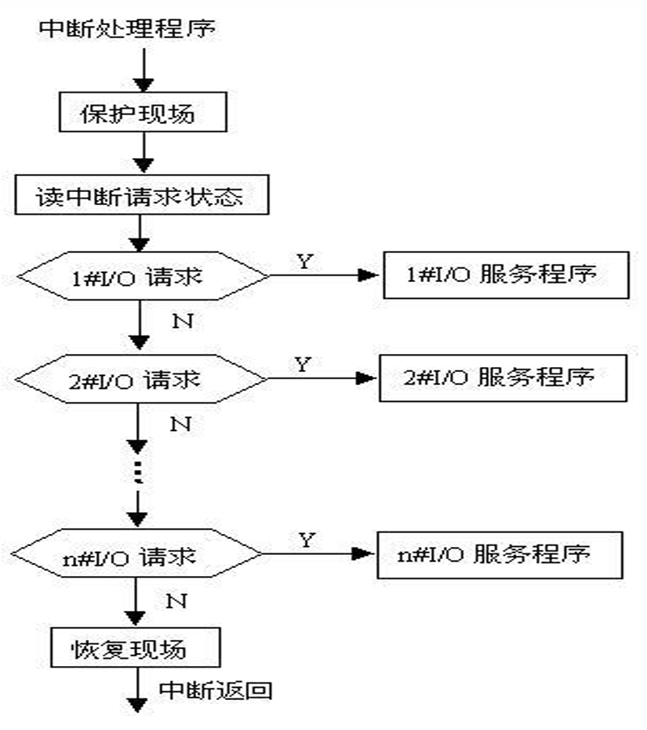
内部异常和外部中断都有优先级，通常所有**内部异常的优先级都比外部中断高**。

### DMA方式
– 程序直接控制方式受“踏步”现象的限制（CPU利用率100%），效率低下，不适合高速设备和主机间的数据传送。
– 中断控制方式虽比程序直接控制方式有效，CPU和外设有一定的并行度，但由于下列原因也不适合高速设备和主机间的数据传送。
• 对I/O请求**响应慢**：每传送一个数据都要等待外设的中断请求，并增加许多中断响应和中断处理前、后的附加开销（保护断点、现场等），**不能及时响应**I/O请求。
• 数据传送速度慢：数据传送由**软件**完成（由CPU执行相应的中断服务程序来完成），速度慢

DMA方式的**基本思想**：**在高速外设和主存间直接传送数据**，由专门硬件（即：**DMA接口**）控制总线进行传输

采用“请求-响应”方式：
- 每当高速设备准备好数据，就进行一次“**DMA请求**”，DMA控制器接受到DMA请求后，申请总线使用权
- DMA控制器的总线使用优先级**比CPU高**

与中断控制方式结合使用
– DMA传送前，寻道、旋转等操作结束时，通过“中断”**告知CPU**
– 在DMA控制器控制总线进行数据传送时，CPU执行其他程序
– DMA传送结束时，要通过“DMA结束中断”**告知CPU**，要告知CPU让出了总线使用权

由于DMA接口和CPU共享主存，所以可能出现两者争用主存的现象，为使两者协调使用主存，DMA通常采用以下三种方式进行数据传送。
- (1) CPU停止法(成组传送)，DMA传输时，CPU脱离总线，停止访问主存，直到DMA传送一块数据结束
- (2) 周期挪用(窃取)法(单字传送)，DMA传输时，CPU让出一个总线事务周期，由DMA控制总线来访问主存，传送完一个数据后立即释放总线。
- (3) 交替分时访问法每个存储周期分成两个时间片，一个给CPU，一个给DMA，这样在每个存储周期内，CPU和DMA都可访问存储器。

#### CPU停止法
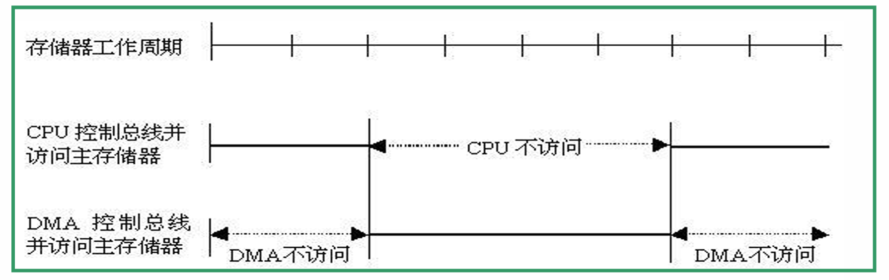
优点：控制简单、适用于传输率很高的外设实现成组数据传送。
缺点：
- CPU工作受影响：DMA访存时CPU基本上处于停止状态
- 主存周期没有被充分利用：即使I/O设备高速运行，但两个数据之间的准备间隔时间也总大于一个存储周期，所以主存周期没有被充分利用。

弥补这个缺点，
– 在DMA接口中引入**缓冲器**，在DMA接口中采用一个小容量的半导体存储器，使I/O设备先和这个小容量存储器交换数据，然后再使用总线由小容量存储器与主存进行数据交换。这样可减少DMA传送数据时**占用总线的时间**，也就减少了CPU的等待时间。
– 采用周期挪用（窃取）法

#### 周期挪用法
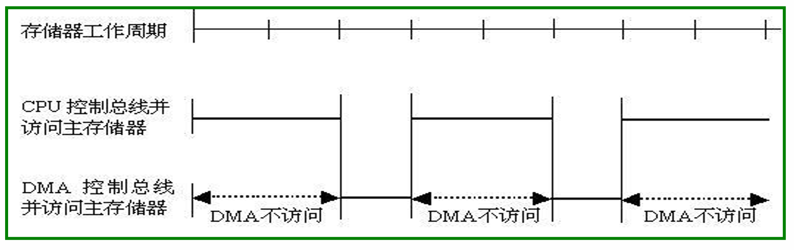
只挪用一个存储周期，既能及时响应I/O请求，又能较好地发挥CPU和主存的效率。
这种方式下，在下一数据的准备阶段，主存周期被CPU充分利用。因此适合于I/O设备的读写周期大于主存周期的情况。
但是，每次DMA访存都要申请总线控制权、占用总线进行传送、释放总线，因此，会增加**传输开销**。

I/O设备要求DMA传送时可能会遇到以下三种情况之一：
– CPU不需访问主存：此时，不会发生冲突，两者并行。如: CPU正在执行乘法指令，要花很长时间而不需马上访存。
– CPU正在访问主存：此时须等到存储周期结束，CPU让出总线，DMA才能访存。
– CPU也同时要访问主存：此时出现访存冲突。因为不马上响应DMA请求的话，高速设备可能会发生数据丢失，所以，**DMA的总线优先权比CPU高**。这时，先让DMA占用总线，窃取一个主存周期，完成一个数据的交换。这样，CPU便要延迟一段时间才能访存。
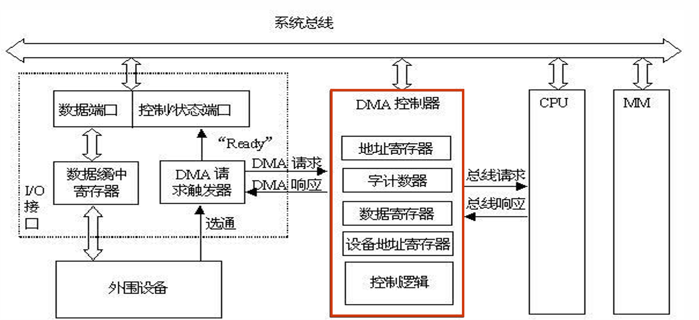

#### DMA控制器
DMA数据传送过程由**DMA接口**的控制逻辑完成，所以DMA接口也称DMA控制器。
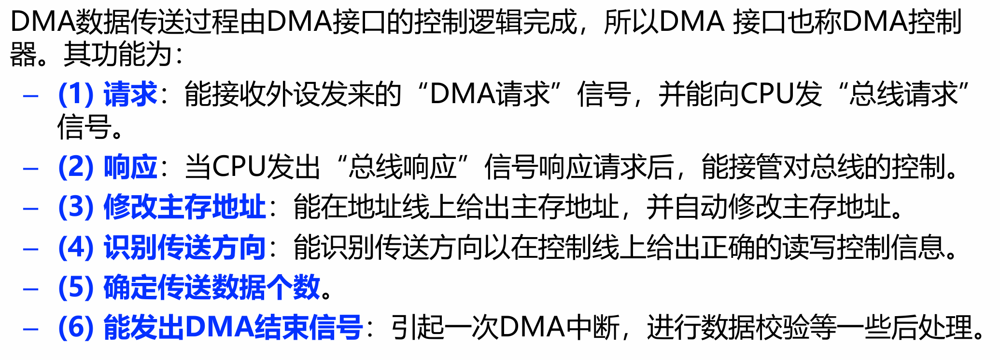
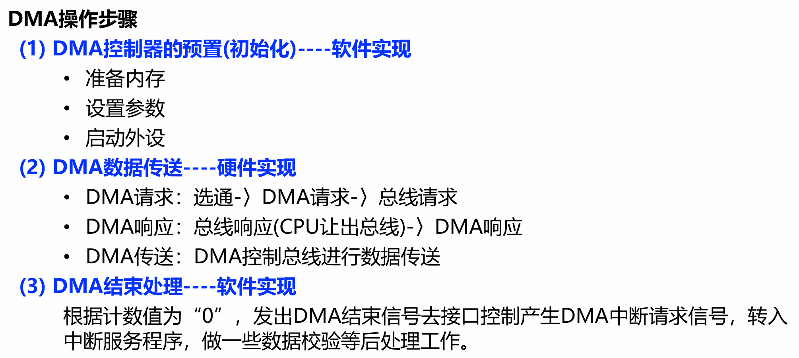

##### DMA控制器的初始化
- 准备内存区
- 设置传送参数
- 启动外设，然后执行其他程序

##### DMA传输过程
(1) 当外设准备好数据，或准备好接收数据时，发“**选通**”信号，使数据送**数据缓冲寄存器**，同时**DMA请求触发器**置“1”。
(2) DMA请求触发器向控制/状态端口发“**Ready**”信号，同时向DMA控制器发“**DMA请求**”信号。
(3) DMA控制器向CPU发“**总线请求**”信号。
(4) CPU完成现行机器周期后，响应DMA请求，发出“**总线响应**”信号。DMA控制器接受到该信号后，发出“**DMA响应**”信号，使DMA请求触发器复位。此时，CPU浮动它的总线，**让出总线控制权**，由DMA控制器控制总线。
(5) DMA控制器给出内存地址，并在其读/写线上发出“读”或“写”命令，随后在数据总线上给出数据。
(6) 根据读写命令，将数据总线上的数据写入存储器中，或写入数据端口，并进行主存地址增量，计数值减1，
若采用“CPU停止法”，则循环第6步，直到计数值为“0”。
若采用“周期挪用法”，则释放总线（下次数据传送时再按过程(1)到(6)进行）

#### DMA和中断方式的区别
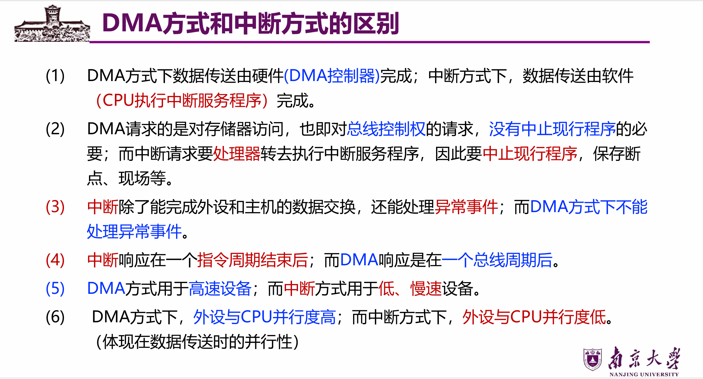

## 内核空间I/O软件
### I/O子系统
page68
所有高级语言的运行时（runtime）都提供了执行I/O功能的机制
I/O子系统也采用层次结构
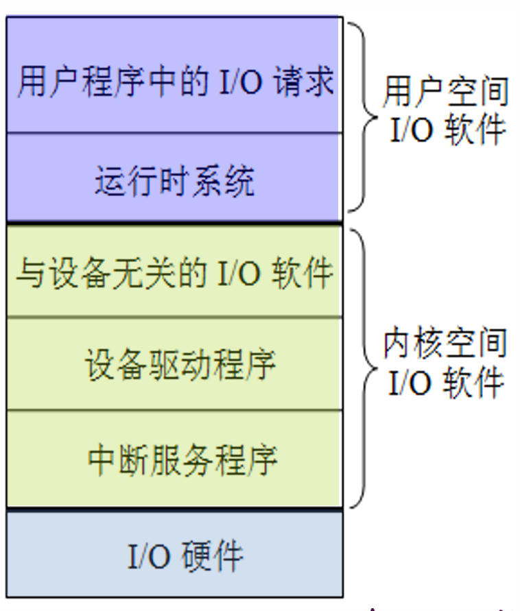
从用户I/O软件切换到内核I/O软件的唯一办法是“异常”机制：系统调用（自陷）
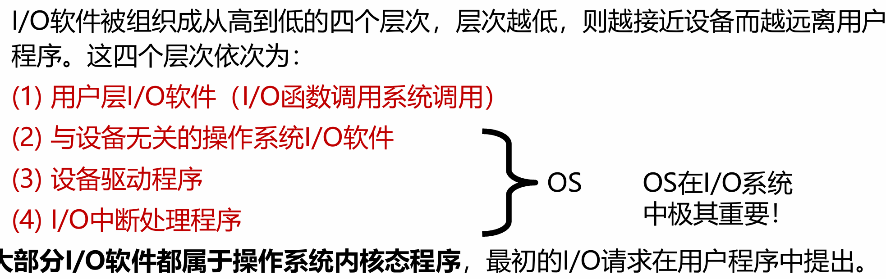
